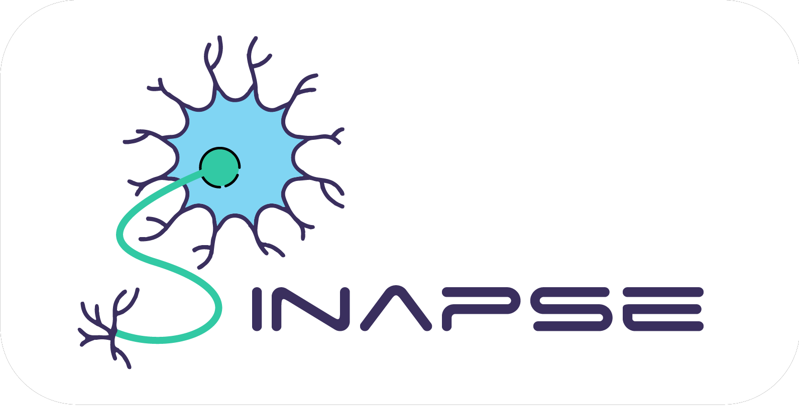

# Inteli - Instituto de Tecnologia e Liderança 

<p align="center">
<a href= "https://www.inteli.edu.br/"></a>
</p>

# Sinapse

# Grupo e Aplicação

<p align="center">
<a href= "https://www.inteli.edu.br/"></a>
</p>

## :student: Integrantes: 
- <a href="https://www.linkedin.com/in/cec%C3%ADlia-alonso-gon%C3%A7alves-3aa4bb271/">Cecília Gio Alonso Gonçalves</a>
- <a href="https://www.linkedin.com/in/eduardo-hos/">Eduardo Henrique Oliveira Santos</a>
- <a href="https://www.linkedin.com/in/gabriel-pelinsari-13185b1a0/">Gabriel Pelinsari</a> 
- <a href="https://www.linkedin.com/in/joselitojunior/">Joselito Júnior Motta de Carvalho</a> 
- <a href="https://www.linkedin.com/in/kaiane-souza-cordeiro-696076268/">Kaiane Souza Cordeiro</a>
- <a href="https://www.linkedin.com/in/marcelo-sitton-878248271/">Marcelo Sitton</a> 
- <a href="https://www.linkedin.com/in/marco-antonio-rizzi-meneguetti-620b56257/">Marco Antonio Rizzi Meneguetti</a>

## :teacher: Professores:
### Orientador(a) 
- <a href="https://www.linkedin.com/in/victorbarq/">Claudio André</a>
### Instrutores
- <a href="https://www.linkedin.com/in/aila-esteque/">Aila Esteque</a>
- <a href="https://www.linkedin.com/in/fatima-toledo/">Fatima Toledo</a> 
- <a href="https://www.linkedin.com/in/francisco-escobar/">Francisco Escobar</a> 
- <a href="https://www.linkedin.com/in/henrique-mohallem-paiva-6854b460/">Henrique Mohallem Paiva</a>
- <a href="https://www.linkedin.com/in/victorbarq/">Leonardo Bontempo</a> 

## 📝 Descrição

O Grupo Sinapse desenvolveu um modelo preditivo de Churn (medida do número de clientes que deixam de comprar, seja cancelando contrato ou não renovando), projetado para analisar os motivos por trás da perda de clientes de uma empresa energética. Todos os dados usados para o desenvolvimento do modelo, foram fornecidos pelo stakeholder parceiro do Inteli (Instituto de Tecnologia e Liderança).

A abordagem selecionada para a solução é fundamentada em Machine Learning, com a linguagem de programação Python desempenhando um papel central. Isso viabilizou a criação de um modelo preditivo sólido e eficiente. Ademais, esse modelo pode ser facilmente adaptado para uso em diferentes cenários no futuro. Além disso, o modelo processa e analisa os dados para antever o Churn dos clientes, fornecendo insights valiosos para orientar as estratégias de retenção.

Para garantir um desempenho otimizado do modelo preditivo, é importante que você siga as instruções detalhadas contidas neste documento. Além disso, ao adicionar novos dados ao conjunto de dados, é altamente recomendável manter a consistência no processamento de dados e na aplicação das medidas de normalização padrão.

É possível analisar o dataset original com a descrição de colunas e seus significados clicando <a href="https://docs.google.com/spreadsheets/d/1Z68OfUbNVbiQv_ZUn3DJorZGYV5e_cHYu3DAbyvoe9w/edit?usp=sharing">aqui.</a> 

## 📁 Estrutura de pastas

Dentre os arquivos presentes na raiz do projeto, definem-se:

- <b>readme.md</b>: arquivo que serve como guia e explicação geral sobre o projeto (o mesmo que você está lendo agora).

- <b>documentos</b>: aqui estarão todos os documentos do projeto. Existem dois arquivos de documentação: um em portugês e outro em inglês. Há também uma pasta denominada <b>outros</b> onde estão presentes documentos complementares e imagens.

- <b>notebooks</b>: todos os Jupyter Notebooks criados na plataforma Colab para desenvolvimento do projeto. Aqui existem notebooks de análise de negócios, exploração e pré-processamento dos dados, assim como o notebook principal que abriga toda a lógica do modelo e o treinamento de diversos algoritmos de Machine Learning.

- <b>src</b>: software de web desenvolvido para a solução.

## 💻 Execução dos projetos

Para executar a solução "Sinapse", é necessário baixar os arquivos clicando no botão `Code` e em seguida em `Download Zip`.

Com os arquivos baixados, é recomendado visualizar os notebooks (arquivos onde os códigos se encontram) pelo <a href="https://colab.google/">Google Colab</a>. No site, é preciso clicar em `Open Colab` e seleciona o notebook desejado realizando o upload do arquivo baixado.

### Explicações e objetivos de cada notebook:

Para visualizar o *pré-processamento* dos dados que foram utilizados para treinar e testar o modelo: `1. preprocess_model.ipynb`. Após abrir o arquivo `.ipynb` no colab,  clicar em "Ambiente de execução" e em seguida em "Executar tudo".

Para visualizar a *modelagem* do modelo preditivo e as métricas de cada algorítmo testado: `2. modeling.ipynb`. Após abrir o arquivo `.ipynb` no colab,  clicar em "Ambiente de execução" e em seguida em "Executar tudo". Após executar tudo, será exportado um arquivo `.joblib`, que contém as informações necessárias para o funcionamento da inteligência artificial desenvolvida. Caso seja do interesse baixar esse arquivo, é necessário clicar em `Arquivos` no lado esquerdo do ambiente do Google Colab e realizar o download.

Com o objetivo de visualizar a *probabilidade de churn* de clientes que já se encontram cadastrados no dataset: `3. testing_model.ipynb`. Após abrir o arquivo `.ipynb` no colab,  clicar em "Ambiente de execução" e em seguida em "Executar tudo". Após executar tudo, será exportado um arquivo `.xlsx`, que contém as informações das probabilidades de churn e as features decisivas para a conclusão do modelo. Para baixar esse arquivo, é necessário clicar em `Arquivos` no lado esquerdo do ambiente do Google Colab e realizar o download.

Dentro da pasta `notebooks`, existem na pasta `outros` os notebooks:

`4. extra_analysis.ipynb` - informações sobre a análise exploratória do dataset.

`5. business_projection.ipynb` - análises e projeções de negócios em relação ao churn de clientes.

`6. Input de dados.ipynb` - nesse arquivo é possível inserir uma tabela nova (já tratada) para prever novos churns.

`7. real_time_simulation.ipynb` - esse arquivo integra o modelo com o frontend.

Caso haja dúvidas sobre como executar os notebooks, assista ao vídeo de instruções [aqui](https://youtu.be/PMVuzxPnh9E?si=J9hMWSCNSBVo1nFN).

### Para executar o frontend, inserir novos valores de dados e visualizar as novas probabilidades:

Abrir no <a href="https://code.visualstudio.com/download">VS Code</a> o arquivo baixado do <a href="https://github.com/2023M3T7-Inteli/grupo2/tree/main">Git Hub</a>.

Entrar na pasta `src` e depois na pasta `backend` e então no arquivo `real_time_simulation.ipynb`. Em seguida, abrir o terminal - isso pode ser feito apertando as teclas <Ctrl> + <aspas> ou então clicando no menu do vc code em `Terminal` e em seguida em `New Terminal`.

Dentro do terminal, é necessário que o arquivo `real_time_simulation.ipynb` esteja sendo acessado.

- isso pode ser feito da seguinte maneira: </br>

a. Veja se a ultimo arquivo aberto é o "real_time_simulation.ipynb"</br>

EX: C:\Users\Inteli\Documentos\grupo2\src\backend\real_time_simulation.ipynb </br>

Caso não esteja sendo acessado:

b. Entre na pasta "src" digitando "cd src" + \<TAB> para autocompletar ou digite "cd scr" + "\<ENTER>". </br>

EX: PS C:\Users\fulano\Documents\grupo2> cd scr</br>

c. Repita o processo entre na pasta "backend"</br>

EX: PS PS C:\Users\fulano\Documents\grupo2\scr\backend\real_time_simulation.ipynb> cd .\backend\</br>

d. Digite os comandos:</br>

```sh
npm install 
```

Isso instalará todas as dependências definidas que são necessárias para rodar o projeto. Agora o projeto já está pronto para ser modificado. Caso ainda deseje iniciar a aplicação, digite o comando abaixo no terminal::</br>

```sh
npm run dev
```

Agora você pode acessar a aplicação através do link fornecido no próprio terminal.

## 🗃 Histórico de lançamentos

* 1 - 11/08/2023
    * Atualização de documentos (código do módulo permanece inalterado).
    * Visão e análise de negócio (Análise SWOT e Cinco forças de Porter).
    * Política de Privacidade LGPD.
    * Matriz de Riscos.
    * Value Proposition Canvas.
    * Personas e Mapas de Jornadas do Usuário.
* 2 - 25/08/2023
    * Exploração de dados.
    * Pré-processamento dos dados (limpeza e transformaçãodas colunas).
    * Tratamento de missings e remoção de outliers.
    * Transformação (normalização e codificação).
    * Levantamento de hipóteses.
* 3 - 06/09/2023
    * Notebook com a preparação dos dados e modelagem.
    * Finalização do pré-processamento dos dados.
    * Proposta de features.
    * Métricas relacionadas ao modelo.
    * Modelo candidato!
* 4 - 22/09/2023
    * Escolha da métrica do modelo.
    * Definição do modelo escolhido.
    * Tuning de hiperparâmetros.
* 5 - 06/10/2022
    * Colab do projeto o modelo final escolhido: indicado pelo grupo para ser utilizado em produção no contexto real do negócio.

## 📋 Licença/License

<p xmlns:cc="http://creativecommons.org/ns#" xmlns:dct="http://purl.org/dc/terms/"><a property="dct:title" rel="cc:attributionURL" href="https://github.com/Spidus/Teste_Final_1">MODELO GIT SINAPSE</a> by <a rel="cc:attributionURL dct:creator" property="cc:attributionName" href="https://www.inteli.edu.br/">Inteli</a>,<a href="https://www.linkedin.com/in/cec%C3%ADlia-alonso-gon%C3%A7alves-3aa4bb271/">Cecília Gio Alonso Gonçalves</a>, <a href="https://www.linkedin.com/in/eduardo-hos/">Eduardo Henrique Oliveira Santos</a>, <a href="https://www.linkedin.com/in/gabriel-pelinsari-13185b1a0/">Gabriel Pelinsari</a>, <a href="https://www.linkedin.com/in/joselitojunior/">Joselito Júnior Motta de Carvalho</a>, <a href="https://www.linkedin.com/in/kaiane-souza-cordeiro-696076268/">Kaiane Souza Cordeiro</a>,<a href="https://www.linkedin.com/in/marcelo-sitton-878248271/"> Marcelo Sitton</a>, <a href="https://www.linkedin.com/in/marco-antonio-rizzi-meneguetti-620b56257/">Marco Antonio Rizzi Meneguetti</a></a> is licensed under <a href="http://creativecommons.org/licenses/by/4.0/?ref=chooser-v1" target="_blank" rel="license noopener noreferrer" style="display:inline-block;">Attribution 4.0 International</a>.</p>

## 🎓 Referências

Aqui estão as referências usadas no projeto:


1. SSE Airtricity. (s.d.). We are SSE Airtricity - This is our story. SSE Airtricity. Disponível em: https://www.sseairtricity.com/ie/home/about-us/about-us/
2. SHEEHAN, M.; NIJSSAN, S. M. The CRISP-DM Model: The New Blueprint for Data Mining. Journal of Data Warehousing, vol. 5, nº 4, p. 13-22, 2000.
3. CASAROTTO, C. (2020, 11 de dezembro). As 5 forças de Porter: quais são elas e como entender o conjunto de fatores que influenciam no sucesso do seu negócio? rockcontent. Disponível em: https://rockcontent.com/br/blog/5-forcas-de-porter/
4. RAEBURN, A. (2022, 28 de novembro). Análise SWOT/FOFA: o que é e como usá-la (com exemplos). asana. Disponível em: https://asana.com/pt/resources/swot-analysis?gclid=CjwKCAjww7KmBhAyEiwA5-PUStFYfdjQk1NDB65i4CO2FKSIh7XsE-8s6JXOQBSOJ6NEsmQlpH90_xoChhkQAvD_BwE&amp;gclsrc=aw.ds
5. OSTERWALDER, A.; PIGNEUR, Y.; BERNARDES, G.; SMITH, A. Value Proposition Design: How to Create Products and Services Customers Want. New Jersey: Wiley, 2014.
6. ESFERA ENERGIA. (2022, 14 de outubro). Matriz de risco: o que é, quando usar e como montar uma tabela. esferablog. Disponível em: https://blog.esferaenergia.com.br/gestao-empresarial/matriz-de-risco
7. SIQUEIRA, A. (2022, 14 de fevereiro). Persona: o que é, como definir e por que criar uma para sua empresa [+ exemplos práticos e um gerador]. Resultados Digitais. Disponível em: https://resultadosdigitais.com.br/marketing/persona-o-que-e/#:~:text=O%20que%20é%20persona?,,%20objetivos,%20desafios%20e%20preocupações.
8. GIBBONS, S. (2018, 9 de dezembro). Journey Mapping 101. Nielsen Norman Group. Disponível em: https://www.nngroup.com/articles/journey-mapping-101/
9. XAVIER, F. (2021, 31 de agosto). LGPD: conheça seus direitos como titular de dados pessoais. MIT Technology Review Brasil. Disponível em: https://mittechreview.com.br/lgpd-conheca-seus-direitos-como-titular-de-dados-pessoais/
10. TECH, Didática. Entenda como funciona o Random Forest (Machine Learning). Disponível em: https://didatica.tech/o-que-e-e-como-funciona-o-algoritmo-randomforest/. Acesso em: 4 set. 2023.
11. SACRAMENTO, Gabriel. ÁRVORE DE DECISÃO: ENTENDA ESSE ALGORITMO DE MACHINE LEARNING. Disponível em: https://blog.somostera.com/data-science/arvores-de-decisao#:~:text=Uma%20árvore%20de%20decisão%20é,valor%20do%20lucro%20em%20reais. Acesso em: 4 set. 2023.
12. DIDÁTICA TECH. Como funciona o algoritmo ExtraTrees. 2022. Disponível em: https://didatica.tech/como-funciona-o-algoritmo-extratrees/. Acesso em: 4 set. 2023.
13. TEAM, Written by Data Science. Gradient Boosting – O que você precisa de saber. 5 ago. 2020. Disponível em: https://datascience.eu/pt/aprendizado-de-maquina/gradient-boosting-o-que-voce-precisa-de-saber/. Acesso em: 4 set. 2023.
14. AZAMBUJA, Pedro. AdaBoost (Adaptive Boosting). 4 dez. 2020. Disponível em: https://pedroazambuja.medium.com/adaboost-adaptive-boosting-dbbec150fced. Acesso em: 4 set. 2023.
15. TECH, Didática. Como funciona o KNN (K-nearest neighbors). Disponível em: https://didatica.tech/o-que-e-e-como-funciona-o-algoritmo-knn/. Acesso em: 4 set. 2023.
16. GUSMÃO, Amanda. O que é Naive Bayes e como funciona esse algoritmo de classificação. 8 abr. 2022. Disponível em: https://rockcontent.com/br/blog/naive-bayes/. Acesso em: 4 set. 2023.
17. HROUDA-RASMUSSEN, Stefan. Quadratic Discriminant Analysis. 2 abr. 2021. Disponível em: https://towardsdatascience.com/quadratic-discriminant-analysis-ae55d8a8148a. Acesso em: 4 set. 2023.
18. MELO, Carlos. XGBoost: aprenda este algoritmo de Machine Learning em Python. 28 ago. 2019. Disponível em: https://sigmoidal.ai/xgboost-aprenda-algoritmo-de-machine-learning-em-python/. Acesso em: 4 set. 2023.
19. GUIMARÃES, Alysson. Entendendo CatBoost: Um guia (quase) definitivo. 13 fev. 2022. Disponível em: https://medium.com/data-hackers/entendendo-catboost-um-guia-quase-definitivo-b28bc153a78. Acesso em: 4 set. 2023.
