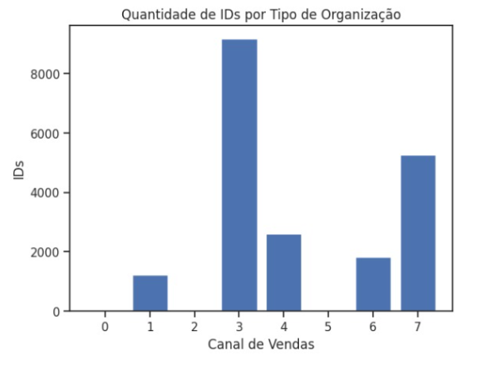
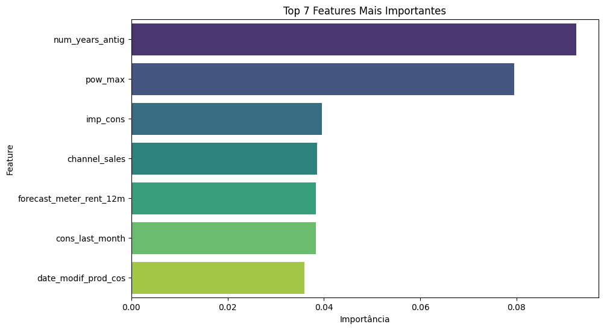

# Documentação Modelo Preditivo - Inteli

## Sinapse
### Grupo Sinapse
#### (Cecília Gonçalves, Eduardo Henrique Santos, Gabriel Pelinsari, Joselito Junior, Kaiane Souza, Marcelo Sitton e Marco Rizzi)
## Sumário
[1. Introdução](#c1)

[2. Objetivos e Justificativa](#c2)

[3. Metodologia](#c3)

[4. Desenvolvimento e Resultados](#c4)

[5. Conclusões e Recomendações](#c5)

[6. Referências](#c6)

[Anexos](#attachments)


## <a name="c1"></a>1. Introdução

Esse documento apresenta o desenvolvimento e manuseio de um modelo preditivo, feito a partir de algoritimos de inteligência artificial, de churn. Nele é abordado questões de análise de negócios e processamento de dados.

Primeiramente, o grupo Sinapse desenvolveu uma solução para uma empresa de consultoria global. Mais objetivamente, a abordagem se baseou em empresas reais que se aplicam no nosso contexto: para o modelo preditivo desenvolvido, tomou-se como referência a "SSE Airtricity"¹, uma empresa europeia de médio porte que compartilha valores sustentáveis, dedicada ao fornecimento de energia elétrica e gás. Por razões contratuais, o stakeholder não será mencionado no documento. 

A todo modo, a solução proposta é um modelo preditivo de churn, projetado para analisar os motivos por trás da perda de clientes de uma empresa energética. Todos os dados usados para o desenvolvimento do modelo, foram fornecidos pelo stakeholder parceiro do Inteli (Instituto de Tecnologia e Liderança).


## <a name="c2"></a>2. Objetivos e Justificativa
### 2.1 Objetivos
O objetivo principal da solução é prever com precisão o churn (saída) de clientes da SSE Airtricity. Assim, é possível que a empresa identifique e retenha aqueles com maior probabilidade de deixar de ser cliente. Como ideal, se busca proporcionar *insights* que possam ajudar a melhorar a qualidade de seu serviços, sempre visando obter o lucro máximo e diminuir a probabilidade do churn. Mas claro, para isso, desde o início o modelo foi projetado para priorizar a ética na análise dos dados.


### 2.2 Proposta de solução
A abordagem selecionada para a solução é fundamentada em machine learning, com a linguagem de programação Python desempenhando um papel central. Isso viabilizou a criação de um modelo preditivo sólido e eficiente. Ademais, esse modelo pode ser facilmente adaptado para uso em diferentes cenários no futuro. O modelo processa e analisa os dados de uma companhia elétrica para antever o churn dos clientes, fornecendo *insights* valiosos para orientar as estratégias de retenção.

Para viabilizar esse processo, foi necessário realizar um pré-processamento detalhado dos dados, a fim de garantir maior qualidade e capacidade preditiva do modelo. A abordagem também contemplou a análise de variáveis tanto qualitativas quanto quantitativas, possibilitando ao modelo identificar com segurança os clientes com maior probabilidade de deixar os serviços da empresa. Além disso, determinar os principais fatores que influenciam na decisão de churn por parte dos clientes.


### 2.3 Justificativa
A solução se destaca por sua eficiência e escalabilidade. A abordagem ética e a consideração das necessidades específicas da SSE Airtricity garantem a relevância da solução para o cliente. Dessa maneira, a escolha da empresa europeia reforça a adaptação realista da solução aos dados e ao mercado.


## <a name="c3"></a>3. Metodologia

A abordagem adotada para desenvolver o modelo preditivo seguiu as etapas da metodologia CRISP-DM² que significa "Cross-Industry Standard Process for Data Mining", é um processo de desenvolvimento de projetos de mineração de dados e modelagem preditiva que visa fornecer uma estrutura organizada e sistemática para orientar as atividades envolvidas. Ele é composto por seis etapas principais:
* Entendimento do Negócio 
* Entendimento dos Dados 
* Preparação dos Dados 
* Modelagem 
* Avaliação 
* Implantação (Deployment)
  
Juntas, criam uma metodologia cíclica, permitindo uma movimentação orgânica entre as etapas.

Critérios rigorosos de avaliação foram estabelecidos para garantir a qualidade da solução. Alguns deles são: metas de acurácia, matriz de confusão, F1 score, entre outros. Nesse cenário, a fim de manter a excelência em operação, foi-se estabelecido os seguintes critérios:

**Acurácia:** o modelo foi desenvolvido buscando atender uma taxa de acurácia mínima de 80%, sendo assim margem para erro de 20%. Considerando os dados fornecidos, essa métrica se põe justa mas não como uma lei existente.

**Recall:** Garantindo uma taxa real de churn, o modelo de recall é de pelo menos 60%.

**F1 score:** Como métrica que equilibra precisão e recall, o F1 score deve ser mantido em nível satisfatório para alcançar resultados sólidos.

A solução não apenas identifica os fatores tradicionais que influenciam o churn, como o custo do serviço, mas também adota uma abordagem holística. Nesse contexto, as informações contidas no dataset são exploradas, pré-processadas e avaliadas em relação a sua importância para o modelo. Garantindo assim, uma solução de qualidade e que se encaixe precisamente no cenário abordado.


## <a name="c4"></a>4. Desenvolvimento e Resultados
### 4.1. Compreensão do Problema
#### 4.1.1. Contexto da indústria 
Em relação a indústria elétrica, o seu contexto foi elaborado com base nas 5 forças de Porter³. As 5 Forças de Porter constituem um modelo que proporciona uma análise detalhada da competitividade de um setor no mercado. 

Este modelo abrange cinco elementos: rivalidade entre os concorrentes, que examina a intensidade da competição entre as empresas existentes no setor; o poder de negociação dos fornecedores, que avalia a influência que os fornecedores podem ter, seja através do controle dos preços, da qualidade dos insumos ou das condições de pagamento; a ameaça de novos entrantes, que considera a facilidade com que novas empresas podem entrar no setor e se tornar concorrentes efetivas; a ameaça de produtos substitutos, que analisa a possibilidade de produtos ou serviços alternativos satisfazerem a mesma necessidade dos consumidores, impactando assim a demanda do produto ou serviço do setor; e, finalmente, o poder de negociação dos clientes, que avalia o poder que os clientes têm para influenciar os preços, a qualidade e o serviço.

As 5 Forças de Porter proporcionam uma estrutura analítica que permite uma compreensão profunda do ambiente competitivo em que a SSE Airtricity se encontra. Esta análise estratégica contribui para a identificação dos principais determinantes da rentabilidade no setor energético e como estes podem evoluir ao longo do tempo. Tal conhecimento é crucial para o posicionamento eficaz do projeto, permitindo antecipar mudanças, compreender as complexidades do setor e orientar a direção da empresa de forma benéfica.

- Rivalidade Entre Concorrentes

No cenário europeu, a SSE Airtricity atua em um setor energético altamente competitivo, com várias empresas que oferecem serviços semelhantes e soluções de energia renovável. Entre os concorrentes se encontram o Grupo EDF com a EDF Energy, E.ON e a RWE, sendo que as três trabalham com energia renovável. A vasta concorrência pode influenciar os preços, a qualidade do serviço e a capacidade de inovação da empresa.

- Poder de barganha dos fornecedores

A SSE Airtricity pode explorar oportunidades de alternativas estratégicas para fortalecer sua posição no que diz respeito ao poder de barganha dos fornecedores. Uma das opções disponíveis é a verticalização, ou seja, a empresa pode considerar a possibilidade de adquirir ou investir em fornecedores estratégicos, o que poderia reduzir sua dependência de terceiros. Além disso, a negociação de contratos de longo prazo com fornecedores-chave pode proporcionar estabilidade nos preços e garantir o fornecimento contínuo de equipamentos e tecnologias essenciais. A diversificação de fornecedores também é uma estratégia importante, permitindo à SSE Airtricity explorar diferentes fontes de suprimento e minimizar os riscos associados à dependência de um único fornecedor. Por último, a inovação e diferenciação dos produtos podem aumentar o poder de barganha da empresa, incentivando os fornecedores a oferecer condições mais favoráveis devido à exclusividade ou qualidade superior dos produtos. Essas alternativas estratégicas podem mitigar possíveis ameaças ao seu poder de barganha.

- Ameaça de novos entrantes

A ameaça de novos entrantes no mercado de energia é mitigada por diversas barreiras significativas. Estas incluem regulamentações complexas, requisitos legais rigorosos, a necessidade de investimentos substanciais em infraestrutura e tecnologia, bem como a demanda por talentos altamente especializados. Além disso, a presença de empresas consolidadas na indústria, flutuações nos preços das commodities e crescentes pressões ambientais e sociais impõem desafios adicionais. No entanto, à medida que as tecnologias avançam e a demanda por energia renovável aumenta, surgem oportunidades para empresas em segmentos específicos do mercado, como a SSE Airticity, desde que essas estejam dispostas a superar tais barreiras e enfrentar os desafios inerentes ao setor.

- Ameaça de produtos substitutos

O aumento do reconhecimento da importância da energia renovável e a adoção de tecnologias mais limpas pode acabar representando ameaças de produtos ou serviços substitutos para a SSE Airtricity. Os clientes podem decidir por adotar fontes de energia mais sustentáveis, optar por geração de energia por concorrente, como painéis solares ou até mesmo por alternativas mais baratas porém insustentáveis.

- Poder de barganha dos clientes

Os clientes da SSE Airtricity incluem consumidores domésticos, empresas e indústrias que buscam soluções de energia renovável e fornecimento de eletricidade. O poder de negociação dos clientes pode ser afetado pela variedade de escolhas de fornecedores, preços competitivos e a qualidade do serviço prestado, já que existe uma grande disponibilidade de demais serviços de energia na Europa como das empresas EDF (Électricité de France), E.ON e Enel.

<div align="center">
  <p>Imagem 01 - Infográfico das 5 Forças de Porter (SSE Airtricity)</p>
  
  <p>Fonte: elaborada pelos autores</p>
</div>

#### 4.1.2. Análise SWOT 

A Matriz SWOT⁴ é uma análise que avalia os aspectos internos de uma empresa, identificando suas forças e fraquezas, além de analisar o ambiente externo, identificando oportunidades e ameaças. Essa matriz proporciona uma visão ampla dos fatores que podem afetar a organização, permitindo reconhecer recursos disponíveis, dificuldades e desafios. Com base nessa análise, a empresa pode tomar decisões estratégicas para melhorar sua posição competitiva, capitalizando seus pontos fortes e abordando suas fraquezas, buscando alcançar seus objetivos de negócio com mais eficácia. Para o contexto do projeto apresentado, segue sua análise através da matriz SWOT.
A Matriz SWOT é uma ferramenta analítica que proporciona uma visão abrangente dos fatores internos e externos que podem influenciar a SSE Airtricity. A análise das forças e fraquezas internas permite identificar os recursos e capacidades da empresa, bem como as áreas que precisam de melhoria. A avaliação das oportunidades e ameaças externas ajuda a entender o ambiente de negócios e os desafios que a empresa pode enfrentar. Essa visão holística permite que a empresa tome decisões estratégicas informadas para melhorar sua posição competitiva.

Para fins explicativos, tem-se a descrição de cada termo da matriz:
Forças:
- Variedade de serviços: A empresa oferece tanto o fornecimento de energia elétrica como de gás, o que torna a empresa capaz de atender a uma quantidade maior de necessidades dos clientes
- Reconhecimento no mercado, o que pode trazer parceira com outras empresas
- Foco em energia renovável: pode atrair clientes ecologicamente conscientes

Fraquezas:
- Dependência em fontes de energia: A empresa pode estar vulnerável, por conta das variações nos preços de matérias-primas, o que pode afetar sua renda
- Preço alto: O fator preço é uma das possibilidades para o grande número de churns
- Dificuldade para atender a alta demanda de clientes

Oportunidades:
- Tecnologia: Surgimento de novas tecnologias como o Copilot, para possibilitar economia de tempo por exemplo trabalhando mais rápido.  A alta previsibilidade de investimos se torna uma oportunidade com contínuos investimos. Como o do Governo Federal que em 2022 investiu R$ 36 milhões em inteligência artificial aplicada a serviços públicos.
- Expansão da exploração de outros mercados: Há uma oportunidade notável para a empresa expandir sua atuação para mercados adicionais. Nota-se uma tendência de expansão global de recursos renováveis mais acessíveis em relação a custo e eficiência. Ao buscar novas fontes de energia renovável que oferecem vantagem em relação a concorrência, a empresa pode capitalizar essa oportunidade.

Ameaças:
- Regulamentações do governo: O setor de energia é frequentemente regulado pelo governo, o que pode impor desafios e custos à Power Co
- Grande concorrência (com possibilidade de avanço): A empresa atua em um setor de muita concorrência, o que pode ser considerado uma ameaça, apesar de ser líder na produção eólica de energia. 
- Oscilação econômica, tanto por um contexto de saída do Reino Unido da União Europeia, pela instabilidade do governo do Reino Unido que trocou diversas vezes de primeiro-ministro nos últimos tempos e pela Guerra na Ucrânia e Rússia, que afeta todo o mundo energético com uma influencia negativamente a empresa

<div align="center">
  <p>Imagem 02 - Análise de modelo Swot (SSE Airtricity)</p>
  
  <p>Fonte: elaborada pelos autores</p>
</div>

#### 4.1.3. Planejamento Geral da Solução

##### Dados disponíveis
O conjunto de dados disponíveis abrange uma ampla gama de informações relacionadas aos clientes e sua relação com a empresa. Isso inclui detalhes como o churn individual na amostra, que indica se os clientes permaneceram ou saíram do contrato. Além disso, oferece informações sobre a atividade específica à qual cada cliente se associou, o canal de vendas utilizado e os padrões de consumo de eletricidade e/ou gás nos últimos 12 meses, incluindo o consumo específico do último mês. Também fornece dados relevantes sobre datas, como início e término de contrato, próxima renovação contratual e o primeiro contato estabelecido pelo cliente.

O conjunto de dados vai além, apresentando previsões tanto de consumo quanto de contas de eletricidade, juntamente com indicadores financeiros como margens brutas e líquidas relacionadas às inscrições de energia. Aspectos técnicos, como variações nos preços da energia ao longo do dia e descontos aplicados nas faturas do medidor, também estão contemplados. Detalhes sobre a duração do relacionamento do cliente com a empresa, bem como informações sobre sua participação inicial em campanhas elétricas, quantidade de produtos ativos e consumo de gás, são igualmente incorporados.

##### Solução proposta
Criação de um modelo preditivo para analisar e apoiar decisões relacionadas ao churn de clientes, esse modelo é capaz de analisar as razões por trás da saída dos clientes da empresa. O desenvolvimento da solução foi pautado pela eficiência e pelas necessidades dos clientes, com especial atenção para evitar qualquer viés e com uma priorização clara da ética.

Para garantir que a solução fosse alinhada com a identidade e os princípios de uma marca real, a escolha recaiu sobre a SSE Airtricity, uma empresa irlandesa conhecida por seu compromisso sustentável no fornecimento de energia elétrica e gás. Essa seleção tornou os dados mais congruentes e a abordagem mais consistente.

O centro da solução está na aplicação do machine learning, com foco especialmente na linguagem de programação Python. Essa abordagem não apenas demonstrou eficácia, mas também foi projetada com escalabilidade em mente, possibilitando sua reutilização em futuras consultorias.

##### Tipo de tarefa 
O tipo de tarefa é de classificação, uma vez que envolve categorizar ou atribuir uma instância de entrada a uma classe predefinida. A saída é uma classe ou categoria discreta, neste caso, uma resposta de churn ou não. E para avaliar o desempenho desse modelo de classificação, métricas como a acurácia podem ser usadas.

##### Utilização
Com base nos resultados, os gestores poderão se concentrar nos clientes com maior probabilidade de churn, usando as visualizações fornecidas para entender as principais métricas e fatores que influenciam essa probabilidade. Isso permitirá que os gestores personalizem  abordagens e estratégias para reter esses clientes, por exemplo, alinhando-se com os valores da empresa.

##### Benefícios 
Os benefícios trazidos pela solução proposta são o entendimento dos dados que correlacionam a saída de clientes e outras métricas como flutuabilidade de preços para que estes sejam utilizados em decisões que serão tomadas na empresa.

##### Critério de sucesso e Métrica
A avaliação do desempenho de um modelo de machine learning envolve a análise de várias métricas essenciais que ajudam a entender como ele está se saindo. Essas métricas incluem a acurácia, que indica qual a porcentagem das previsões que o modelo acertou. Também consideramos a precisão, que indica quantas das previsões positivas do modelo eram realmente corretas, evitando assim previsões erradas. O recall é outra métrica importante, pois ajuda a identificar quantos dos casos reais positivos o modelo conseguiu capturar.

Além disso, são considerados o valor preditivo positivo, que se concentra em minimizar os erros nas previsões positivas, e o valor preditivo negativo, que é fundamental para evitar falsos resultados negativos. Em última análise, essas métricas ajudam a entender a capacidade do modelo de machine learning em identificar corretamente os padrões e comportamentos relevantes a serem previstos, como no caso da detecção de churn.

#### 4.1.4. Value Proposition Canvas
O projeto adota uma abordagem centrada na solução, o que possibilita a redução dos possíveis impactos negativos. Isso garante a criação de valor e a satisfação do cliente ao longo do processo, tornando a gestão de riscos mais inteligente e alinhada aos objetivos do projeto por meio do uso do Value Proposition Canvas⁵. Essa ferramenta estratégica é essencial para a avaliação e gestão de riscos em projetos ou implementações, pois, ao analisar abrangentemente os elementos-chave da proposta de valor e as necessidades dos clientes, a matriz permite a priorização de riscos críticos e a implementação de medidas preventivas e corretivas adequadas.

O Value Proposition Canvas é uma ferramenta estratégica que permite uma avaliação abrangente e gestão de riscos em projetos. Ao analisar os elementos-chave da proposta de valor e as necessidades dos clientes, a ferramenta possibilita a priorização de riscos críticos e a implementação de medidas preventivas e corretivas adequadas. Esta abordagem centrada na solução minimiza os impactos negativos potenciais, garantindo a criação de valor e a satisfação do cliente.

<div align="center">
  <p>Imagem 03 - Canvas Proposta de Valor</p>
  
  <p>Fonte: elaboração propria</p>
</div>

#### 4.1.5. Matriz de Riscos
A avaliação e gestão de riscos em projetos ou implementações é fundamental, e a matriz de risco⁶ desempenha um papel crucial nesse processo. Uma matriz bem elaborada possibilita à equipe a priorização dos riscos mais críticos, além de facilitar a implementação de medidas preventivas e corretivas adequadas. Dessa forma, os possíveis impactos negativos são reduzidos. Considerando as particularidades da equipe e do projeto em questão, é apresentado a seguir uma análise de riscos específica para este empreendimento.
A matriz de risco é uma ferramenta estratégica essencial para a avaliação e gestão de riscos em projetos. Ao permitir uma análise abrangente dos riscos associados ao projeto, a matriz facilita a priorização dos riscos mais críticos e a implementação de medidas preventivas e corretivas adequadas. Esta abordagem estruturada minimiza os impactos negativos potenciais, garantindo a eficácia do projeto.

<div align="center">
  <p>Imagem 04 - Matriz de Risco para Ameaças e Oportunidades</p>
  
  <p>Fonte: elaborada pelos autores. Template disponívle em https://ferramentasdaqualidade.org/matriz-de-riscos-matriz-de-probabilidade-e-impacto/</p>
</div>

Com o intuito de melhorar a clareza da imagem, procedemos à transcrição dos textos nela contidos e os estruturamos em tópicos separados, da seguinte maneira:

**Riscos potenciais:**
- Não cumprir o escopo (Probabilidade: Muito baixa X Impacto: Muito alto);
- Utilizar dados irrelevantes para predição do churn (Probabilidade: Baixa X Impacto: Alto);
- Falta de dados para o treinamento da IA (Probabilidade: Moderada X Impacto: Alto);
- Não ter uma acurácia de previsão relativamente boa de acordo com parâmetros determinados (Probabilidade: Baixa X Impacto: Muito alto);
- O software não atender às expectativas da empresa de consultoria ou do cliente final (Probabilidade: Moderada X Impacto: Muito alto);
- Carga grande de dados e muitas métricas para seguir (Probabilidade: Moderado X Impacto: Moderado);

**Riscos reais:**
- Falta de tempo para refinar o projeto (Probabilidade: Alta 70% X Impacto: Muito baixo);
- Falta de conhecimento técnico para realizar o projeto (Probabilidade: Baixa X Impacto: Muito baixo);
- Falta de organização para realizar as entregas dentro da data estipulada (Probabilidade: Muita Baixa X Impacto: Baixo);
- Interface com uma usabilidade negativa (Probabilidade: Muita Baixa X Impacto: Moderado);
- Falhas na comunicação entre a equipe e o projeto (Probabilidade: Muita Baixa X Impacto: Moderado);

**Plano de ação e resposta para todos os riscos:**

**Potenciais:**

- Criar um cronograma realista e atribuir tarefas específicas para a equipe e mantê-la bem atualizada sobre o escopo do projeto e as expectativas do cliente, incentivando a busca por melhorias e aperfeiçoamento contínuo, para que os objetivos sejam alcançados dentro do prazo estabelecido.
- Ao tratar os dados das tabelas, atentar-se para filtrar bem o “lixo” de cada, para que no futuro isso não atrapalhe no treinamento da nossa IA, conseguindo assim evitar uma predição errada.
- Realizar uma análise detalhada dos dados utilizados com toda a equipe para garantir sua relevância e qualidade antes de inseri-los no modelo.

**Reais:**

- Ao não seguir um bom planejamento e se atentar a organização do projeto pode vir a ocorrer a falta de tempo, entretanto, para que isso não seja um problema e não venha a ocorrer, a equipe optou por trabalhar com a metodologia Agile e Kanban, o que permitirá a divisão eficiente das tarefas e sua conclusão dentro do prazo estabelecido.
- No início do projeto, é fundamental criar um planejamento básico que aborda apenas o escopo, a fim de evitar frustrar o cliente com quebras de expectativas.
- Além disso, é essencial garantir que o software seja eficaz e tenha um design atraente para satisfazer o cliente visualmente.
- Seguir princípios de design de interface e boas práticas de usabilidade ao desenvolver a interface do projeto.
- Promover uma cultura de comunicação aberta e honesta, incentivando os membros da equipe a relatarem problemas ou preocupações.

**Oportunidades potenciais:**
- Otimização do tempo para previsão do churn utilizando a IA; (Probabilidade: Muito alta 90% X Impacto: Alto)
- Continuidade do MVP após o módulo; (Probabilidade: Muito baixo 10% X Impacto: Moderado)
- Maior visibilidade para a empresa de consultoria por vender um software eficiente; (Probabilidade: Muito baixo 10% X Impacto: Muito alto)

**Oportunidades reais:**

- Otimização do tempo para previsão do churn utilizando a IA; (Probabilidade: Muito alta 90% X Impacto: Alto)
- Conjuntos de dados relevantes disponibilizados para o treinamento da IA; (Probabilidade: Intermediária 70% X Impacto: Alto)
- Diminuição do churn através dos resultados gerados pela IA; (Probabilidade: Intermediária 70% X Impacto: Alto)
- Uma equipe muito boa e engajada com o projeto; (Probabilidade: Média 50% X Impacto: Muito alto) 

**Plano de ação e resposta para todas as oportunidades:**

**Potenciais:**
- Otimizando o tempo de resposta da IA, há um software mais eficiente e que atende de melhor maneira às expectativas do cliente, aumentando, assim, a qualidade do produto final.
- Conseguindo atender as expectativas do cliente e atingindo um alto nível de sucesso nos testes a probabilidade de continuidade do software é alta. 
- Caso o MVP atinja as expectativas do cliente e seja vendido de fato para a PowerCo, a empresa de consultoria - contratante dos nossos serviços - terá uma alta visibilidade no mercado.

**Reais:**

- Ao melhorar o algoritmo, a empresa diminuirá o tempo de predição da IA, o que a permitirá assumir uma posição de destaque frente aos concorrentes.
- Acessando a base de dados disponibilizada pela PowerCo, a equipe terá dados mais precisos para o treinamento da IA, aumentando, assim, o nível de acurácia do produto.
- Após obter uma métrica de predição estabilizada e alta, a empresa conseguirá diminuir o churn da PowerCo, beneficiando essa instituição por meio da usabilidade do software.
- Com uma equipe engajada e autodidata, será possível entregar um produto de alta qualidade e que atende as necessidades do nosso cliente.


#### 4.1.6. Personas
A persona⁷ é uma representação ficcional do cliente ideal de um negócio, construída com base em informações e características reais do público-alvo. Essa ferramenta de marketing desempenha um papel crucial, pois ajuda as empresas a compreenderem melhor as necessidades, desejos, comportamentos e expectativas de seus potenciais clientes.

A relevância da persona está em sua capacidade de guiar a criação de conteúdo e estratégias de marketing mais eficazes e direcionadas ao público-alvo, aumentando, assim, as chances de sucesso nas campanhas e a aquisição de novos clientes. Como parte deste projeto, foram criadas imagens ilustrativas das personas identificadas abaixo:

<div align="center">
  <p>Imagem 05 - Template Persona</p>
  
  <p>Fonte: elaborada pelos autores</p>
</div>

<div align="center">
  <p>Imagem 06 - Template Persona</p>
  
  <p>Fonte: elaborada pelos autores</p>
</div>

<div align="center">
  <p>Imagem 07 - Template Persona</p>
  
  <p>Fonte: elaborada pelos autores</p>
</div>

#### 4.1.7. Jornadas do Usuário
A Jornada do Usuário é um mapa visual de todas as etapas que o cliente passa com o produto que as empresas oferecem. Ela descreve o passo a passo percorrido, detalhando todos pontos de interações do ponto de vista do usuário. Abaixo, encontra-se template desenvolvido para tal:

<div align="center">
  <p>Imagem 08 - Template Jornada de Usuário</p>
  
  <p>Fonte: elaborada pelos autores / template modificada</p>
</div>

#### 4.1.8 Política de Privacidade

1. Informações gerais sobre a organização:

    A SSE Airtricity é uma empresa no setor energético, com destaque de atuação na produção e distribuição de energia elétrica. Seu compromisso é fornecer um suprimento confiável e sustentável de energia, impulsionando o desenvolvimento e garantindo o bem-estar das comunidades que atende. Com infraestrutura e tecnologias, ela abrange uma variedade de clientes, com soluções personalizadas para atender às necessidades específicas das PMEs (pequenas e médias empresas) em diferentes setores.

2. Informações sobre o tratamento de dados:

    São utilizadas as coletas de dados fornecidas e armazenadas pela organização para realizar o tratamento e a limpeza desses dados, bem como para identificar se existem valores duplicados, com erros ou ausentes. Em seguida, é estabelecido um padrão que é aplicado a toda a base de dados. Como resultado, forma-se uma coleta de dados limpa e pronta para ser utilizada nos algoritmos necessários para diferentes análises, em conformidade com a LGPD⁹ (Lei Geral de Proteção de Dados) do Brasil.

3. Quais dados são coletados?
    Foram coletados:

    - Dados de churn de cada indivíduo da amostra, indicando se eles saíram ou não do contrato comercial com a empresa;
    - Categoria da atividade da empresa: qual a campanha de eletricidade que cada cliente se inscreveu;
    - Qual o canal de vendas foi utilizado;
    - O consumo de eletricidade e/ou gás dos últimos 12 meses;
    - O consumo de eletricidade do último mês;
    - A data de ativação e/ou fim do contrato e a data da próxima renovação contratual;
    - Data do primeiro contato do cliente;
    - Contas previstas de eletricidade em relação ao valor-base ($) da contratação para o próximo mês e/ou para o próximo o ano;
    - O consumo previsto (em kWh) para o próximo mês e para o próximo ano; 
    - O consumo previsto de desconto sobre a fatura do aluguel do medidor para os próximos 12 meses;
    - O preço previsto de energia elétrica para os dois períodos do dia;
    - A indicação se o cliente é também consumidor de gás
    -  Uma margem bruta e uma margem líquida de indicadores financeiros sobre as inscrições de energia;
    - O número de produtos e serviços ativos
    - A margem líquida total, quanto tempo (em anos) o cliente está na empresa;
    - O código de qual campanha elétrica o cliente se inscreveu em primeiro lugar;
    - A quantidade de energia consumida em kWh;
    - Datas de referência;
    - O preço da energia (`$/kWh`) e preços brutos (`$`) para três períodos do dia.


4. Onde os dados são coletados?

    Os dados fornecidos foram coletados dentro da própria empresa, ou seja, são informações que foram levantadas ao longo do tempo de vida útil entre a relação fornecedor - consumidor. 

5. Para quais finalidades os dados são utilizados?

    A utilização inteligente e ética dos dados desempenha um papel crucial na identificação daqueles clientes que apresentam maior probabilidade de cancelar o serviço contratado. Por meio de uma análise aprofundada, a SSE Airtricity poderá traçar perfis e identificar padrões que indicam quais usuários estão mais propensos a optar pelo churn. Essa investigação minuciosa permitirá que a empresa compreenda melhor os fatores e as principais alavancas que influenciam o processo de desistência dos clientes. Será possível identificar eventuais falhas na prestação de serviços, influências dos preços e outros aspectos que possam contribuir para o descontentamento e a consequente saída dos clientes.

6. Onde os dados ficam armazenados?

    Os dados obtidos ficam armazenados sob a organização: a parte responsável por proteger e assegurar essas informações sensíveis são o operador e o controlador de dados, entidades dentro da LGPD que são voltadas para esse objetivo final.

7. Qual o período de armazenamento dos dados?

    Os dados são armazenados por períodos que possibilitem analisar cenários e entender quais fatores são positivos ou negativos para a empresa. Essa estratégia de armazenamento por períodos, muitas vezes chamada de histórico de dados, desempenha um papel fundamental na análise de tendências, identificação de padrões sazonais, avaliação de desempenho e tomada de decisões informadas. 

    A análise de dados históricos permite que compreenda-se a evolução ao longo do tempo e identifique padrões e flutuações que podem não ser visíveis ao examinar apenas um único ponto no tempo. Esses períodos podem variar dependendo do contexto a ser examinado e da natureza dos dados. Alguns exemplos incluem análises mensais, trimestrais ou anuais, que são frequentemente usadas para avaliar o desempenho financeiro, de vendas ou de produção.

8. Existe o uso de cookies e/ou tecnologias semelhantes?

    No setor comercial das companhias elétricas e consequentemente neste tipo de armazenamento de dados, não existe o uso de cookies ou de tecnologias semelhantes. Isso se deve ao fato de que os cookies são pequenos arquivos de texto que são usados para diversos fins como rastrear ou coletar dados pessoais. Alguns cookies são estritamente necessários para o funcionamento básico de um site, enquanto outros têm finalidades mais específicas, mas não são utilizados nesse contexto de base de informações e taxonomia de dados. Dessa maneira, todos os dados coletados e armazenados são próprios da empresa e obtidos a partir da conexão entre provedores e clientes.

9. Com quem esses dados são compartilhados?

    As informações coletadas serão armazenadas de forma segura e restrita, sendo acessíveis somente por parte dos interessados diretamente envolvidos no projeto. Apenas os fornecedores dos dados, membros do departamento de dados responsável e desenvolvedores designados terão permissão para acessar os dados registrados, ou seja, o acesso será estritamente controlado e limitado às pessoas responsáveis pelo tratamento dos dados, assegurando a privacidade e a integridade das informações. Existem tomadas medidas de segurança rigorosas para proteger a confidencialidade dos dados dos clientes, impedindo qualquer acesso não autorizado.

10. Informações sobre medidas de segurança adotadas pela empresa:

    Foram adotadas várias medidas de segurança para proteger as informações dos consumidores e garantir a privacidade dos dados. Essas medidas visam prevenir o acesso não autorizado, a manipulação indevida e a divulgação não autorizada das informações pessoais dos consumidores. Entre essas medidas, se encontram: o acesso restrito à informações sensíveis, segurança de rede, monitoramento de atividades, treinamento dos funcionários em relação ao possível vazamento de dados, políticas do consumidor e testes de segurança. Todos esses fatores ajudam a manter a organização segura e fazer com que a proteção de dados dos clientes seja efetiva.

11. Orientações sobre como os direitos dos usuários são atendidos:
    
    Os direitos dos usuários são devidamente respeitados e considerados no que diz respeito à confirmação do tratamento de dados, ao acesso às informações processadas e às entidades com as quais essas informações foram compartilhadas. Adicionalmente, foram levadas em consideração a limitação de dados desnecessários, excessivos, ilícitos ou tratados com base no consentimento. A revogação do consentimento também é respeitada, e o cliente tem pleno controle e ciência de toda a utilização dos dados fornecidos.

    Além disso, oferece-se a possibilidade de portabilidade dos dados para outro prestador de serviço ou produto, caso o cliente opte por encerrar o contrato com a empresa. Também é assegurada a correção de dados incompletos, inexatos ou desatualizados. Adicionalmente, o titular das informações é informado sobre a possibilidade de não fornecer seu consentimento e as consequências decorrentes dessa escolha.

12. Informações sobre como o titular de dados pode solicitar e exercer os seus direitos:

    Antes de fornecer seus dados, o titular deve concordar e assinar os termos de uso. Além disso, ele pode entrar em contato e solicitar qualquer um dos seguintes serviços: solicitar informações sobre quais dados pessoais estão sendo coletados e processados, correção de dados pessoais imprecisos ou incompletos ou até solicitar a exclusão de seus dados pessoais, em certas circunstâncias, como quando os dados não são mais necessários. Alguns canais disponíveis são formulários no site, email ou então no canal de atendimento ao cliente.

13. Informações de contato do Data Protection Officer (DPO) ou encarregado de proteção de dados:

    Para entrar em contato com o Data Protection Officer, é necessário utilizar o endereço de e-mail ou formulário de contato fornecido e enviar uma solicitação ou consulta ao DPO. Também é possível direcionar mensagens até o departamento de privacidade para obter informações sobre a segurança e armazenamento de dados.


### 4.2. Compreensão dos Dados
Em busca de chegar em dados limpos, concluiu-se que o ponto de partida deveria ser a análise dos dados. Essa análise consistiu em examinar os dados disponíveis, identificar inconsistências, duplicações e discrepâncias. Isso envolve comparação de conjuntos para achar padrões.

A seguir, foi feito o tratamento dos dados baseado em hipóteses. Supondo que determinadas variáveis estão relacionadas de certa maneira, elas foram tratadas, usando técnicas como: preenchimento de valores ausentes e padronização de formatos. Essas hipóteses foram formuladas com base na compreensão inicial dos dados.

Após tratar esses dados, iniciou-se uma análise exploratória. O que envolveu a utilização de gráficos e outras técnicas de visualização para compreender melhor as relações entre as variáveis. A análise exploratória ajudou a identificar possíveis padrões.

Caso a hipótese fizesse sentido ao final da análise, os dados foram considerados limpos. As hipóteses formuladas foram validadas com base nos resultados da análise exploratória. Se as hipóteses tivessem sido confirmadas e os dados tivessem passado por um processo de validação rigoroso, eles teriam sido considerados prontos para uso.

É importante observar que esse processo se trata de um ciclo iterativo, com uma abordagem baseada na metodologia CRISP-DM (Cross-Industry Standard Process for Data Mining). À medida que novos dados são adquiridos, as hipóteses podem evoluir, e o processo de análise, tratamento e limpeza, será repetido para garantir que os dados permaneçam relevantes e confiáveis ao longo do tempo.

#### 4.2.1. Exploração de dados
A exploração dos dados foi realizada utilizando o Google Colab. Tendo como objetivo compreender um conjunto de dados por meio de estatísticas descritivas e visualizações. Primeiramente, foi importado os dados para o ambiente Colab. Em seguida, buscou-se identificar se cada coluna é numérica discreto, numérico contínuo, categórica nominal ou categórica ordinal, assim direcionando a  abordagem de análise. Foram calculadas  estatísticas descritivas como média e desvio padrão para colunas numéricas, revelando *insights* sobre distribuições.

Abaixo, pode ser observado a qual tipo pertence cada coluna, sendo as numéricas classificadas entre número ordinal (indicam posição ou ordem) ou contínuo (números inteiros ou reais) e entre os categóricos existem os nominais (diferentes categorias sem ordem) e ordinais (possuem ordem ou ranking específico):

Tabela 01 - Classificação de Colunas
| Coluna                    | Tipo               |
|---------------------------|--------------------|
| id                        | Número Discreto    |
| activity_new              | Categórico Ordinal |
| campaign_disc_ele         | Null               |
| channel_sales             | Categórico Nominal |
| cons_12m                  | Número Contínuo    |
| con_gas_12m               | Número Contínuo    |
| cons_last_month           | Número Contínuo    |
| data_activ                | Número Discreto    |
| data_end                  | Número Discreto    |
| data_first_activ          | Número Discreto    |
| data_modif_prod           | Número Discreto    |
| data_renewal              | Número Discreto    |
| forecast_base_bill_ele    | Número Contínuo    |
| forecast_case_bill_year   | Número Contínuo    |
| forecast_bill_12m         | Número Contínuo    |
| forecast_cons             | Número Contínuo    |
| forecast_cons_12m         | Número Contínuo    |
| forecast_cons_year        | Número Contínuo    |
| forecast_discont_energy   | Número Discreto    |
| forecast_meter_rent_12m   | Número Contínuo    |
| forecast_prince_energy_p1 | Número Contínuo    |
| forecast_price_energy_p2  | Número Contínuo    |
| forecast_price_pow_p1     | Número Contínuo    |
| has_gas                   | Categórico Nominal |
| imp_cons                  | Número Contínuo    |
| margin_gross_pow_ele      | Número Contínuo    |
| margin_net_pow_ele        | Número Contínuo    |
| nb_prod_act               | Número Discreto    |
| net_marigin               | Número Contínuo    |
| num_years_anting          | Número Discreto    |
| origin_up                 | Categórico Nominal |
| pow_max                   | Número Contínuo    |
| price_date                | Número Contínuo    |
| price_p1_var              | Número Contínuo    |
| price_p2_var              | Número Contínuo    |
| price_p3_var              | Número Contínuo    |
| price_p1_fix              | Número Contínuo    |
| price_p2_fix              | Número Contínuo    |
| price_p3_fix              | Número Contínuo    |
| churned                   | Número Discreto    |

Fonte: elaborada pelos autores

A parte central do processo envolve a criação de três gráficos relacionais entre as colunas escolhidas. Essas visualizações, como histogramas ou gráficos de dispersão, destacam padrões e correlações nos dados. O objetivo é proporcionar uma compreensão mais profunda das informações contidas nos dados, auxiliando na tomada de decisões informadas. Ao concluir essa exploração de dados no Google Colab, se almeja fornecer uma visão concisa e valiosa das características do conjunto de dados, demonstrando como estatísticas e visualizações trabalham em conjunto para revelar *insights* relevantes.

O primeiro gráfico realizado foi feito com objetivo de conseguir trabalhar com a coluna central do projeto que é a de `churn`, ela indica os clientes que saíram no período de 3 meses. Nela existiam valores inteiros entre 0 e 1, o que facilitou a visualização da porcentagem de clientes que saíram e permaneceram na empresa. Os clientes que saíram possuem valor 1, e os que eram turnover possuíam valor 0. Sendo assim, utilizando as bibliotecas pandas e  matplotlib
foi possível construir esse gráfico: 

<div align="center">
  <p>Gráfico 01 - Porcentagem de Churn</p>
  
  <p>Fonte: elaborada pelos autores</p>
</div>

Buscando um entendimento mais aprofundado sobre como relacionar as demais colunas existentes nos dados, foi elaborado um mapa de calor (Heat Map) utilizando a biblioteca Seaborn. Esse mapa permite visualizar as correlações entre os valores das colunas. A escala de correlação varia de 0 a 1, onde 1 representa uma relação máxima entre as colunas. É interessante notar que ao comparar uma coluna com ela mesma, o valor é 1, o que era esperado, já que os dados são idênticos.

No entanto, o objetivo principal é identificar relações entre colunas que não fossem evidentes a olho nu. Por meio da comparação dos dados, foi possível encontrar colunas que demonstraram uma grande semelhança em seus padrões, mesmo que inicialmente não parecessem correlacionadas. A imagem abaixo ilustra essas correlações de forma mais detalhada e minuciosa.

<div align="center">
  <p>Gráfico 02 - Mapa de Calor de Relação das Colunas</p>
  
  <p>Fonte: elaborada pelos autores</p>
</div>

Nos endereços abaixo, você será redirecionado para o ambiente Colab, onde poderá realizar a análise de dados das tabelas de clientes e preços (Exploração de dados e pré-processamento estão contidos em ambas tabelas). No terceiro link disponibilizado, será possível encontrar um dicionário elaborado pelo grupo, incorporado à planilha do Google. Esse dicionário oferece uma descrição mais aprofundada de cada coluna, especificando o tipo de dado contido e apresentando as suposições formuladas em relação a cada cenário analisado:

Google colab:
1. Clientes;
https://colab.research.google.com/drive/1JatnxJIsnlIf4QqYD7npcWB1AdeDZePG#scrollTo=jk4Vp-ndNuCP
2. Preços;
https://colab.research.google.com/drive/1Tzxnlh39_TdOt6eOVbJ9tZWFq7kGiJ2U#scrollTo=JCpWAb4cPbjH

Planilha Google:
1. Dicionário:
https://docs.google.com/spreadsheets/d/1Z68OfUbNVbiQv_ZUn3DJorZGYV5e_cHYu3DAbyvoe9w/edit#gid=0

#### 4.2.2. Pré-processamento dos dados
Pré-processamento de dados refere-se ao conjunto de técnicas e etapas aplicadas a conjuntos de dados brutos com o objetivo de prepará-los para análise ou modelagem, visando sua limpeza e coesão. Essas técnicas envolvem desde a limpeza dos dados, como a remoção de valores ausentes ou inconsistentes e a transformação de variáveis, normalização de escalas e a criação de características relevantes, como aparecerá no documento. Além disso, o pré-processamento também pode incluir a redução de dimensionalidade para lidar com informações redundantes e a detecção de outliers. Ao realizar o pré-processamento, os dados tornam-se mais adequados para a extração de conhecimento e *insights* por parte dos algoritmos de análise e modelagem.

Para melhor análise do modelo, foi separado a limpeza e pré-processamento em duas tabelas: a tabela dos dados do cliente e a tabela de preços.

### Tabela `"base_clientes"`
Nesta tabela, uma análise detalhada foi conduzida com foco em padronizar as medidas e regularizar as métricas, sejam elas categóricas ou numéricas. Além disso, foi realizado um processo de remoção de outliers.

O primeiro passo foi transformar para *Booleano* a coluna `has_gas`, que armazena como “v” (verdadeiro) ou “f” (falso) se o cliente possui gás ou não. Essa transformação simplifica a interpretação dos dados pelo modelo preditivo.

```
df_clientes['has_gas'] = df_clientes['has_gas'].replace( {'f':0, 't':1} )
df_clientes.head()
```

Após isso, foram analisadas colunas que possuíam dados numéricos extremamente altos e as padronizamos, para que a máquina pudesse ter um melhor processamento e análise na hora de usar esses valores para a sua predição. Neste caso, foram selecionadas as colunas de interesse e armazenada em `scaled_data`, para que, depois, o método `StandartScaler( )` coloque todos dentro de um mesmo padrão de variação.

```
# Criando o objeto Standard Scaler
scaler = StandardScaler()
scaled_data = df_clientes[['cons_12m', 'cons_gas_12m', 'cons_last_month', 'forecast_price_pow_p1', 'imp_cons', 'margin_gross_pow_ele', 'margin_net_pow_ele', 'net_margin', 'num_years_antig', 'pow_max']]

# Ajustando e transformando os dados
df_scaled = pd.DataFrame(scaler.fit_transform(scaled_data), columns = scaled_data.columns)
df_clientes = df_clientes.drop(['cons_12m', 'cons_gas_12m', 'cons_last_month', 'forecast_price_pow_p1', 'imp_cons', 'margin_gross_pow_ele', 'margin_net_pow_ele', 'net_margin', 'num_years_antig', 'pow_max'], axis=1)
df_clientes_scaled = df_clientes.join(df_scaled, rsuffix='_right')
```

Com esse tratamento inicial, as colunas podem ser analisadas e modificadas de acordo com seus próprios valores e relações, sem o risco de perda de significado.

A primeira coluna a ser tratada é a `activity_new`. Essa coluna representa a categoria da pessoa que contratou o serviço, mas seus termos estão codificados, o que dificulta o acesso às informações. A coluna possui 8.221 valores preenchidos em um total de 20.119 linhas, o que corresponde a cerca de 40% dos dados preenchidos.

O tratamento dessa coluna envolve a conversão dos dados categóricos em dados numéricos, com o objetivo de facilitar a análise pelo modelo preditivo.

```
# Função para trocar strings (objetos) para números, para que a máquina possa entender melhor na hora de realizar a predição
label_encoder1 = LabelEncoder()
df_clientes['activity_new'] = label_encoder1.fit_transform(df_clientes['activity_new'])

# A função preencheu os valores que estavam nulos com 0 no lugar
```

A coluna `campaign_disc_ele` representa o código de campanha de eletricidade. É preciso prestar atenção que esta coluna possui suas linhas contendo 0% de preenchimento. Dessa forma, foi utilizado o seguinte código para descartar a coluna mencionada.

```
df_clientes = df_clientes.drop('campaign_disc_ele', axis = 1)
```

A próxima coluna é a `channel_sales`, que representa o meio no qual o serviço foi vendido. Essa coluna, no entanto, possui elementos vazios, cujo preenchimento é de cerca de 73%. Essa coluna originalmente era composta por dados categóricos que, após sua padronização, passou a ter dados de caráter numérico. O código utilizado para tal transformação está exibido a seguir:

```
label_encoder2 = LabelEncoder()
df_clientes['channel_sales'] = label_encoder2.fit_transform(df_clientes['channel_sales'])
df_clientes['channel_sales'].unique()
```

A coluna analisada a seguir, foi a `date_activ`. Essa coluna representa as datas de ativação de contrato do cliente e está definida como uma **string**. Para o tratamento, transformou-se os valores, anteriormente em formatação de data, para numérica. Esta coluna se encontra 100% preenchida. Primeiramente foi analisado que existem datas nessa coluna que não fazem um sentido coeso, por isso, foi desenvolvida uma função que trata destes erros. Após isso, as datas analisadas foram convertidas em funções de seno e cosseno, para que a leitura desses valores fossem mais palpáveis para o modelo.

```
# Função feita para tratar datas que não existem, como: 29/02/2017
def to_dt(cell):
  try:
    if pd.isnull(cell):
        return cell
    elif int(cell.split('/')[0]) == 29 and int(cell.split('/')[1]) == 2:
        return cell.replace('29/02', '28/02')
    else:
        return cell
  except:
    return cell

# Aqui, as datas foram trocadas por valores mais "palpáveis" para a máquina analisar: "sin" e "cos"
df_clientes['date_activ'] = df_clientes['date_activ'].apply(to_dt)
df_clientes['date_activ'] = pd.to_datetime(df_clientes['date_activ'])
df_clientes['dia_do_ano'] = df_clientes['date_activ'].dt.dayofyear
df_clientes['date_activ_sin'] = np.sin(2 * np.pi * df_clientes['dia_do_ano']/365)
df_clientes['dia_activ_cos'] = np.cos(2 * np.pi * df_clientes['dia_do_ano']/365)
df_clientes = df_clientes.drop(['date_activ'], axis=1)
df_clientes = df_clientes.drop(['dia_do_ano'], axis=1)
```

Outra coluna de data que foi tratada é a coluna `data_end`, que representa as datas de encerramento de contrato dos clientes. Ela estava formatada como uma data, por conta disso, deve-se transformar estes valores em numéricos. A coluna possui 99,7% de preenchimento. Para o tratamento de datas que não fazem sentido foi utilizada novamente a função de correção de datas. Após isso, o mesmo tratamento da `date_activ` foi aplicado, transformando o dado em um valor de cosseno e seno.

```
# Função feita para tratar datas que não existe, como: 29/02/2017
def to_dt(cell):
  try:
    if pd.isnull(cell):
        return cell
    elif int(cell.split('/')[0]) == 29 and int(cell.split('/')[1]) == 2:
        return cell.replace('29/02', '28/02')
    else:
        return cell
  except:
    return cell

# Aqui, as datas foram trocadas por valores mais "palpáveis" para a máquina analisar: "sin" e "cos"
df_clientes['date_end'] = df_clientes['date_end'].apply(to_dt)
df_clientes['date_end'] = pd.to_datetime(df_clientes['date_end'])
df_clientes['dia_do_ano'] = df_clientes['date_end'].dt.dayofyear
df_clientes['date_end_sin'] = np.sin(2 * np.pi * df_clientes['dia_do_ano']/365)
df_clientes['date_end_cos'] = np.cos(2 * np.pi * df_clientes['dia_do_ano']/365)
df_clientes = df_clientes.drop(['date_end'], axis=1)
df_clientes = df_clientes.drop(['dia_do_ano'], axis=1)
```

Para prosseguir, a próxima coluna tratada foi ` date_first_activ `, que se refere a data do primeiro contrato do cliente. Pôde-se perceber que esta coluna possui somente 21% de preenchimento e, após análises, percebe-se que a coluna ` num_years ` representa dados relacionados a essa. Devido a isso, essa coluna foi removida.

```
df_clientes = df_clientes.drop('date_first_activ', axis = 1)
```

Por conseguinte, a coluna ` date_modif_prod `, que contém as datas de encerramento de contrato. Está formatada como uma data, por isso, os valores dever ser transformados em numéricos, sendo que 98% da tabela está preenchida. O método utilizado é comum para as outras colunas de datas, com a correção de datas não coesas e suas respectivas correções em seno e cosseno.

```
# Função feita para tratar datas que não existe, como: 29/02/2017
def to_dt(cell):
  try:
    if pd.isnull(cell):
        return cell
    elif int(cell.split('/')[0]) == 29 and int(cell.split('/')[1]) == 2:
        return cell.replace('29/02', '28/02')
    else:
        return cell
  except:
    return cell

# Aqui, as datas foram trocadas por valores mais "palpáveis" para a máquina analisar: "sin" e "cos"
df_clientes['date_modif_prod'] = df_clientes['date_modif_prod'].apply(to_dt)
df_clientes['date_modif_prod'] = pd.to_datetime(df_clientes['date_modif_prod'])
df_clientes['dia_do_ano'] = df_clientes['date_modif_prod'].dt.dayofyear
df_clientes['date_modif_prod_sin'] = np.sin(2 * np.pi * df_clientes['dia_do_ano']/365)
df_clientes['date_modif_prod_cos'] = np.cos(2 * np.pi * df_clientes['dia_do_ano']/365)
df_clientes = df_clientes.drop(['date_modif_prod'], axis=1)
df_clientes = df_clientes.drop(['dia_do_ano'], axis=1)
```

Para terminar as colunas de datas, corrigiu-se a coluna `date_renewal`, que representa a data de renovação de contrato, cujo preenchimento é de 99%. Por isso, o mesmo processo das outras datas foram feitas nesta.

```
# Função feita para tratar datas que não existe, como: 29/02/2017
def to_dt(cell):
  try:
    if pd.isnull(cell):
        return cell
    elif int(cell.split('/')[0]) == 29 and int(cell.split('/')[1]) == 2:
        return cell.replace('29/02', '28/02')
    else:
        return cell
  except:
    return cell

# Aqui, as datas foram trocadas por valores mais "palpáveis" para a máquina analisar: "sin" e "cos"
df_clientes['date_renewal'] = df_clientes['date_renewal'].apply(to_dt)
df_clientes['date_renewal'] = pd.to_datetime(df_clientes['date_renewal'])
df_clientes['dia_do_ano'] = df_clientes['date_renewal'].dt.dayofyear
df_clientes['date_renewal_sin'] = np.sin(2 * np.pi * df_clientes['dia_do_ano']/365)
df_clientes['date_renewal_cos'] = np.cos(2 * np.pi * df_clientes['dia_do_ano']/365)
df_clientes = df_clientes.drop(['date_renewal'], axis=1)
df_clientes = df_clientes.drop(['dia_do_ano'], axis=1)
```

Existem as seguintes colunas na tabela: forecast_base_bill_year, forecast_bill_12m, forecast_cons, forecast_cons_12m, forecast_cons_year, forecast_discount_energy, forecast_meter_rent_12m, forecast_price_energy_p1, forecast_price_energy_p2. Essas colunas representam o preço esperado para alguma métrica específica do projeto. No entanto, foi feita uma análise sobre estas colunas e nenhuma delas recebeu um tratamento separado, já que elas tinham um preenchimento baixo que foi tratado por meio de regressão linear. Com isso, o código utilizado foi o seguinte, que representa, genericamente, a análise das tabelas com a quantidade de zeros contidos nas colunas e suas informações gerais: 

```
quantidade_zeros = (df_generico['coluna_x'] == 0).sum()
df_generico['coluna_x'].info()
df_generico['coluna_x'].unique()
df_generico['coluna_x'].describe()
```

Outras colunas da tabela "base_clientes" também não requereram algum processamento de dados adicional e foram submetidas à mesma análise, são elas: "nb_prod_act", "cons_gas_12m", "cons_last_month", "imp_cons", "margin_gross_pow_ele", "net_margin", "num_years_antig" e "pow_max".

### Tabela `"base_precos"`
Nesta base de dados de preços, a intenção foi padronizar as informações na mesma escala, transformar dados ilegíveis pela máquina, como datas, em formatos numéricos compreensíveis, e eliminar valores nulos e outliers (valores discrepantes que se destacam do conjunto).

Inicialmente, houve a transformação das datas em duas colunas, as quais foram expressas por meio de suas componentes seno e cosseno. Posteriormente, a coluna original foi excluída.

```
df_prices['price_date'] = pd.to_datetime(df_prices['price_date'])
df_prices['day_of_the_year'] = df_prices['price_date'].dt.dayofyear
df_prices['day_of_the_year_sin'] = np.sin(2 * np.pi * df_prices['day_of_the_year']/365)
df_prices['day_of_the_year_cos'] = np.cos(2 * np.pi * df_prices['day_of_the_year']/365)
df_date_dropped = df_prices.drop(['price_date'], axis=1)
df_date_dropped = df_prices.drop(['day_of_the_year'], axis=1)
df_date_dropped.head(40)
```

Depois, os valores foram normalizados em uma mesma escala para otimizar o tempo e interpretação da machine learning.

```
scaler = StandardScaler()
scaled_data = df_prices[['price_p1_var', 'price_p2_var', 'price_p3_var', 'price_p1_fix', 'price_p2_fix', 'price_p3_fix']]
df_scaled = pd.DataFrame(scaler.fit_transform(scaled_data), columns=scaled_data.columns)
df_clientes = df_prices.drop(['price_p1_var', 'price_p2_var', 'price_p3_var', 'price_p1_fix', 'price_p2_fix', 'price_p3_fix'], axis=1)
df_clientes_scaled = df_clientes.join(df_scaled, rsuffix='_right')
```

Os dados das colunas ` price_p1_fix `, ` price_p2_fix ` e ` price_p3_fix ` que continham valores negativos foram substituídos por um média aritmética dos valores de clientes que continham o mesmo tipo de segmento, de acordo com a coluna ` activity_new `. Caso não houvesse mais de 1 cliente com a mesma atividade, era calculado uma média geral, contabilizando todos os clientes.

```
# Substituindo os valores negativos de price_p1_fix, price_p2_fix e price_p3_fix por uma média

# Uma função que retorna a média
def to_mean(id, column=None):
    # Se o parâmetro 'column' não estiver definido, ocorrerá um erro.
    if column == None:
        raise ValueError('Insert a column name!')


    # Recebe o valor do 'activity_new' do cliente
    activity_new = df_customers[(df_customers['id'] == id) & (df_customers['activity_new'].notnull())]['activity_new']


    # Se um 'activity_new' existir, a média será calculada para todos os clientes com o mesmo segmento. Caso contrário, uma média geral será calculada.
    if not activity_new.empty:
        activity_new = activity_new.iloc[0]
        ids = df_customers[df_customers['activity_new'] == activity_new]['id']
        # Se houver clientes com o mesmo segmento na tabela de preços, uma média exclusiva será calculada.
        if len(ids) > 0:
            return df_prices[df_prices['id'].isin(ids)][column].mean()
        # Caso contrário, uma média geral será calculada.
        else:
            return df_prices[column].mean()
    else:
        return df_prices[column].mean()


# Seleciona os dados negativos correspondentes à coluna 'price_p1_fix'
neg_df_prices = df_prices[(df_prices['price_p1_fix'] < 0)]
neg_df_prices['price_p1_fix'] = neg_df_prices['id'].apply(to_mean, column='price_p1_fix')
df_prices.update(neg_df_prices, overwrite=True)


# Seleciona os dados negativos correspondentes à coluna 'price_p2_fix'
neg_df_prices = df_prices[(df_prices['price_p2_fix'] < 0)]
neg_df_prices['price_p2_fix'] = neg_df_prices['id'].apply(to_mean, column='price_p2_fix')
df_prices.update(neg_df_prices, overwrite=True)


# Seleciona os dados negativos correspondentes à coluna 'price_p3_fix'
neg_df_prices = df_prices[(df_prices['price_p3_fix'] < 0)]
neg_df_prices['price_p3_fix'] = neg_df_prices['id'].apply(to_mean, column='price_p3_fix')
df_prices.update(neg_df_prices, overwrite=True)
```

Por fim, a coluna ` price_total ` foi criada com a intenção de facilitar a criação de um gráfico que possibilita a comparação entre as taxas de churn com base no preço total dos clientes. Inicialmente, uma duplicata do dataframe original foi gerada e, posteriormente, os valores foram gradualmente convertidos para o formato de ponto flutuante (float). Em seguida, a coluna ` price_total ` foi definida como a soma dos valores correspondentes nos três períodos distintos.

Para a elaboração do gráfico, um novo dataframe foi criado, combinando três colunas: ` id `, ` price_total ` e a coluna de churns. Por último, foram excluídos os registros com valores nulos de churn, a fim de otimizar a visualização.

```
# Coluna de price_total
df_precos_copy = df_precos.copy()
df_precos_copy['price_p1_fix'] = df_precos_copy['price_p1_fix'].map(lambda price: float(price))
df_precos_copy['price_p2_fix'] = df_precos_copy['price_p2_fix'].map(lambda price: float(price))
df_precos_copy['price_p3_fix'] = df_precos_copy['price_p3_fix'].map(lambda price: float(price))
df_precos_copy['price_total'] = df_precos_copy['price_p1_fix'] + df_precos_copy['price_p2_fix'] + df_precos_copy['price_p3_fix']
df_precos_copy['price_total'] = df_precos_copy['price_total'].round()
df_precos_copy = df_precos_copy.drop_duplicates(subset='id')

# Cria um dataframe para preço e churn
df_churn_preco = pd.DataFrame({'id': df_clientes['id']})
df_churn_preco = pd.merge(df_churn_preco, df_precos_copy[['id', 'price_total']], on='id', how='left')
df_churn_preco = pd.merge(df_churn_preco, df_churn, on='id', how='left')
df_churn_preco.dropna(subset='churn', inplace=True)
```

#### 4.2.3. Hipóteses
**Hipótese 1:** A primeira hipótese testada abordou a *sensibilidade dos valores aplicados*, conforme apresentado no relatório *TAPI*. Inicialmente, considerou-se que valores excessivamente elevados poderiam exercer influência sobre a taxa de saída dos clientes.

Como resultado, após a exclusão dos valores nulos e a transformação dos dados em números inteiros, foi construída uma tabela contendo a coluna `price_total`. Essa coluna foi criada com o propósito de consolidar todos os valores de preços atribuídos aos clientes que deram churn, os quais estavam identificados na coluna `churned` com o valor  **1**. Cada cliente tinha seus respectivos valores registrados, indicando aqueles que encerraram a relação com a empresa.

<div align="center">
  <p>Gráfico 03 - Churn de acordo com o preço</p>
  
  <p>Fonte: elaborada pelos autores</p>
</div>

**Teste 1:** Com os dados relacionados, é possível verificar que a *ideia central* de que o preço influencia parece ser uma *hipótese difusa*. Observa-se que o churn é mais alto quando os valores são mais baixos. A partir do ponto de "60", o churn começa a aumentar gradualmente, atingindo um pico por volta de "80" (supõe-se que esses valores estejam em dólares e se refiram a um período mensal na empresa).

Esses resultados levantaram mais hipóteses, especialmente em relação aos tipos de clientes que tendem a sair quando os preços estão mais baixos. Será que os clientes com menor poder aquisitivo se inclinam para contas mais baratas e são mais sensíveis a variações de valores? Além disso, como os clientes com maior capacidade financeira são afetados? O aumento do churn após ultrapassar a faixa de "60-80" tem impacto nos clientes mais abastados?

Para investigar essas hipóteses, é necessário realizar uma segmentação mais detalhada dos clientes, o que pode proporcionar *insights* sobre o contexto social em que estão inseridos.

**Hipótese 2:** Nessa hipótese, o foco foi direcionado para os dados mais concisos referentes aos anos de permanência dos clientes na empresa. O objetivo era verificar se os clientes que fizeram churn nos últimos 3 meses tinham uma permanência mais longa ou mais curta na empresa. A intenção era compreender qual faixa de tempo de permanência era mais crítica para o churn, possibilitando assim uma concentração de esforços nos clientes mais suscetíveis de acordo com sua idade na empresa.

Inicialmente, a premissa era de que os clientes mais novos nos primeiros anos de sua relação com a empresa poderiam ser mais sensíveis e que aqueles nos dois primeiros anos poderiam ser particularmente críticos em relação à saída. Para investigar essa hipótese, estabeleceu-se uma relação entre a coluna `num_years_anting` (número de anos de permanência) e a coluna `churned`. O resultado desse relacionamento foi representado no gráfico a seguir:

<div align="center">
  <p>Gráfico 04 - Churn de clientes por anos  de permanência </p>
  
  <p>Fonte: elaborada pelos autores</p>
</div>

**Teste 2:** O que se observou é que nos **primeiros dois anos**, a taxa de saída de clientes é muito baixa. Entretanto, o churn começa a se tornar mais crítico a partir do **terceiro ano**, alcançando seu ponto mais crítico no **quarto ano** com mais de 500 clientes encerrando seu relacionamento com a empresa. Após esse período, há nuances na tendência e, ao atingir o marco de **oito anos**, a situação parece se estabilizar em certa medida.

Dessa forma, é essencial concentrar esforços para entender quem são esses clientes que permanecem na empresa por um período entre 3 e 8 anos, e o que os leva a sair nessa fase. Uma abordagem viável é investigar se esses clientes têm múltiplos serviços contratados junto à empresa e qual é a projeção de gastos para eles. Além disso, seria interessante analisar se há um padrão de aumento nos gastos previstos e se essa mudança pode estar influenciando os clientes a optarem por encerrar sua relação com a empresa.

**Hipótese 3:** No intuito de compreender os distintos perfis de clientes presentes na coluna `channel_sales` – que representa os canais de vendas das organizações que contratam os serviços da empresa –, foi conduzida uma análise para identificar quais categorias de organizações têm uma tendência mais pronunciada de churn a partir do seu canal de origem. O objetivo era direcionar atenção a esses clientes e explorar os atributos que os tornam suscetíveis ao churn, representado pela coluna `churned`.

A hipótese subjacente era que diferentes canais de vendas podem reagir de maneira diversa ao churn, devido às variações em suas necessidades qualitativas e quantitativas. Essa suposição se baseia na compreensão de que categorias de clientes distintas em canais de vendas adversos possuem demandas específicas e, portanto, podem ser afetadas de maneira singular.

Devido a preocupações de confidencialidade, as categorias de organizações estão codificadas e seus canais de venda também. As  figuras a seguir apresentam os gráficos que relacionam os canais de venda com a incidência de churn nos últimos três meses, e os canais de vendas com os id’s que deram churn.

<div align="center">
  <p>Gráfico 05 - Churns por tipo de organização </p>
  
  <p>Fonte: elaborada pelos autores</p>
</div>

<div align="center">
  <p>Gráfico 06 - IDs por tipo de organização </p>
  
  <p>Fonte: elaborada pelos autores</p>
</div>

**Teste 3:** A análise buscou identificar categorias mais suscetíveis ao churn no canal de vendas. Nesse contexto, um canal se destacou, apresentando uma taxa de churn consideravelmente superior às demais. Esse canal é a `3`, que registrou mais de 9050 churns nos últimos 3 meses. O	 segundo canal com maior churn registrou menos de 6000 churns, representando um valor consideravelmente inferior em comparação com o canal ` 3 `. Esse cenário nos permite direcionar uma atenção mais específica para esses canais de clientes e entender os padrões de dados associados a ela. 

Tendo um olhar mais minucioso e relacionando as informações da tabela é notável que: 
Canal 0: 6 clientes e 0 churns (0%)
Canal 1: 1218 clientes e 82 churns (6,7%)
Canal 2: 4 clientes e 0 churns (0%)
Canal 3: 9168 clientes e 922 churns (10%)
Canal 4: 2601 clientes e 116 churns (4%)
Canal 5: 13 clientes e 0 churns (0%)
Canal 6: 1836 clientes e 150 churns (8%)
Canal 7: 5274 clientes e 325 churns (6%)

Com esses dados em mente, é evidente que o Canal 3 possui a taxa de churn mais significativa (10%). Diante desse cenário, é crucial conduzir uma análise mais aprofundada dos clientes associados à categoria 3. Isso permitirá investigar padrões de comportamento que podem estar contribuindo para o alto churn nessa categoria. Com base nesses *insights*, poderá ser implementado estratégias para melhorar a retenção desses clientes e otimizar a experiência deles.


### 4.3. Preparação dos Dados e Modelagem

&emsp;&emsp;O modelo preditivo foi desenvolvido com um foco crítico e avaliativo na performance dos algoritmos selecionados. Estes algoritmos abrangem modelos com abordagens funcionais distintas, e a construção inicial tem como objetivo explorar as diferentes abordagens funcionais para encontrar o modelo preditivo mais eficaz na resolução do desafio central deste projeto: a identificação de churn, ou seja, a previsão de clientes que deixarão de fazer negócios com a empresa.

&emsp;&emsp;Esses modelos utilizam o banco de dados fornecido pela empresa PowerCo. Dentro das informações existentes desse database, existem informações relacionadas aos clientes sobre: consumo, gastos, previsibilidade em relação ao que ele pode pagar no futuro, o quanto foi contratado de energia, entre outros. Cada uma dessas informações foram separadas por features que possuem importância para os modelos utilizarem a fim de conseguir prever nosso target, que é o churn.

&emsp;&emsp;Além disso, é crucial ressaltar que, devido ao desbalanceamento do dataset, no qual a maioria dos dados pertence ao grupo de clientes que não efetuaram churn, foi necessária uma preparação dos dados para a modelagem. Foi fundamental compreender a natureza do negócio, analisar cuidadosamente as características disponíveis, selecionar métricas de avaliação apropriadas para os modelos e examinar as matrizes de confusão. Esse enfoque abrangente permitiu a identificação do modelo que foi mais eficiente em antecipar tanto os casos de churn quanto os de não churn, otimizando assim o desempenho e a eficácia das previsões. As características, o impacto das métricas utilizadas e as matrizes de confusão estão descritas com mais precisão nas seções 4.3.1 e 4.3.2.

&emsp;&emsp;Nesse mesmo contexto, para o bom funcionamento do projeto e visando os objetivos do projeto, a modelagem do problema ajudou a estabelecer metas claras. Dessa maneira, o conceito “Domain Knowledge” foi utilizado para representar essa modelagem em relação ao entendimento do contexto específico da PowerCO, uma vez que pode ser um recurso valioso por beneficiar cada fase do processo de análise de dados. O “Domain Knowledge”, representa o fluxo de atividades que percorrem desde a formulação do problema, o entendimento da coleção de dados, o processamento desses dados, a modelagem do problema e a interpretação dos resultados.

&emsp;&emsp;Dessa maneira, é importante compreender que o contexto de negócios da PowerCO, descrito no tópico 4.1 deste documento, juntamente com a análise da exploração de dados apresentada nos tópicos 3.3 e 3.4, assim como todos os métodos e algoritmos de modelagem que serão abordados nas próximas seções, fazem parte da estruturação do problema. Esses elementos nos proporcionam uma visão mais abrangente do projeto como um todo.

&emsp;&emsp;Além disso, é fundamental destacar que, para o sucesso da solução, foi essencial formular o problema: prever, no contexto da companhia elétrica, quais clientes têm maior probabilidade de fazer churn. Essa etapa é de importância crítica para o êxito geral da análise de dados.

&emsp;&emsp;Em outro aspecto, com o *domain knowledge* adequado foram identificados dados com melhor qualidade e de maneira mais eficaz, o que influencia positivamente na etapa de coleção de dados da proposta. Como consequência, o pré-processamento e a engenharia de recursos realizados a seguir são feitas com mais clareza e com a orientação sobre quais recursos podem ser úteis para o modelo proposto. Por fim, esses conhecimentos também são aplicados na fase de modelagem: a escolha do algoritmo que melhor se adequa ao contexto do problema e a interpretação das métricas discutidas nas seções 3 e 4.3.2 fazem parte do conhecimento do domínio e contribuem para obtermos insights sobre o desempenho do modelo, auxiliando na seleção daquele que melhor representa a solução.


#### 4.3.1. Features

&emsp;&emsp;Para abordar o projeto de forma supervisionada, foi essencial realizar uma cuidadosa seleção de features que seriam utilizadas para alimentar nosso modelo de aprendizado de máquina. Essas features desempenham um papel crítico na previsão e no entendimento do comportamento do cliente em relação aos serviços de energia elétrica oferecidos a ele. Os tópicos a seguir buscam descrever as features de forma objetiva e simples, elucidando suas características e funções no DataBase.

&emsp;&emsp;O objetivo por trás dessa descrição é relacionar o churn com outras colunas da tabela de forma a apresentar possíveis tendências e correlações. Antes da apresentação das features selecionadas foi necessária uma extensa seleção e análise de itens existentes na tabela. Inicialmente, o DataBase possuía cerca de 39 colunas, o que não permitia uma boa análise, já que muitas delas não permitiam um tratamento e correlação ideal.

&emsp;&emsp;Com isso, foi possível entender a seleção das features, que se baseiam em uma relação com o churn e outras colunas que podem afetá-lo. Para o início dessa análise, foi feita uma matriz de correlação entre as features, obtendo-se o seguinte resultado:

<div align="center">
  <p>Gráfico 07 - Matriz de correlação de features </p>
  
  <p>Fonte: elaborada pelos autores</p>
</div>

&emsp;&emsp;Após essa construção, o processo faltante é simplesmente entender qual a necessidade de cada feature no modelo final, para isso, foi desenvolvido um gráfico de comparação de features.

<div align="center">
  <p>Gráfico 08 - Comparação de features </p>
  
  <p>Fonte: elaborada pelos autores</p>
</div>

<div align="center">
  <p>Gráfico 08 - Melhores features </p>
  
  <p>Fonte: elaborada pelos autores</p>
</div>

&emsp;&emsp;Tendo em vista essas representações visuais, conclui-se que na matriz de correlação são fornecidas conexões entre features, que não impactam diretamente o churn, por exemplo, a coluna ‘net_margin’, que tem grande ligação com as colunas de consumo mas ao churn não tanto. Dessa maneira, a matriz de correlação fornece um caminho para olhar para as features. Além disso, pode-se perceber na tabela de features mais importantes que existem 2 mais importantes e as outras um pouco menos representativas, porém, todas elas, quando combinadas trazem um valor significativo ao modelo. Com isso, foram selecionadas justamente as features apresentadas.

`activity_new`: Essa feature representa a atividade principal do cliente e é importante para entender como diferentes setores podem afetar o consumo de energia.

`channel_sales`: A origem das vendas de contratos pode influenciar o comportamento do cliente em relação aos produtos e serviços.

`cons_12m`, `cons_last_month`: O consumo médio anual de eletricidade e o consumo no mês anterior são features importantes para prever o comportamento futuro do cliente.

`forecast_base_bill_ele`, `forecast_base_bill_year`: Essas features fornecem informações sobre as previsões de faturamento com base no consumo de eletricidade, o que pode ser relevante para a tomada de decisões do cliente.

`forecast_bill_12m`: Essa variável está relacionada ao faturamento projetado para o próximo ano e é importante para entender as expectativas financeiras do cliente.

`forecast_cons` ,`forecast_cons_12m`: Essas features refletem as previsões de consumo de energia.

`forecast_cons_year`, `forecast_meter_rent_12m`: Essas variáveis estão relacionadas às previsões de consumo e aluguel de medidores, respectivamente.

`forecast_price_energy_p1` e `forecast_price_energy_p2`: Os preços projetados da energia elétrica podem influenciar a escolha do cliente em relação aos fornecedores de energia.

`forecast_price_pow_p1`: O preço projetado da potência elétrica é uma variável importante no contexto de previsão de gastos do cliente.

`imp_cons`: O consumo de energia atual pago.

`margin_gross_pow_ele` e `margin_net_pow_ele`: Essas features estão relacionadas à margem de lucro bruta e líquida da potência.

`net_margin`: A margem líquida financeira do cliente e sua capacidade de pagamento.

`num_years_antig`: O número de anos como cliente, relevante para entender o relacionamento de longo prazo.

`pow_max`: A potência máxima contratada pelo cliente.

`date_activ_sin`, `dia_activ_cos`, `date_end_sin`, `date_end_cos`, `date_modif_prod_sin`, `date_modif_prod_cos`, `date_renewal_sin`, `date_renewal_cos`: Variáveis cíclicas codificadas para representar datas importantes.

&emsp;&emsp;Para as próximas features, foi feita uma análise de como elas poderiam ser utilizadas, nesse contexto, existiam 6 colunas: `price_p1_var`, `price_p2_var`, `price_p3_var`, `price_p1_fix`, `price_p2_fix`, `price_p3_fix`, que acabaram se tornando 3 após uma identificação de que elas representavam justamente o consumo do cliente.

`consumption_p1`, `consumption_p2`, `consumption_p3`: Essas features representam o consumo de energia em diferentes períodos, importantes para prever tendências e padrões de uso.

&emsp;&emsp;Com essa análise foi feita uma transformação geral em todas essas features, preenchendo dados vazios e *nonsenses* através de regressão comparativa, o que adiciona à acurácia uma confiabilidade maior. Além disso, fornece uma consequência positiva à matriz de confusão, que é a menor presença de falsos positivos e negativos no resultado. 
&emsp;&emsp;Pode-se concluir que as features acima têm uma importância pouco significativa, com exceção de `num_years_antig` e `pow_max`, mas revelam uma boa correlação entre os dados. Com isso, as features escolhidas foram essas mencionadas que já possuem tratamento e correção baseada na predição de resultados.

#### 4.3.2. Modelos 
&emsp;&emsp;Para um maior aproveitamento e garantia do modelo apropriado para o objetivo de prever o churn, foram testados diversos algoritmos existentes. Ao analisar as métricas já estabelecidas anteriormente, interpretar a matriz de confusão e buscar sempre um equilíbrio, obteve-se  uma amostragem de diversos modelos. Nesse contexto, foi procurado um algoritmo que possua boa adaptabilidade, mas que não ocorra overfitting (quando o modelo se adapta demais aos dados) ou underfitting (quando o modelo não consegue aprender as relações entre as classes).
&emsp;&emsp;Para facilitar o entendimento da matriz de confusão, a explicação da mesma será apresentada a seguir.


&emsp;&emsp;A matriz de confusão é composta por quatro elementos:

- **Verdadeiro Positivo (VP):** Clientes que foram previstos corretamente em relação ao alvo, no caso específico, o objetivo é identificar o churn.
- **Verdadeiro Negativo (VN):** Clientes que foram previstos corretamente como não churn.
- **Falso Positivo (FP):** Clientes que foram previstos erroneamente como churn quando na verdade não eram.
- **Falso Negativo (FN):** Clientes que foram previstos erroneamente como não churn quando na verdade eram.

**Matriz de Confusão**
Tabela 02 - Definição Matriz de Confusão 

|                | Previsto não Churn (0) | Previsto Churn (1) |
|----------------|------------------------|---------------------|
| Não Churn  (0) | VP                     | FN                  |
| Churn   (1)    | FP                     | VN                  |

Fonte: 

- **VP (Verdadeiro Positivo):** Quanto maior, melhor, pois significa que o modelo está acertando as previsões de churn.
- **VN (Verdadeiro Negativo):** Também é desejável ter um número alto de VN, pois indica que o modelo está acertando as previsões de clientes que não realizam o churn.
- **FP (Falso Positivo):** Quanto menor melhor, pois representa clientes que foram erroneamente identificados como churn.
- **FN (Falso Negativo):** Também se deseja minimizar esse valor devido ele representar clientes que foram erroneamente identificados como não churn quando deveriam ser classificados como churn.

##### Random Forest Classifier

&emsp;&emsp;**Descrição:**  Random Forest Classifier¹⁰ é um modelo de aprendizado de máquina que se distingue dos demais devido a sua capacidade de combinar várias árvores de decisão em um único modelo. Como principais vantagens desse modelo, destacam-se a capacidade de lidar com dados de alta dimensionalidade e resistência ao overfitting.

&emsp;&emsp;O modelo Random Forest é um poderoso algoritmo de aprendizado de máquina utilizado para tarefas de classificação e regressão. Ele opera criando uma floresta de árvores de decisão, daí o nome "Random Forest". Cada árvore na floresta é construída de forma independente usando uma amostra aleatória dos dados de treinamento e uma seleção aleatória de características (ou atributos) para dividir os dados. Isso introduz diversidade e reduz o risco de overfitting, tornando o modelo mais robusto.

&emsp;&emsp;O funcionamento do Random Forest é baseado na agregação das previsões de todas as árvores na floresta. Para classificação, cada árvore vota na classe prevista, e a classe com mais votos é escolhida como a previsão final. O modelo é altamente eficaz devido à sua capacidade de lidar com dados de alta dimensionalidade, lidar com overfitting e fornecer importâncias de recursos para ajudar na interpretação

&emsp;&emsp;**Métricas:** 

Tabela 03 - Métricas Random Forest
| Metric    | Testing    |
|-----------|------------|
| Accuracy  | 89.98%     |
| Precision | 94.97%     |
| Recall    | 52.12%     |
| F1 score  | 51.42%     |
| AUC-ROC   | 64.19%     |

Fonte: elaborada pelos autores

&emsp;&emsp;**Acurácia (Accuracy):** No conjunto teste, a acurácia continua bem alta, com 89.98%. Isso sugere que o modelo está adequadamente adaptado aos dados.

&emsp;&emsp;**Precisão (Precision):** No conjunto de teste, a precisão segue muito alta, com 94.97%. O que indica que o modelo está sendo bastante seletivo em suas previsões, fazendo pouquíssimos falsos positivos.

&emsp;&emsp;**Revocação (Recall):** Apesar da acurácia e precisão satistfatórias, no conjunto teste, o recall diminui para 52.12%, indicando que as instâncias positivas estão sendo perdidas no conjunto teste.

&emsp;&emsp;**Pontuação F1 (F1 score):**  O F1 score no conjunto teste é de 49.07%, o que indica que o modelo tem dificuldades em estar equilibrado entre o recall e a precisão.

&emsp;&emsp;**AUC-ROC:**  O AUC-ROC no conjunto teste é de 64.19%, o que indica que o modelo consegue distinguir as classes do dataset com 64.19% de acertos.

&emsp;&emsp;**Matriz de Confusão:**
<div align="center">
  <p> Gráfico 09 - Matriz de confusão do conjunto treinamento </p>
  
  <p>Fonte: elaborada pelos autores</p>
</div>

&emsp;&emsp;O modelo de Random Forest é otimista pela sua adaptabilidade. Ainda sujeito a aperfeiçoamento, o modelo de Random Forest está no caminho para tornar-se uma escolha para a aplicação desejada que tem como objetivo prever o churn.

##### Extra Trees Classifier

&emsp;&emsp;**Descrição:** Extra Trees Classifier¹² é um modelo de aprendizado de máquina semelhante ao Random Forest Classifier, mas possui uma abordagem um pouco diferente. Enquanto o Random Forest seleciona as melhores divisões de características em cada nó com base em critérios específicos, esse modelo faz divisões ainda mais aleatórias em cada nó, o que o torna ainda mais resistente ao overfitting. 

&emsp;&emsp;**Métricas:** 

Tabela 04 - Métricas Extra Tree Classifier
| Metric    | Testing    |
|-----------|------------|
| Accuracy  | 89.73%     |
| Precision | 76.77%     |
| Recall    | 51.98%     |
| F1 score  | 51.26%     |
| AUC-ROC   | 65.06%     |

Fonte: elaborada pelos autores

&emsp;&emsp;**Acurácia (Accuracy):** O modelo atingiu uma acurácia de 89.73%, o que é considerado uma boa métrica. Contudo, é necessário entender que em datasets desbalanceados como o desse projeto, a acurácia não deve ser a métrica mais relevante. 

&emsp;&emsp;**Precisão (Precision):** A precisão no conjunto de treinamento é de 76.77%. Signfica que  76.77% das classificações de classe "Verdadeiro Positivo" que o modelo previu estão corretas.

&emsp;&emsp;**Revocação (Recall):** No conjunto de treinamento, a métrica recall é de 51.98%. Sendo considerada uma das mais relevantes para o projeto, não atingiu o esperado.

&emsp;&emsp;**Pontuação F1 (F1 score):**  No conjunto de teste, o F1 score é baixo, o que indica a falta de harmonia entre precisão e recall. Dessa maneira, sua pontuação de 51.26% aponta que existem outos caminhos para aperfeiçoar esse modelo.

&emsp;&emsp;**AUC-ROC:**  O AUC-ROC no conjunto teste é de 65.06%, o que mostra uma melhora em relação ao outro modelo apresentado acima e continua a mostrar uma possível melhora dessas métricas.

&emsp;&emsp;**Matriz de Confusão:**
<div align="center">
  <p> Gráfico 10 - Matriz de confusão do conjunto treinamento</p>
  
  <p>Fonte: elaborada pelos autores</p>
</div>

&emsp;&emsp;Com base nas métricas, o modelo 'Extra Trees Classifier' demonstra altos valores de acurácia e precisão, porém apresenta resultados menos consistentes em relação ao recall e ao F1 score. Portanto, é preferível explorar outros modelos na busca pela melhoria dessas pontuações.

##### Gradient Boosting Classifier

&emsp;&emsp;**Descrição:** Gradient Boosting Classifier¹³ é um modelo de aprendizado de máquina muito potente que opera combinando árvores de decisão de forma contínua. Suas principais características incluem a correção dos erros dos modelos anteriores durante o processo de construção e sua alta precisão. Vantagens notáveis desse modelo em relação aos outros são a sua capacidade de lidar com dados desequilibrados e a alta resistência ao overfitting.

&emsp;&emsp;**Métricas:** 

Tabela 05 - Métricas Gradient Boosting Classifier
| Metric    | Testing    |
|-----------|------------|
| Accuracy  | 89.47%     |
| Precision | 64.82%     |
| Recall    | 50.50%     |
| F1 score  | 48.39%     |
|  AUC-ROC  | 63.91%     |

Fonte: elaborada pelos autores

&emsp;&emsp;**Acurácia (Accuracy):** A pontuação de acurácia é de 89.47% no conjunto de teste. No entanto, em conjuntos de dados desbalanceados, onde uma classe tem muito mais exemplos do que a outra, o modelo pode alcançar uma alta acurácia simplesmente prevendo a classe majoritária na maioria das vezes.

&emsp;&emsp;**Precisão (Precision):** Uma precisão de 64,82% significa que, em um conjunto de dados ou em um modelo específico, o modelo de machine learning ou classificador foi capaz de fazer previsões corretas corretas em cerca de 64,82% das vezes. Em outras palavras, aproximadamente 64,82% das previsões feitas pelo modelo estavam corretas em relação ao total de previsões.
 
&emsp;&emsp;**Revocação (Recall):** A revocação no conjunto teste é de 50,50%. Indicando que o modelo está perto da aleatoriedade e não é uma métrica satisfatória.

&emsp;&emsp;**Pontuação F1 (F1 score):** Um F1 score de 48,39% é uma métrica que combina precisão e recall (revocação) e é usada para avaliar o desempenho de um modelo de classificação. O F1 score é especialmente útil quando se lida com conjuntos de dados desbalanceados, onde uma classe é muito mais frequente do que a outra, porque leva em consideração tanto os falsos positivos quanto os falsos negativos.

&emsp;&emsp;**AUC-ROC:**  Um valor de AUC-ROC de 63,91% deixa claro que o modelo de classificação binária em questão possui uma capacidade moderada de discriminar entre as duas classes (positiva e negativa).

**Matriz de Confusão:**
<div align="center">
  <p> Gráfico 11 - Matriz de confusão do conjunto treinamento</p>
  
  <p>Fonte: elaborada pelos autores</p>
</div>

&emsp;&emsp;Com base nas análises, no conjunto de teste, as métricas são consideradas inferiores ao esperado. Porém, ainda mantém um desempenho que pode ser melhorado com as ferramentas necessárias.

##### Extreme Gradient Boosting Classifier (XGBoost)

&emsp;&emsp;**Descrição:** O XGBoost¹⁸ é um algoritmos sob a estrutura Gradient Boosting, seu nome vem de eXtreme Gradient Boosting, e representa uma categoria de algoritmo ensemble (técnica que combina o resultado de múltiplos modelos em busca de produzir um melhor modelo preditivo) baseada em Decision Trees (árvores de decisão) com Gradient Boosting (aumento de gradiente). Ele cria sequencialmente novos modelos, corrigindo os erros dos modelos anteriores. Além disso, possui um mecanismo de regularização que evita o overfitting (superajuste aos dados), embora seja feito de maneira mais manual. De forma mais técnica, o gradiente do modelo indica que o algoritmo utiliza o Gradient Descent para minimizar a perda à medida que novos modelos são adicionados para a análise desejada. O modelo é altamente flexível e oferece uma variedade considerável de hiperparâmetros (atributos que controlam o treinamento do modelo) que podem ser ajustados para aprimorar o desempenho.


&emsp;&emsp;**Métricas:** 

Tabela 06 - Métricas XGBoost
| Metric    | Testing    |
|-----------|------------|
| Accuracy  | 90.04%     |
| Precision | 80.15%     |
| Recall    | 54.03%     |
| F1 score  | 54.92%     |
| AUC-ROC   | 62.89%     |

Fonte: elaborada pelos autores

&emsp;&emsp;**Acurácia (Accuracy):** A acurácia de 90,04% é alta, porém é preciso relembrar que essa não é a métrica indicada no caso de datasets desbalanceados.

&emsp;&emsp;**Precisão (Precision):**  A precisão do modelo é 80,15%, métrica satisfotória.

&emsp;&emsp;**Revocação (Recall):**  O recall de 54,03% indica que o modelo pode ser melhorado.

&emsp;&emsp;**Pontuação F1 (F1 score):** O F1 score de 54,92% indica que o modelo pode ser melhorado.

&emsp;&emsp;**AUC-ROC:**  Um valor de AUC-ROC de 62,89% deixa claro que o modelo de classificação binária em questão possui uma capacidade moderada de discriminar entre as duas classes (positiva e negativa).

**Matriz de Confusão:**
<div align="center">
  <p> Gráfico 12 - Matriz de confusão do conjunto treinamento</p>
  
  <p>Fonte: elaborada pelos autores</p>
</div>

&emsp;&emsp;O modelo XGBoost apresenta potencial de melhora, mas no cenário atual, permanece como uma opção secundária em relação a outros modelos.

##### CatBoost

&emsp;&emsp;**Descrição:** CatBoost (Categorical Boosting)¹⁹ é um algoritmo que se destaca por sua eficácia no tratamento de variáveis categóricas, bem como características numéricas, quando se trata de tarefas de classificação e regressão. Este algoritmo é uma implementação de Gradient Boosting que utiliza árvores de decisão binárias como preditores base. Foi projetado para enfrentar os desafios apresentados por conjuntos de dados que incluem variáveis categóricas e numéricas, proporcionando uma solução eficiente e precisa. Embora seja semelhante ao XGBoost, uma de suas características distintivas é a capacidade de lidar diretamente com variáveis categóricas, eliminando a necessidade de codificação one-hot ou outros pré-processamentos."

&emsp;&emsp;O CatBoost suporta treinamento paralelo e foi otimizado para ser rápido, tornando-o adequado para conjuntos de dados grandes. Uma das diferenças notáveis entre o CatBoost e outros algoritmos é sua implementação de árvores simétricas (ou oblivious trees). Isso significa que o mesmo critério de divisão é usado em todo o nível da árvore, tornando-as balanceadas e menos propensas a overfitting.

&emsp;&emsp;**Métricas:** 

Tabela 07 - Métricas CatBoost
| Metric    | Testing   |
|-----------|-----------|
| Accuracy  | 89.73%    |
| Precision | 94.85%    |
| Recall    | 50.91%    |
| F1 score  | 49.07%    |
| AUC-ROC   | 66.72%    |

Fonte: elaborada pelos autores

&emsp;&emsp;**Acurácia (Accuracy):**  A acurácia de 89.73% apresenta que o modelo é bom em prever a classe correta, mas é necessário lembrar que em datasets desbalanceados essa não é a métrica referência.

&emsp;&emsp;**Precisão (Precision):**  A precisão no conjunto de treinamento e de teste é alta, indicando que o modelo está fazendo previsões precisas em ambos os conjuntos em quase 95% dos casos. A diferença entre as precisões é pequena, o que é um sinal positivo.

&emsp;&emsp;**Revocação (Recall):**  A revocação, destoa em relação as outras métricas, quase aleatória com 50.91% de pontuação.

&emsp;&emsp;**Pontuação F1 (F1 score):**  O F1 score mostra resultados em 49.07% dos casos, o que não pode ser considerado um bom resultado.

&emsp;&emsp;**AUC-ROC**  Um valor de AUC-ROC de 66.72% deixa claro que o modelo de classificação binária em questão possui uma capacidade moderada de discriminar entre as duas classes (positiva e negativa).

**Matriz de Confusão:**
<div align="center">
  <p> Gráfico 13 - Matriz de confusão do conjunto treinamento</p>
  
  <p>Fonte: elaborada pelos autores</p>
</div>

&emsp;&emsp;Dentre os modelos testados o CatBoost é um dos destaques de ótimo desempenho, ele está equilibrado entre o overfitting e o underfitting. As métricas de teste sugerem que o modelo está se generalizando bem para novos dados. A alta precisão e AUC-ROC é indicativo de um bom desempenho do modelo.

#### 4.3.3. Modelo Candidato: Gradient Boosting Classifier


**obs:** No decorrer do documento, junto ao decorrer do projeto, novos ajustes foram feitos. A escolha do modelo "Gradient Boosting Classifier" ocorreu antes do tuning de hiperparametros que será abordada na seção 4.4.

&emsp;&emsp;O método Gradient Boosting é uma técnica altamente eficaz no campo da aprendizagem de máquina, especialmente quando se trata de prever o churn, ou seja, a perda de clientes em uma empresa. Seu sucesso é amplamente atribuído ao trabalho minucioso realizado no pré-processamento e análise dos dados.

&emsp;&emsp;Em primeiro lugar, o Gradient Boosting é um método de ensemble learning que constrói uma sequência de modelos, como árvores de decisão rasas, de forma iterativa. Cada novo modelo é treinado para corrigir os erros do modelo anterior, o que ajuda a melhorar a precisão do modelo final. Essa abordagem ajuda a evitar o overfitting, um problema comum em modelos de aprendizado de máquina. Esse cuidado na construção do conjunto de modelos resulta em um modelo robusto e generalizável, menos suscetível a ser influenciado por ruídos ou anomalias nos dados.

&emsp;&emsp;Outro ponto crucial é a capacidade do Gradient Boosting de avaliar a importância das características na tomada de decisão. Isso é possível graças a uma análise detalhada das características durante o pré-processamento, permitindo que seja identificado quais fatores estão mais fortemente correlacionados com o churn. Essa compreensão aprofundada ajuda na implementação de estratégias mais eficazes de retenção de clientes.

&emsp;&emsp;Portanto, com todas essas análises, o método Random Forest se destaca na previsão de churn, como uma abordagem robusta, versátil e altamente eficiente. O Random Forest se tornou uma escolha sólida para a empresa SSE Airtricity que busca maximizar a retenção de clientes e alcançar sucesso duradouro no mercado estimulando a venda de fontes de energia renovável. Levando em conta todas as métricas obtidas e o conhecimento mais detalhado sobre o Random Forest, por segurança e prezando qualidade, essa abordagem foi a escolhida. Reconhece-se que a utilização do smote no tratamento de dados para teste não foi a opção mais adequada. A todo modo, a modelagem ainda necessita de mais testes, com outras observações e parâmetros que serão discutidos nas próximas seções. Dependendo dos novos resultados da modelagem, que é construída com o modelo de mineração de dados, a metodologia do CRISP-DM entra em ação para a melhor mineração de dados.


### 4.4. Comparação de Modelos

&emsp;&emsp; Com objetivo de reafirmar o melhor modelo preditivo para churn, comparamos aqueles que eram mais promissores. Nessa seção, o foco é analisar os diferentes resultados das métricas obtidas com o tuning de hiperparâmetros.

#### 4.4.1. Métricas analisadas com hiperparâmetros

&emsp;&emsp; Ao avaliar diferentes modelos para a tarefa de prever churn, é essencial estabelecer métricas relevantes para medir o desempenho de cada modelo. No contexto do projeto, o objetivo principal é identificar com precisão os clientes que têm uma alta probabilidade de churn, a fim de tomar medidas preventivas eficazes. Para isso, é fundamental considerar as métricas chaves escolhidas: AUC-ROC (Área sob a curva da característica de operação do receptor)²⁰ e recall. 

**Recall:**
&emsp;&emsp; O recall, também conhecido como taxa de verdadeiros positivos, é uma métrica fundamental quando se trata de previsão de churn. Essa métrica foca na capacidade do modelo de identificar corretamente os clientes que estão realmente propensos a churn, ou seja, aqueles que têm a intenção de cancelar o serviço. A fórmula para calcular o recall é dada por:

<div align="center">
  Recall = Verdadeiros Positivos / (Verdadeiros Positivos + Falsos negativos)
</div>
<br>

&emsp;&emsp; Aqui, "Verdadeiros Positivos" representa os casos em que o modelo previu corretamente que um cliente iria romper contrato, enquanto "Falsos Negativos" representa os casos em que o modelo previu erroneamente que um cliente não iria dar churn quando, na verdade, ele “churnou”.

&emsp;&emsp; O churn representa a perda de clientes, o que pode ter um impacto significativo nos negócios e na receita de uma empresa. Nesse contexto, é preferível que um modelo de previsão cometa um falso positivo (prever erroneamente que um cliente dará churn) do que um falso negativo (falhar em prever que um cliente realmente dará churn) por uma razão importante: Se o modelo não identificar corretamente um cliente propenso a churn, a empresa pode não tomar medidas preventivas a tempo, resultando na perda desse cliente.

**AUC-ROC:** 
&emsp;&emsp; Quando se trata de um modelo preditivo de machine learning com dados não balanceados e de informação binária como o que está sendo tratado, a métrica se torna um destaque em usabilidade. Assim, podemos entender qual algoritmo se encaixa melhor no escopo do projeto. Dessa maneira, é importante ressaltar que o AUC-ROC é eficaz em dados não balanceados e se qualifica no caso de prever o churn, principalmente por se tratar da nossa classe com baixa incidência (9,9% do dataset).

&emsp;&emsp;AUC-ROC é uma métrica usada para avaliar o desempenho de modelos de classificação, principalmente em problemas binários (como prever se um cliente vai "churnar" ou não). ROC significa "Receiver Operating Characteristic," que é um gráfico que mostra a relação entre a Taxa de Verdadeiros Positivos (TPR) e a Taxa de Falsos Positivos (FPR) em diferentes pontos de corte.

- **TPR (Taxa de Verdadeiros Positivos):** representa a proporção de casos positivos reais (clientes que realmente "churnaram") que foram corretamente classificados como positivos pelo modelo. Em outras palavras, TPR é a capacidade do modelo de identificar com precisão os casos verdadeiramente positivos.

- **FPR (Taxa de Falsos Positivos):** representa a proporção de casos negativos reais (clientes que não "churnaram") que foram erroneamente classificados como positivos pelo modelo. Em outras palavras, FPR é a capacidade do modelo de errar ao classificar casos negativos como positivos.

&emsp;&emsp;Com esse dados é possível criar o gráfico ROC com diferentes limites de decisão. Cruzando as informações, normalmente tende-se a ter uma curva que se estende do canto inferior esquerdo (0,0) para o canto superior direito (1,1) do gráfico. Por fins ilustrativos, análise o gráfico 29:

<div align="center">
  <p>Gráfico 14 -  Exemplo da ROC/AUC
</p>
  
  <p>Fonte: Dernoncourt, F. (2015). Receiver Operating Characteristic Example [Imagem]. imgur: the simple image sharer. https://i.stack.imgur.com/9NpXJ.png</p>
</div>

&emsp;&emsp; Como é possível ver na gráfico 29, fazendo um tracejado dos pontos de TPR E FPR, se obtém o aproximado de uma curva. Nessa curva (ROC), quanto mais próxima a curva estiver do ponto (0,1), melhor é o desempenho do modelo de classificação, pois indica uma baixa taxa de FPR em relação a uma alta taxa de TPR. 

&emsp;&emsp;Tendo conhecimento sobre ROC, agora é possível entender o que é o AUC-ROC completo. O AUC-ROC (Área sob a curva da característica de operação do receptor) é então a medida quantitativa da área sob a curva ROC com pode ser vista no gráfico 29. Quanto maior a AUC, melhor o modelo é em separar as classes estabelecidas.

&emsp;&emsp; Nesse cenário, a Área sob a Curva ROC é uma métrica que quantifica o desempenho global do modelo. Quanto maior o AUC-ROC, melhor o modelo é em distinguir entre clientes que vão romper contrato e clientes que permanecerão na empresa. 

#### 4.4.2 Comparação de modelos com Hiperparâmetros

 **O que são "Hiperparâmetros" e o que é o "Tuning de Hiperparâmetros"?**

&emsp;&emsp; Hiperparâmetros são configurações externas ao modelo de machine learning, que auxiliam no controle funcional do algoritmo. Dessa maneira, os hiperparâmetros precisam ser pré-definidos e não são aprendidos automaticamente. Ou seja, o tuning (afinamento em inglês) permite melhorar a performance do modelo preditivo que está sendo implementado, por meio desse ajuste no algoritmo.

Alguns exemplos de hiperparâmetros são:

1. Número de Árvores: Em algoritmos de conjunto como Random Forests e Gradient Boosting, o número de árvores é um hiperparâmetro importante.

2. Profundidade Máxima da Árvore: Em árvores de decisão, a profundidade máxima da árvore é um hiperparâmetro que controla o nível de complexidade da árvore.

3. K em K-Vizinhos Mais Próximos: O valor de K é um hiperparâmetro que determina o número de vizinhos mais próximos a serem considerados para a classificação.

&emsp;&emsp; Dessa maneira, por lidar com configurações sensíveis, um ajuste errôneo pode influenciar em modelos que subajustam (underfitting) ou super ajustam (overfitting) os dados, ocasionando em resultados inoportunos. Portanto, o tuning de hiperparâmetros com teste de valores diferentes, é crucial para encontrar a combinação mais adequada que promova o melhor desempenho do modelo. Para esse objetivo, foi analisado cada modelo para entender quais os hiperparâmetros ideais de cada um.

Os modelos que se destacaram foram: 
- Random Forest Classifier 
- Extra Trees Classifier 
- Gradiente Boosting Classifier 
- CatBoost


**Como é realizado esse processo?**

&emsp;&emsp; Existem diferentes maneiras de se encontrar os melhores hiperparâmetros para cada modelo. O tuning foi feito utilizando a busca em grade (`GridSearchCV`). Dessa maneira, será apresentado quais são os hiperparâmetros ajustados:

&emsp;&emsp; No `param_grid` é definido um espaço de hiperparâmetros que serão ajustados durante a busca. Os hiperparâmetros dos modelos "Random Forest" "Extra Trees" e "Gradient Boosting" incluem: o número de estimadores **`n_estimators`**, a profundidade máxima das árvores **`max_depth`**, bem como número mínimo de amostras necessárias para dividir um nó **`min_samples_split`** (um "nó" em uma árvore de decisão é um ponto de divisão onde os dados são separados com base em um critério específico durante o processo de aprendizado de máquina).

 &emsp;&emsp; De maneira distinta dos outros modelos, o CatBoost Classifier possui hiperparâmetros específicos, incluindo **`iteration`**, que controla o número máximo de iterações (ou épocas) durante o treinamento, **`learning_rate`**, que define a taxa de aprendizado, afetando a precisão e a velocidade do treinamento, e **`depth`**, que determina a profundidade máxima das árvores na floresta CatBoost, afetando a capacidade de capturar relações detalhadas nos dados.

&emsp;&emsp; Em cada código desses modelos é aplicado o Grid Search, que é a técnica que permite o tuning dos hiperparâmetros. A seguir é explicado como ela é aplicada:

- `GridSearchCV`: Cria um objeto `GridSearchCV` que utiliza validação cruzada com dobras `cv=5`, sendo 5 o número das dobras, para avaliar o desempenho do modelo em diferentes combinações de hiperparâmetros. A validação cruzada é uma técnica que divide o conjunto de dados em partes, treina e testa o modelo várias vezes para estimar o desempenho em dados não vistos

- `grid_search.fit(X_train, y_train)`: No processo de busca de hiperparâmetros é aplicado aos dados de treinamento, onde o `GridSearchCV` ajustará o modelo com todas as combinações de hiperparâmetros definidas em `param_grid` e avaliará o desempenho de cada modelo com base na validação cruzada.

- `best_params`: Após a conclusão da busca, o código obtém os melhores hiperparâmetros (`best_params_`) que produziram o melhor desempenho de acordo com a validação cruzada.

&emsp;&emsp; Com a compreensão desses princípios, torna-se possível avaliar cuidadosamente o desempenho dos modelos após ajustes manuais dos hiperparâmetros. Assim, é possível identificar o modelo que se sobressai.

A seguir, é apresentado cada modelo e sua tunagem de hiperparâmetros.

#### 4.4.2.1. Random Forest Classifier

**Algoritmo:**

&emsp;&emsp; O algoritmo Random Forest é um método de aprendizado de máquina que pertence à categoria de modelos de ensemble (discutido no tópico 4.3.2.). A todo modo, ele é usado principalmente para tarefas de classificação e regressão, onde são criadas várias árvores de decisão para combinar suas previsões e obter um resultado mais conciso.

**Tunings de hiperparâmetros:**

&emsp;&emsp; Após realizar a busca de hiperparâmetros, foram identificadas as melhores configurações para o modelo Random Forest Classifier. Os hiperparâmetros otimizados são os seguintes:

- Profundidade máxima das árvores individuais (`max_depth`): 42
- Número mínimo de amostras para dividir um nó (`min_samples_split`): 2
- Número de estimadores (árvores) no ensemble (`n_estimators`): 272

&emsp;&emsp; Dessa maneira, é possível comparar valores e entender na prática como a tunagem de hiperparâmetros contribui para a melhora das métricas do modelo:

**Métricas:**

Tabela 08 - Métricas Random Forest (pré-tunagem)
| Metric    | Testing    | 
|-----------|------------|
| Accuracy  | 89.98%     |
| Precision | 94.97%     |
| Recall    | 52.12%     |
| F1 score  | 51.42%     |
| AUC-ROC   | 64.19%     |

Tabela 09 - Métricas Random Forest (pós-tunagem)
| Metric    | Testing    | 
|-----------|------------|
| Accuracy  | 89.98%     |
| Precision | 89.44%     |
| Recall    | 52.39%     |
| F1 score  | 51.95%     |
| AUC-ROC   | 65.37%     |

Fonte: elaborada pelos autores

**Conclusão** 

&emsp;&emsp; Após a otimização dos hiperparâmetros do modelo Random Forest por meio da busca em grade, foi possível identificar configurações que resultaram em um desempenho aprimorado do modelo. No entanto, é importante ressaltar que os resultados observados ainda apresentam alguns problemas que serão discutidos a seguir.


&emsp;&emsp; Ao avaliar o modelo final, foram consideradas como métricas cruciais o recall e o AUC-ROC.

- Para relembrar: O recall representa a capacidade do modelo de identificar corretamente exemplos positivos.

No caso dessa solução, significa que o modelo foi equilibrado entre seus erros e acertos, o que não passa segurança sobre identificar a classe interessada: o churn. Dessa maneira, a ocorrência de falsos positivos próxima aos verdadeiros positivos indica a necessidade de revisitar etapas anteriores no processo de mineração de dados, como a limpeza de dados e o aprimoramento das features. Sendo essa etapa de revisão parte da técnica constantemente utilizada no projeto, que é o CRSP-DM, descrito no tópico 3 (Metodologia).

- Para relembrar: O AUC-ROC é uma métrica que avalia a capacidade do modelo de distinguir as classes. Quanto mais próximo de 1 o valor do AUC-ROC, melhor o modelo é em separar as classes. 

Após o ajute de hiperparâmetros, é possível reconhecer uma melhora na pontuação do modelo. Mesmo que pequena, essa melhora no valor do AUC-ROC (que passou a ser 65.37%) indica uma capacidade e potencial de melhoria.

#### 4.4.2.2. Gradient Boosting Classifier

**Algoritmo:**

&emsp;&emsp; O Gradient Boosting Classifier é um algoritmo complexo devido à sua natureza de ensemble de boosting, que envolve a construção sequencial de vários modelos (geralmente árvores de decisão fracas) e a aplicação de fórmulas matemáticas para melhorar continuamente os resultados em relação aos modelos anteriores.

**Tunings de hiperparâmetros:**

&emsp;&emsp; Com o objetivo de melhorar o desempenho do aprendizado de máquina, foi essencial realizar ajustes em alguns hiperparâmetros do modelo:

- Taxa de aprendizado (`learning_rate`): 0.2
- Profundidade máxima das árvores individuais (`max_depth`): 20
- Número mínimo de amostras para dividir um nó (`min_samples_split`): 2
- Número de estimadores (árvores) no ensemble (`n_estimators`): 190

&emsp;&emsp; Dessa maneira, é possível comparar valores e entender na prática como a tunagem de hiperparâmetros contribui para a melhora das métricas do modelo:

**Métricas:**

Tabela 10 - Métricas Gradient Boosting Classifier (pré-tunagem)
| Metric    | Testing    |
|-----------|------------|
| Accuracy  | 89.47%     |
| Precision | 64.82%     |
| Recall    | 50.50%     |
| F1 score  | 48.39%     |
|  AUC-ROC  | 63.91%     |

Tabela 11 - Métricas Gradient Boosting Classifier (pós-tunagem)
| Metric    | Testing    |
|-----------|------------|
| Accuracy  | 89.98%     |
| Precision | 89.44%     |
| Recall    | 52.39%     |
| F1 score  | 51.95%     |
|  AUC-ROC  | 65.37%     |

Fonte: elaborada pelos autores

**Conclusão:**

&emsp;&emsp; Ao configurar o modelo, os hiperparâmetros são ajustados com o objetivo de otimizar o desempenho do aprendizado de máquina. Foi definida a taxa de aprendizado (`learning_rate`) em 0.2 para controlar a velocidade do treinamento. Além disso, estabeleceu-se a profundidade máxima das árvores de decisão em 20 e o valor mínimo de amostras para divisão de um nó em 2, com o objetivo de evitar complexidade excessiva e influenciar a granularidade das divisões. Também foi escolhido o uso de 190 árvores de decisão (`n_estimators`) para melhorar a estabilidade e a capacidade de generalização.

&emsp;&emsp; A tunagem de hiperparâmetros contribuiu para a melhora das métricas do modelo: é possível identificar o aumento numérico em todas elas.

&emsp;&emsp;No entanto, é importante observar que, mesmo com essas configurações, o modelo ainda enfrenta desafios significativos em seu desempenho. Apesar na melhora nas métricas definidas: O AUC-ROC em 65.37% e o recall em 52.39%, ainda é possível identificar limitações na capacidade do modelo de distinguir categorias de forma eficaz.

&emsp;&emsp;Dada a complexidade do modelo e seu desempenho atual, foi escolhido investir mais energia em outro modelo que possa oferecer um melhor desempenho no objetivo de prever “churn”.

#### 4.4.2.3.  Extreme Gradient Boosting Classifier(XGBoost)

**Algoritmo:** 

&emsp;&emsp; O  Gradient Boosting constrói um modelo preditivo robusto combinando várias árvores de decisão em um ensemble sequencial. Começando com um modelo simples, ele subsequentemente cria árvores adicionais para corrigir os erros do modelo anterior. Em cada iteração, o algoritmo ajusta uma nova árvore para prever os resíduos (diferença entre as previsões atuais e os valores reais) do modelo existente. Essas árvores corretivas são ponderadas e combinadas para produzir uma previsão final. Essa abordagem de boosting gradualmente melhora o desempenho do modelo, tornando-o eficaz em tarefas de regressão e classificação, capturando relações complexas nos dados.

**Tunings de hiperparâmetros:**

&emsp;&emsp; Após realizar a busca de hiperparâmetros, foram identificadas as melhores configurações para o modelo Random Forest Classifier. Os hiperparâmetros otimizados são os seguintes:

- Profundidade máxima das árvores individuais (`max_depth`): 42
- Número mínimo de amostras para dividir um nó (`min_samples_split`): 2
- Número de estimadores (árvores) no ensemble (`n_estimators`): 272

&emsp;&emsp; Dessa maneira, é possível comparar valores e entender na prática como a tunagem de hiperparâmetros contribui para a melhora das métricas do modelo:

**Métricas:**

Tabela 12 - Métricas XGBoost (pré-tunagem)
| Metric    | Testing    |
|-----------|------------|
| Accuracy  | 90.04%     |
| Precision | 80.15%     |
| Recall    | 54.03%     |
| F1 score  | 54.92%     |
| AUC-ROC   | 62.89%     |

Tabela 13 - Métricas XGBoost (pós-tunagem)
| Metric    | Testing    |
|-----------|------------|
| Accuracy  | 90.68%     |
| Precision | 83.76%     |
| Recall    | 52.92%     |
| F1 score  | 53.03%     |
| AUC-ROC   | 52.92%     |

Fonte: elaborada pelos autores

**Conclusão** 

&emsp;&emsp; Após a sintonia dos hiperparâmetros do modelo Random Forest através da busca em grade, foram identificadas configurações que impulsionaram o desempenho do modelo. No entanto, é crucial destacar que os resultados alcançados ainda levantam algumas questões que requerem uma análise mais profunda.

&emsp;&emsp;Ao avaliar o modelo final, foram priorizadas métricas críticas, como recall e AUC-ROC. Nesse cenário, as métricas melhoradas pelo tuning de hiperparâmetros como a acurácia e a precisão, não são prioridade no contexto desbalanceado do dataset. 

- Para relembrar: Uma alta acurácia em um conjunto de dados desbalanceado pode ser enganosa e não refletir necessariamente a qualidade do modelo. A acurácia é uma métrica que mede a proporção de previsões corretas feitas pelo modelo em relação ao total de previsões. No entanto, em conjuntos de dados desbalanceados, onde uma classe tem muito mais exemplos do que a outra, o modelo pode alcançar uma alta acurácia simplesmente prevendo a classe majoritária na maioria das vezes.

&emsp;&emsp;Isso aponta para a necessidade de revisitar etapas anteriores no processo de mineração de dados, incluindo a limpeza de dados e o aprimoramento das características (features).

#### 4.4.2.4. CatBoost

**Algoritmo:**

&emsp;&emsp; O CatBoost é uma ferramenta que utiliza a técnica de aprendizado “gradiente boosting”, que funciona através da criação de um conjunto de árvores de decisão para fazer suas previsões. Como mencionado no tópico 4.3.2, o CatBoost se destaca por sua eficácia no tratamento de variáveis categóricas. Sua principal característica é a capacidade de trabalhar com variáveis sem codificações ou pré-processamentos. Assim, o modelo se torna o mais simples e rápido, além de eficaz. 

**Tunings de hiperparâmetros:**

&emsp;&emsp; Após realizar a busca de hiperparâmetros, foram identificadas as melhores configurações para o modelo CatBoost. Os hiperparâmetros otimizados foram:


- Iterações (`iterations`): 300
- Taxa de aprendizado (`learning_rate`): 0.2
- Profundidade máxima das árvores individuais (`depth`): 10
- Número mínimo de amostras para dividir um nó (`min_child_samples`): 2

**Métricas:**

Tabela 07 - Métricas CatBoost (pré-tunagem)
| Metric    | Testing   |
|-----------|-----------|
| Accuracy  | 89.73%    |
| Precision | 94.85%    |
| Recall    | 50.91%    |
| F1 score  | 49.07%    |
| AUC-ROC   | 66.72%    |

Tabela 07 - Métricas CatBoost (pós-tunagem)
| Metric    | Testing   |
|-----------|-----------|
| Accuracy  | 90.68%    |
| Precision | 83.76%    |
| Recall    | 52.92%    |
| F1 score  | 53.03%    |
| AUC-ROC   | 52.92%    |

Fonte: elaborada pelos autores

**Conclusão:**

&emsp;&emsp;Após uma análise minuciosa do desempenho do modelo CatBoost com base nas métricas apresentadas (acurácia: 90.68%, precisão: 83.76%, recall: 52.92%, F1: 53.03%, AUC-ROC: 52.92%), utilizando hiperparâmetros específicos (Profundidade: 10, Iterações: 300, Taxa de aprendizado: 0.2), algumas considerações importantes surgem.

&emsp;&emsp; É crucial notar que, embora o modelo CatBoost tenha apresentado um desempenho sólido em algumas métricas, a métrica de recall, que avalia sua capacidade de identificar corretamente os clientes propensos a churn, registrou um valor de 52.92%, o mesmo valor que a métrica de AUC-ROC. Isso indica que o modelo não está capturando adequadamente os casos de churn, objetivo do projeto. Portanto, o CatBoost deixa a desejar mesmo com os ajustes de seus hiperparâmetros, alguns deles exacerbados como o número de iterações. O que torna o modelo interessante de investimento, mas complexo em relação a como poderiam ser elaboradas suas melhorias.

#### 4.4.3. Conclusão sobre modelos

&emsp;&emsp; Para a escolha final e elegibilidade do modelo, é importante considerar cuidadosamente o objetivo específico do projeto: a previsão do churn. Dessa maneira, o "Random Forest" foi o modelo eleito. Essa escolha será fundamental para garantir que a companhia elétrica possa tomar medidas proativas e eficazes para reter seus clientes de forma mais precisa e eficiente, contribuindo assim para o sucesso a longo prazo.

&emsp;&emsp; Ao tomar a decisão de adotar o Random Forest como o modelo final, foram levadas em consideração diversas métricas resultantes do processo de tuning de hiperparâmetros. Observando os valores de acurácia (Accuracy), precisão (Precision), recall (Recall), pontuação F1 (F1 score) e a área sob a curva ROC (AUC-ROC), pode-se entender o desempenho do modelo em termos de sua capacidade de prever a rotatividade de clientes.

&emsp;&emsp;A acurácia de 89.98% indica que o modelo tem uma alta taxa de acerto no geral. No Entanto, é importante ressaltar mais uma vez que uma alta acurácia em um conjunto de dados desbalanceado pode ser enganosa e não refletir necessariamente a qualidade do modelo, conforme discutido anteriormente.

&emsp;&emsp;Além disso, mesmo com o recall de 52,39%, a escolha do Random Forest também levou em consideração outros fatores importantes, como o tempo de execução e a complexidade do modelo. Dessa maneira, considerando os resultados com os hiperparâmetros padronizados e tunados, é perceptível um aprimoramento.

&emsp;&emsp; É primordial ressaltar que o CRISP-DM colocado em prática revisa o projeto para obter os melhores resultados. Nessa perspectiva, levando em consideração que o modelo é desbalanciado, o AUC-ROC se destacou como uma metrica decisiva.

&emsp;&emsp;O AUC-ROC de 65,37% é uma medida da capacidade do modelo de distinguir entre clientes que permanecerão e aqueles que sairão. Dessa maneira, é um indicativo da capacidade do modelo de discriminar as classes.

&emsp;&emsp;É relevante ressaltar que o stakeholder deste projeto destacou que as métricas ideais de AUC-ROC se aproximam de 70%. Levando isso em consideração, houve progresso em direção a resultados mais promissores e nos aproximando cada vez mais da meta estabelecida.

&emsp;&emsp; Ademais, o Random Forest é conhecido por sua eficiência computacional e escalabilidade, tornando-o uma escolha prática para a solução. Sua capacidade de lidar com variáveis categóricas e numéricas foram considerações cruciais.

&emsp;&emsp;Em resumo, a decisão de adotar o Random Forest como o modelo escolhido para a previsão de churn foi baseada em uma análise abrangente das métricas de desempenho, juntamente com a consideração do tempo de execução e da complexidade do modelo. Assim, essa escolha se adequa ao objetivo do projeto de indentificar o churn e permite o aprimoramento geral da aplicação.

### 4.5. Avaliação

&emsp;&emsp;A solução final criada para esse projeto é um modelo preditivo originado a partir de conhecimentos de inteligência artificial. Ademais, esse modelo tem como objetivo final prever e ajudar times de análise e cientistas de dados com as probabilidades de clientes em relação ao Churn (rompimento de contrato). Para tal aplicação, conceitos de análise do mercado de negócios foram fundamentados em relação a uma companhia de energia elétrica. Isso acontece por causa do banco de dados no qual o modelo foi construído, que abriga informações de clientes da companhia desde o preço pago por kWh até datas de início ou ruptura de contrato.

&emsp;&emsp;Para viabilizar este projeto, foi adotado o modelo Random Forest Classifier. Essa decisão foi tomada após testes de vários algoritmos de modelos com base em uma análise das métricas de desempenho. Foram levados em consideração o tempo de execução e a complexidade do modelo, bem como os valores das métricas: acurácia, precisão, pontuação F1 (F1 Score) e em especial a taxa de recall e a área sob a curva ROC (AUC-ROC). Isso porque o recall particularmente fundamental quando queremos identificar eficazmente os clientes que estão em risco de churn e a AUC-ROC próxima de 1 indica um bom desempenho na previsão de churn, mesmo em conjuntos de dados desbalanceados.


&emsp;&emsp;Contudo, é necessário estabelecer um plano de contingência para casos onde o modelo não alcance os resultados esperados. Por isso, foi criado um plano de ação em relação a ocasiões em que o modelo não identifica corretamente casos de churn: 

**Definir Alertas:**
   É aconselhado utilizar a solução junto a um sistema de alertas que notifica a equipe de gestão sempre que o modelo identificar um cliente em risco. Essa notificação é o ponto de partida para a ação proativa.

**Treinamento Personalizado:**
   Oferecer treinamento especializado à equipe de marketing para garantir que eles saibam como reconhecer e abordar os clientes em risco com base nas informações fornecidas pelo modelo.

**Segmentação Inteligente:**
Realizar a segmentação de clientes com base nas previsões do modelo. Essa segmentação permite que a equipe de marketing adapte suas estratégias de acordo com o nível de risco de churn e a probabilidade de cada grupo de clientes.

**Mensagens Sob Medida:**
 Também é recomendável a criação de mensagens e campanhas de marketing personalizadas, adaptadas às preocupações e motivações específicas que podem levar ao churn. Essa personalização é possível ser feita ao analisar as informações que são mais valiosas para a predição do modelo já abordadas neste documento.

**Feedback Constante:**
   É sugerido um canal de feedback aberto entre a equipe de marketing e a equipe técnica de cientistas de dados, permitindo a troca contínua de informações e aprendizado.

&emsp;&emsp;Este plano de ação oferece informações para empresas que desejam maximizar a retenção de clientes por meio da integração de um modelo de previsão de churn. Dessa maneira, é necessário tomar medidas e direcionar times de gestão em relação a probabilidade de churn de cada cliente.

&emsp;&emsp;Agora que foi possível entender quais medidas são possíveis de serem tomadas, também é importante entender a  explicabilidade do modelo Random Forest. Esse modelo é abordado com base na visualização de árvores individuais e na análise de erros, verificando quais variáveis influenciam as previsões. Nesse contexto, o Random Forest foi de muita ajuda no debate das hipóteses definidas na seção 4.2.3. desse documento. São elas:

“**Hipótese 1**: A **primeira hipótese** testada abordou a sensibilidade dos valores aplicados, conforme apresentado no relatório TAPI. Inicialmente, considerou-se que valores excessivamente elevados poderiam exercer influência sobre a taxa de saída dos clientes.”

&emsp;&emsp;Após a finalização do modelo, para testar essa hipótese, os dados em relação aos preços cobrados por kWh foram alterados com a aplicação de 10% de desconto. Dessa maneira, foi observada uma diminuição no número da probabilidade de churn, ou seja, foi comprovada a hipótese de que o churn de clientes é relacionável aos valores aplicados.


“**Hipótese 2**: Nessa hipótese, o foco foi direcionado para os dados mais concisos referentes aos anos de permanência dos clientes na empresa. O objetivo era verificar se os clientes que fizeram churn nos últimos 3 meses tinham uma permanência mais longa ou mais curta na empresa. A intenção era compreender qual faixa de tempo de permanência era mais crítica para o churn, possibilitando assim uma concentração de esforços nos clientes mais suscetíveis de acordo com sua idade na empresa.”

&emsp;&emsp;Ao realizar a análise do gráfico que relaciona o número de churns de clientes por anos de permanência (disponível seção 4.2.3. desse documento), que se observou é que nos **primeiros dois anos**, a taxa de saída de clientes é muito baixa. Entretanto, o churn começa a se tornar mais crítico a partir do **terceiro ano**, alcançando seu ponto mais crítico no **quarto ano** com mais de 500 clientes encerrando seu relacionamento com a empresa. Após esse período, há nuances na tendência e, ao atingir o marco de **oito anos**, a situação parece se estabilizar em certa medida.

“**Hipótese 3**: No intuito de compreender os distintos perfis de clientes presentes na coluna `channel_sales`,  foi conduzida uma análise para identificar quais categorias de organizações têm uma tendência mais pronunciada de churn a partir do seu canal de origem. O objetivo era direcionar atenção a esses clientes e explorar os atributos que os tornam suscetíveis ao churn, representado pela coluna `churned`.”

&emsp;&emsp;Após analisar os gráficos que relacionam o número de churns por tipo de organização, foi possível identificar que o Canal 3 possui a taxa de churn mais significativa (10%). Diante desse cenário, é crucial conduzir uma análise mais aprofundada dos clientes associados à categoria 3. Isso permitirá investigar padrões de comportamento que podem estar contribuindo para o alto churn nessa categoria. Com base nesses *insights*, poderá ser implementado estratégias para melhorar a retenção desses clientes e otimizar a experiência deles.

### 4.6. Sugestões estratégias para melhorar a retenção

&emsp;&emsp;A seguir são apresentadas sugestões que foram construídas baseadas nas colunas mais importantes para o modelo preditivo. Dessa maneira, as medidas indicadas são direcionadas a retenção dos clientes e se relacionam diretamente com o banco de dados no qual o modelo foi criado:

1. **Margem Bruta na Subscrição de Energia (margin_gross_pow_ele)**:
Análise: Os clientes que deram churn tendem a ter uma margem bruta média mais alta em comparação com os que não deram churn. Isso pode indicar que os clientes com margens brutas mais altas podem estar insatisfeitos com os serviços. 
Sugestão: Analise as razões para a insatisfação desses clientes e considere oferecer serviços ou descontos especiais para reter clientes com margens brutas elevadas.

2. **Margem Líquida na Assinatura de Energia (margin_net_pow_ele) e Margem Líquida Total (net_margin)**:
Análise: Os clientes que deram churn também têm uma margem líquida média mais alta em comparação com os que não deram churn. Isso sugere que os clientes com margens líquidas mais altas não estão satisfeitos.
Sugestão: Investigue as razões da insatisfação desses clientes e desenvolva estratégias para melhorar a qualidade dos serviços.
3. **Consumo de Eletricidade nos Últimos 12 Meses (cons_12m),  (forecast cons_12m) e (imp_cons)**:
Análise: Os clientes que deram churn têm um consumo médio mais baixo em comparação com os que não deram churn.
Sugestão: Ofereça incentivos, descontos ou planos personalizados para clientes de baixo consumo para incentivá-los a permanecer na empresa.

4. **Antiguidade do Cliente (num_years_antig):**
Os clientes que não dão churn têm uma média de antiguidade maior do que os que dão churn (5.07 anos vs. 4.66 anos).
Sugestão: Ofereça incentivos ou programas de fidelidade para clientes maisnovos, incentivando-os a permanecer.

5. **Consumo do Último Mês (cons_last_month):**
Os clientes que não dão churn têm um consumo médio muito maior no último mês em comparação aos que dão churn.
Sugestão: Monitorar de perto o consumo dos clientes e entrar em contato com aqueles que apresentam quedas abruptas no consumo para entender suas necessidades e preocupações.

&emsp;&emsp;Com base em análises do artigo  “Churn management in utilities”²¹ que fala sobre Churn com um foco especial em empresas de energia, a expectativa de redução de Churn é de 2-3% em um período médio de 12-16 meses. Contudo, com o plano de ação baseado nessas recomendações do modelo e com as análises de negócio feitas nesta documentação, a expectativa é que essas medidas sejam superadas e atinjam métricas mais drásticas. Aumentando assim o lucro do cliente, e a satisfação de seus contratantes.


## <a name="c5"></a>5. Conclusões e Recomendações
&emsp;&emsp;Ao longo deste projeto, exploramos a utilidade e a complexidade do modelo Random Forest em nosso contexto empresarial. Os resultados da modelagem revelaram-se promissores, e contribuíram para a identificação de clientes com mais probabilidade de churn.

&emsp;&emsp;Para lidar com essa complexidade, é fundamental investir em medidas de interpretabilidade e transparência. Recomenda-se a análise da importância das características e a revisão do modelo desenvolvido por uma equipe de análise de dados para a integração do modelo em processos de negócios que maximizem seu valor prático. Além disso, é crucial monitorar continuamente o desempenho do modelo e avaliar seu impacto ético para garantir que as decisões sejam justas e não discriminatórias.

&emsp;&emsp;Dentro do contexto deste projeto, todas as recomendações detalhadas sobre o uso estratégico e ético do modelo estão prontamente disponíveis no arquivo "README" fornecido. Este documento abrangente oferece diretrizes específicas sobre como utilizar o modelo em processos de negócios, monitorar seu desempenho e garantir a conformidade ética. Além disso, o README inclui informações sobre como interpretar os resultados e aproveitar ao máximo suas capacidades. Portanto, para uma implementação eficaz e bem-sucedida do modelo, é recomendável que todos os membros da equipe consultem o README, que servirá como um recurso valioso ao longo do caminho.

&emsp;&emsp;Por fim, é de extrema importância abordar essas decisões de maneira estratégica, ética e transparente. À medida que a implementação desse modelo é realizada, é necessário buscar um equilíbrio entre a complexidade técnica e a compreensão clara, garantindo que ele se torne uma ferramenta valiosa para impulsionar sucesso nos negócios.


## <a name="c6"></a>6. Referências

1. SSE Airtricity. (s.d.). We are SSE Airtricity - This is our story. SSE Airtricity. Disponível em: https://www.sseairtricity.com/ie/home/about-us/about-us/
2. SHEEHAN, M.; NIJSSAN, S. M. The CRISP-DM Model: The New Blueprint for Data Mining. Journal of Data Warehousing, vol. 5, nº 4, p. 13-22, 2000.
3. CASAROTTO, C. (2020, 11 de dezembro). As 5 forças de Porter: quais são elas e como entender o conjunto de fatores que influenciam no sucesso do seu negócio? rockcontent. Disponível em: https://rockcontent.com/br/blog/5-forcas-de-porter/
4. RAEBURN, A. (2022, 28 de novembro). Análise SWOT/FOFA: o que é e como usá-la (com exemplos). asana. Disponível em: https://asana.com/pt/resources/swot-analysis?gclid=CjwKCAjww7KmBhAyEiwA5-PUStFYfdjQk1NDB65i4CO2FKSIh7XsE-8s6JXOQBSOJ6NEsmQlpH90_xoChhkQAvD_BwE&amp;gclsrc=aw.ds
5. OSTERWALDER, A.; PIGNEUR, Y.; BERNARDES, G.; SMITH, A. Value Proposition Design: How to Create Products and Services Customers Want. New Jersey: Wiley, 2014.
6. ESFERA ENERGIA. (2022, 14 de outubro). Matriz de risco: o que é, quando usar e como montar uma tabela. esferablog. Disponível em: https://blog.esferaenergia.com.br/gestao-empresarial/matriz-de-risco
7. SIQUEIRA, A. (2022, 14 de fevereiro). Persona: o que é, como definir e por que criar uma para sua empresa [+ exemplos práticos e um gerador]. Resultados Digitais. Disponível em: https://resultadosdigitais.com.br/marketing/persona-o-que-e/#:~:text=O%20que%20é%20persona?,,%20objetivos,%20desafios%20e%20preocupações.
8. GIBBONS, S. (2018, 9 de dezembro). Journey Mapping 101. Nielsen Norman Group. Disponível em: https://www.nngroup.com/articles/journey-mapping-101/
9. XAVIER, F. (2021, 31 de agosto). LGPD: conheça seus direitos como titular de dados pessoais. MIT Technology Review Brasil. Disponível em: https://mittechreview.com.br/lgpd-conheca-seus-direitos-como-titular-de-dados-pessoais/
10. TECH, Didática. Entenda como funciona o Random Forest (Machine Learning). Disponível em: https://didatica.tech/o-que-e-e-como-funciona-o-algoritmo-randomforest/. Acesso em: 4 set. 2023.
11. SACRAMENTO, Gabriel. ÁRVORE DE DECISÃO: ENTENDA ESSE ALGORITMO DE MACHINE LEARNING. Disponível em: https://blog.somostera.com/data-science/arvores-de-decisao#:~:text=Uma%20árvore%20de%20decisão%20é,valor%20do%20lucro%20em%20reais. Acesso em: 4 set. 2023.
12. DIDÁTICA TECH. Como funciona o algoritmo ExtraTrees. 2022. Disponível em: https://didatica.tech/como-funciona-o-algoritmo-extratrees/. Acesso em: 4 set. 2023.
13. TEAM, Written by Data Science. Gradient Boosting – O que você precisa de saber. 5 ago. 2020. Disponível em: https://datascience.eu/pt/aprendizado-de-maquina/gradient-boosting-o-que-voce-precisa-de-saber/. Acesso em: 4 set. 2023.
14. AZAMBUJA, Pedro. AdaBoost (Adaptive Boosting). 4 dez. 2020. Disponível em: https://pedroazambuja.medium.com/adaboost-adaptive-boosting-dbbec150fced. Acesso em: 4 set. 2023.
15. TECH, Didática. Como funciona o KNN (K-nearest neighbors). Disponível em: https://didatica.tech/o-que-e-e-como-funciona-o-algoritmo-knn/. Acesso em: 4 set. 2023.
16. GUSMÃO, Amanda. O que é Naive Bayes e como funciona esse algoritmo de classificação. 8 abr. 2022. Disponível em: https://rockcontent.com/br/blog/naive-bayes/. Acesso em: 4 set. 2023.
17. HROUDA-RASMUSSEN, Stefan. Quadratic Discriminant Analysis. 2 abr. 2021. Disponível em: https://towardsdatascience.com/quadratic-discriminant-analysis-ae55d8a8148a. Acesso em: 4 set. 2023.
18. MELO, Carlos. XGBoost: aprenda este algoritmo de Machine Learning em Python. 28 ago. 2019. Disponível em: https://sigmoidal.ai/xgboost-aprenda-algoritmo-de-machine-learning-em-python/. Acesso em: 4 set. 2023.
19. GUIMARÃES, Alysson. Entendendo CatBoost: Um guia (quase) definitivo. 13 fev. 2022. Disponível em: https://medium.com/data-hackers/entendendo-catboost-um-guia-quase-definitivo-b28bc153a78. Acesso em: 4 set. 2023.
20. Rodrigues, V. (2018, 26 de outubro). Entenda o que é AUC e ROC nos modelos de Machine Learning. Medium. Disponivel em: https://medium.com/bio-data-blog/entenda-o-que-é-auc-e-roc-nos-modelos-de-machine-learning-8191fb4df772. Acesso em: 11 set. 2023.
21. BORRÀS, David et al. Churn management in utilities. In: BORRÀS, David et al. Linking people, technology and strategy | Arthur D. Little. [S. l.]: Viewpoint, 2015. p. 1-4. Disponível em: https://www.adlittle.com/sites/default/files/viewpoints/ADL_Churn_management_in_utilities.pdf. Acesso em: 4 out. 2023.  