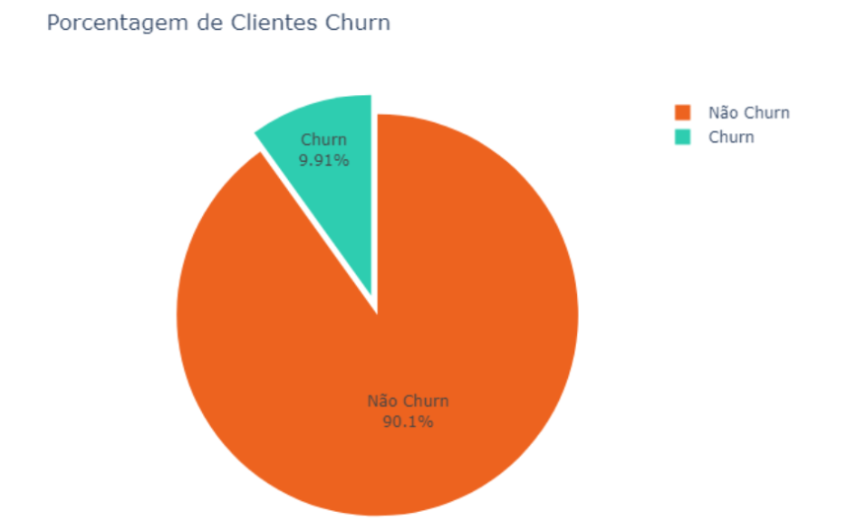
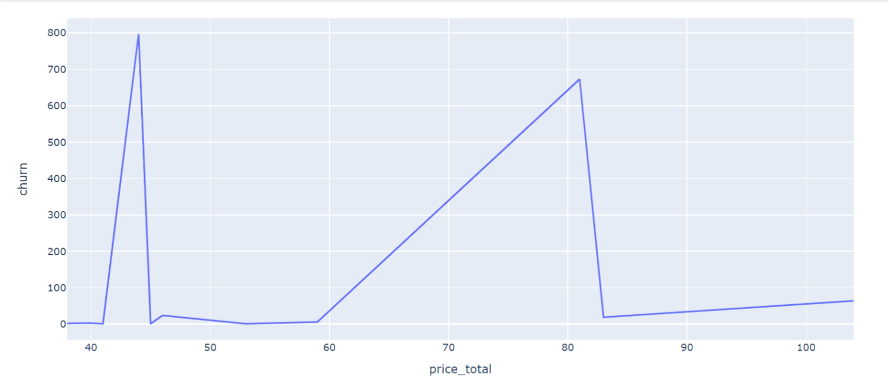

# Predictive Model Documentation - Inteli

## Sinapse
### Sinapse Group
#### (Cecícia Gonçalves, Eduardo Henrique Santos, Gabriel Pelinsari, Joselito Junior, Kaiane Souza, Marcelo Sitton, and Marco Rizzi)
## Table of Contents
[1. Introduction](#c1)

[2. Objectives and Justification](#c2)

[3. Methodology](#c3)

[4. Development and Results](#c4)

[5. Conclusions and Recommendations](#c5)

[6. References](#c6)

[Annexes](#attachments)

## <a name="c1"></a>1. Introduction
The Sinapse Group has developed a solution for a global consulting company. More specifically, a predictive model has been formulated for SSE Airtricity, a medium-sized European company that shares sustainable values, dedicated to supply electricity and gas, aligning with the fictional company for which the provided data corresponds. For contractual reasons, the stakeholder will not be mentioned in this document. However, the proposed solution is a predictive churn model designed to analyze the reasons behind customer attrition for an energy company. All data used for developing the model were provided by the stakeholder partner of Inteli (Institute of Technology and Leadership).

## <a name="c2"></a>2. Objectives and Justification
### 2.1 Objectives
The main objective of the solution is to accurately predict customer churn for SSE Airtricity, enabling the company to identify and retain those customers who are more likely to churn. The project developed by the Sinapse Group focuses on efficiency and the specific needs of the SSE Airtricity client. The aim is to provide insights that can help the company take actions to prevent customer loss, while prioritizing ethical data analysis from the outset.

Another specific initial goal for the solution was to choose a European company that aligns with the provided data, ensuring greater accuracy in conveying brand ideals.

### 2.2 Proposed Solution
The selected approach for the solution is based on Machine Learning, with the programming language Python playing a central role. This facilitated the creation of a robust and efficient predictive model. Furthermore, this model can be easily adapted for use in different scenarios in the future. The model processes and analyzes SSE Airtricity's data to predict customer churn, providing valuable insights to guide retention strategies. To make this process possible, a detailed data preprocessing was carried out to ensure higher quality and predictive capability of the model. The approach also encompassed the analysis of both qualitative and quantitative variables, allowing the model to confidently identify customers more likely to churn and determine the key factors influencing customers' churn decision.

### 2.3 Justification
The solution stands out for its efficiency and scalability. Additionally, the ethical approach and consideration of SSE Airtricity's specific needs ensure the relevance of the solution for the client. The choice of a European company reinforces the realistic adaptation of the solution to the data and market. The methodology used provides access to information with a high level of accuracy, all having over 80% chance of accuracy.


## <a name="c3"></a> 3. Methodology

The approach adopted to develop the predictive model followed the steps of the CRISP-DM methodology, which stands for "Cross-Industry Standard Process for Data Mining." It is a process for developing data mining and predictive modeling projects that aims to provide an organized and systematic framework to guide the involved activities. It consists of six main stages:

* Business Understanding
* Data Understanding
* Data Preparation
* Modeling
* Evaluation
* Deployment
Together, these stages create a cyclical project methodology, allowing for progression to other stages as needed.

The model's performance evaluation was based on metrics such as accuracy, precision, recall, among others. Rigorous evaluation criteria were established to ensure the quality of the solution, including minimum accuracy goals, positive and negative predictive value, recall, as well as F1 Score. To ensure operational excellence, the following criteria were set:

**Accuracy:** The model was developed with a target accuracy rate of at least 80%, allowing for a 20% margin of error. Considering the provided data, this metric is challenging but not an absolute requirement.

**Positive Predictive Value:** Predictions are aimed to achieve a superior metric of 80%, considering that positive predictions should minimize errors.

**Negative Predictive Value:** As important as identifying churn is ensuring non-churn, thus a predictive capacity of above 90% is expected.

**Recall:** Ensuring a true churn rate, the recall model should be at least 80%.

**F1 Score:** As a metric that balances precision and recall, the F1 Score should be maintained at a satisfactory level to achieve robust outcomes.

The solution not only identifies traditional factors like service cost that influence churn but also adopts a holistic approach, aligning with SSE Airtricity's sustainable vision to achieve customer success. To test the solution's effectiveness, tests were conducted in controlled environments, following Nielsen heuristics and evaluating qualitative and quantitative metrics. This ensures that the solution can optimize SSE Airtricity's efforts and resources.

## <a name="c4"></a> 4. Development and Results
### 4.1. Problem Understanding
#### 4.1.1. Industry Context
The industry context, SSE Airtricity, was developed based on Porter's Five Forces, a strategic model used to analyze a sector's competitiveness. This study encompasses the rivalry among competitors, bargaining power of suppliers, threats of new entrants, threats of substitute products, and, finally, bargaining power of customers.
Porter's Five Forces

Image 01 - Porter’s 5 Forces Infographic (SSE Airtricity)

Source: Own authorship


- Rivalry Among Competitors

In the European scenario, SSE Airtricity operates in a highly competitive energy sector, with various companies offering similar services and renewable energy solutions. Competitors include the EDF Group with EDF Energy, E.ON, and RWE, all working with renewable energy. Intense competition can influence prices, service quality, and the company's innovation capacity.

- Bargaining Power of Suppliers

SSE Airtricity may have a dependency on its suppliers to acquire equipment for renewable energy generation, measurement technologies, and other essential elements. The bargaining power of suppliers can be influenced by the availability of alternatives, such as vertical integration, contract negotiations, and supplier diversification, as well as the degree of product differentiation.

- Threat of New Entrants

Entry into the energy market is complex due to significant barriers such as regulations and legal requirements, the need for substantial capital, and the necessity for infrastructure that aligns with the requirements. However, the evolution of technologies and a gradual rise in interest in renewable energy can enable the entry of new companies into these specific segments of the market.

- Threat of Substitute Products

Growing recognition of the importance of renewable energy and adoption of cleaner technologies might pose threats of substitute products or services to SSE Airtricity. Customers might choose more sustainable energy sources, opt for energy generation through competitors like solar panels, or even select cheaper but unsustainable alternatives.

- Bargaining Power of Customers

SSE Airtricity's customers include residential consumers, businesses, and industries seeking renewable energy solutions and electricity supply. The bargaining power of customers can be affected by a variety of supplier choices, competitive prices, and the quality of provided service.


#### 4.1.2. SWOT Analysis

The SWOT Matrix is an analysis that assesses a company's internal aspects by identifying its strengths and weaknesses, while also analyzing the external environment by identifying opportunities and threats. This matrix provides a broad view of factors that can affect the organization, enabling the recognition of available resources, difficulties, and challenges. Based on this analysis, the company can make strategic decisions to improve its competitive position, capitalize on its strengths, and address its weaknesses, aiming to achieve business objectives more effectively. For the presented project context, here is the SWOT analysis.

For explanatory purposes, here is a description of each term in the matrix:

Image 02 - Swot model analysis (SSE Airtricity)


Source: Own authorship


Strengths:
- Service Variety: The company offers both electricity and gas supply, enabling it to address a wider range of customer needs.
- Market Recognition: This can lead to partnerships with other companies.
- Focus on Renewable Energy: This can attract environmentally conscious customers.

Weaknesses:
- Energy Source Dependence: The company might be vulnerable to fluctuations in raw material prices, affecting its revenue.
- High Prices: Price is one of the possible reasons for the high churn rate.
- Difficulty Meeting High Customer Demand.

Opportunities:
- Technology and Innovation: The market provides a conducive environment for the exploration and investment in new technologies. Embracing innovative solutions can bring significant enhancements to the company's operational efficiency.
- Expansion into Other Markets: There is a noteworthy opportunity for the company to extend its operations into additional markets. A noticeable trend is the global expansion of more cost-effective and efficient renewable resources. By seeking out new sources of renewable energy that offer a competitive advantage, the company can capitalize on this opportunity.

Threats:
- Government Regulations: The energy sector is often regulated by the government, posing challenges and costs to the company.
- Intense Competition (with Advancements): The company operates in a highly competitive sector, which can be a threat despite being a leader in wind energy production.
- Economic Fluctuations due to Brexit, UK Government Instability, and Ukraine-Russia Conflict: These global events affect the energy sector, negatively influencing the company.

#### 4.1.3. Overall Solution Planning

##### Available Data
The available dataset encompasses a wide range of information related to customers and their interactions with the company. This includes details such as individual churn in the sample, indicating whether customers remained or left their contracts with the company. Additionally, it offers information about the specific activity each customer engaged in, the sales channel used, and electricity and/or gas consumption patterns over the past 12 months, including specific consumption in the last month. Relevant data about dates, contract start and end, upcoming contract renewals, and the customer's initial contact are also provided.

The dataset goes further by presenting predictions for both consumption and electricity bills, along with financial indicators such as gross and net margins related to energy enrollments. Technical aspects such as energy price variations throughout the day and applied meter bill discounts are also covered. Details about the customer's duration of relationship with the company, initial participation in electricity campaigns, active product counts, and gas consumption are equally incorporated.

##### Proposed Solution
The proposed solution involves creating a predictive model to analyze and support decisions related to customer churn. This model is capable of examining the reasons behind customer departures. The development of the solution was driven by efficiency and customer needs, with a strong focus on avoiding biases and ethical considerations.

To ensure alignment with the identity and principles of a real brand, SSE Airtricity, an Irish company known for its sustainable commitment to electricity and gas supply, was selected. This choice made the data more congruent and the approach more consistent.

The heart of the solution lies in the application of Machine Learning, particularly using the Python programming language. This approach not only demonstrated effectiveness but also was designed with scalability in mind, enabling reuse in future consultations.

##### Task Type
The task type is classification since it involves categorizing or assigning an input instance to a predefined class. The output is a discrete class or category, in this case, a churn or non-churn response. Performance evaluation metrics such as accuracy can be used for this classification model.

##### Usage
Based on the results, managers can focus on customers with a higher likelihood of churn, utilizing the provided visualizations to understand key metrics and factors influencing this likelihood. This will allow managers to personalize approaches and strategies to retain these customers, aligning with the company's values.

##### Benefits
The benefits brought by the proposed solution include understanding the data correlating customer exits and other metrics like price volatility, enabling informed decision-making within the company.

##### Success Criterion and Metric
The model's performance evaluation considers metrics like accuracy, precision, and recall. Criteria were set to evaluate solution quality, including minimum goals for accuracy, positive and negative predictive value, as well as recall. For accuracy, the model's development aimed to achieve at least 80% accuracy, allowing a margin of error of up to 20%. For positive predictive value, predictions were optimized for a positive predictive value exceeding 80%, minimizing errors in positive predictions. For negative predictive value, besides correctly identifying "Churn" cases, it's crucial to avoid false "Churns," so the expected predictive capacity for negative cases is over 90%. Lastly, recall, used to ensure effective detection of real "Churn" cases, is targeted at least 80%.

#### 4.1.4. Value Proposition Canvas
The project employs a solution-centric approach, which reduces potential negative impacts, ensures value creation, and customer satisfaction throughout the process. This approach makes risk management intelligent and aligned with project objectives through the Value Proposition Canvas. This strategic tool is essential for risk assessment and management in projects or implementations. By comprehensively analyzing key elements of the value proposition and customer needs, the matrix enables the prioritization of critical risks and implementation of suitable preventive and corrective measures.


<div align="center">
  <p>Image 03 - Value Proposition Canvas</p>
  
  <p>Source: Own authorship</p>
</div>

#### 4.1.5. Risk Matrix
Risk assessment and management are fundamental for projects or implementations, and the risk matrix plays a pivotal role in this process. A well-constructed matrix allows the team to prioritize the most critical risks and facilitates the implementation of appropriate preventive and corrective measures. This reduces potential negative impacts. Considering the team's characteristics and the project's specifics, we present a risk analysis tailored to this endeavor.

### Figura 02 - Risk Matrix for Threats and Opportunities

Image 04 - Risk Matrix for Threats and Opportunities


Source: Own authorship

Risk Matrix
Source: (Modified Template) https://qualitytools.org/risk-matrix-probability-and-impact-matrix/

In order to improve the clarity of the image, we transcribed the text contained in it and structured it into separate sections as follows:

**Potential Risks:**
- Not meeting the scope (Probability: Very Low X Impact: Very High);
- Using irrelevant data for churn prediction (Probability: Low X Impact: High);
- Lack of data for AI training (Probability: Moderate X Impact: High);
- Not achieving relatively good prediction accuracy according to specified parameters (Probability: Low X Impact: Very High);
- The software not meeting the expectations of the consulting company or end client (Probability: Moderate X Impact: Very High);
- Large amount of data and many metrics to follow (Probability: Moderate X Impact: Moderate);

**Real Risks:**
- Lack of time to refine the project (Probability: High 70% X Impact: Very Low);
- Lack of technical knowledge to carry out the project (Probability: Low X Impact: Very Low);
- Lack of organization to deliver within the stipulated date (Probability: Very Low X Impact: Low);
- Negative usability interface (Probability: Very Low X Impact: Moderate);
- Communication failures between the team and the project (Probability: Very Low X Impact: Moderate);

**Action and Response Plan for all Risks:**
**Potential:**
- Create a realistic schedule and assign specific tasks to the team, keeping them well updated about the project scope and client expectations. Encourage continuous improvement and enhancement efforts to achieve objectives within the established timeframe.
- When processing table data, ensure thorough filtering of unnecessary information to avoid potential interference during AI training, thus preventing incorrect predictions.
- Conduct a detailed analysis of the data used with the entire team to ensure its relevance and quality before incorporating it into the model.
**Real:**
- By adhering to good planning and organizational practices, time scarcity can be mitigated. Agile methodologies and Kanban principles will be employed to divide tasks efficiently and complete them on time.
- At the project's inception, create a basic plan focused solely on the scope to prevent client disappointment due to unmet expectations.
- Additionally, ensure that the software is effective and visually appealing to satisfy the client's requirements.
- Follow interface design principles and usability best practices during the project's interface development.
- Cultivate an environment of open and honest communication, encouraging team members to report problems or concerns.

**Potential Opportunities:**
- Optimization of time for churn prediction using AI; (Probability: Very High 90% X Impact: High)
- Continuation of MVP after the module; (Probability: Very Low 10% X Impact: Moderate)
- Increased visibility for the consulting company due to the sale of an efficient software; (Probability: Very Low 10% X Impact: Very High)
**Real Opportunities:**
- Optimization of time for churn prediction using AI; (Probability: Very High 90% X Impact: High)
- Relevant datasets available for AI training; (Probability: Intermediate 70% X Impact: High)
- Reduction in churn through results generated by AI; (Probability: Intermediate 70% X Impact: High)
- A highly capable and engaged project team; (Probability: Medium 50% X Impact: Very High)

**Action and Response Plan for all Opportunities:**
**Potential:**
- Optimizing AI response time will lead to more efficient software that better meets client expectations, ultimately enhancing the quality of the final product.
- If client expectations are met and the software's testing is successful, there is a high probability of MVP continuation.
- In the event that the MVP meets client expectations and is successfully sold to PowerCo, the contracting consulting company will gain significant market visibility.
**Real:**
- Improving the algorithm will reduce AI prediction time, positioning the software as a leader among competitors.
- Access to the PowerCo-provided database will yield more accurate data for AI training, increasing the accuracy level of the product.
- After achieving a stable and high prediction metric, the PowerCo churn rate can be reduced, benefiting the organization through the software's usability.
- An engaged and self-directed team will deliver a high-quality product that meets the needs of the customer.

#### 4.1.6. Personas
A persona is a fictional representation of an ideal business customer, constructed based on real information and characteristics of the target audience. This marketing tool plays a crucial role in helping companies better understand the needs, desires, behaviors, and expectations of potential customers.

The relevance of personas lies in their ability to guide the creation of more effective and targeted content and marketing strategies, thereby increasing the likelihood of campaign success and acquiring new customers. As part of this project, illustrative images of the identified personas were created:

Image 05 - Persona Template

Source: Own authorship

Image 06 - Persona Template

Source: Own authorship

#### 4.1.7. User Journeys


Source: Own authorship

#### 4.1.8 Privacy Policy

1. General Information about the Organization:

    SSE Airtricity is a company in the energy sector, specializing in electricity production and distribution. Its commitment is to provide a reliable and sustainable energy supply, driving development and ensuring the well-being of the communities it serves. With infrastructure and technologies, it caters to a variety of customers, offering customized solutions to meet the specific needs of small and medium enterprises (SMEs) across different sectors.

2. Information on Data Processing:

    The provided data is used and stored by the organization to process and cleanse the data. Irrelevant, erroneous, or missing values are identified and treated, and a standardized approach is applied throughout the dataset. As a result, a clean dataset is prepared for application in various algorithms required for different analyses.

3. What Data is Collected?

    The following data was collected:

    - Churn data for each individual in the sample, indicating whether they have left or not;
    - Activity category of the company: which electricity campaign each client subscribed to;
    - Sales channel used;
    - Electricity and/or gas consumption for the last 12 months;
    - Electricity consumption for the last month;
    - Activation and/or contract end dates and the next contract renewal date;
    - First client contact date;
    - Estimated electricity bills in relation to the base value ($) for the next month and/or year;
    - Predicted consumption (in kWh) for the next month and year;
    - Predicted rental meter discount consumption for the next 12 months;
    - Predicted electricity prices for two periods of the day;
    - Indication if the client is also a gas consumer;
    - Gross and net profit margin financial indicators for energy subscriptions;
    - Number of active products and services;
    - Total net margin, how long (in years) the client has been with the company;
    - Code of the first electricity campaign the client subscribed to;
    - Amount of energy consumed in kWh;
    Reference dates;
    - Energy price ($/kWh) and gross prices ($) for three periods of the day.

4. Where are the Data Collected?

    The collected data is obtained within the company itself, meaning it is information gathered over the course of the provider-consumer relationship.

5. What

 are the Data Used for?

    Ethical and intelligent data usage is crucial for identifying customers with higher churn probabilities. Through in-depth analysis, SSE Airtricity can identify patterns indicating which users are more likely to churn. This thorough investigation allows the company to understand the factors influencing customer churn. This insight can help identify service shortcomings, pricing influences, and other aspects contributing to customer dissatisfaction and subsequent churn.

6. Where is the Data Stored?

    The obtained data is stored within the organization, with data protection officers and controllers responsible for securing and ensuring the integrity of sensitive information, in compliance with data protection regulations.

7. How Long is the Data Stored?

    The data is stored for periods allowing analysis of scenarios and understanding of positive or negative factors for the company. This historical data strategy plays a crucial role in trend analysis, identifying seasonal patterns, performance evaluation, and informed decision-making.

8. Use of Cookies and Similar Technologies?

    In the commercial sector of electricity companies and this kind of data storage, there is no use of cookies or similar technologies. Cookies are small text files used for various purposes, such as tracking or collecting personal data. Some cookies are strictly necessary for basic website functionality, while others have more specific purposes. However, these are not used in this context of data taxonomy and information storage. All collected and stored data is proprietary to the company and obtained from the connection between providers and customers.

9. With Whom are the Data Shared?

    The collected information will be stored securely and restricted, accessible only by relevant parties directly involved in the project. Only data providers, responsible data department members, and designated developers will have permission to access the recorded data. Access will be strictly controlled and limited to individuals responsible for data processing, ensuring privacy and information integrity. Stringent security measures are implemented to protect customer data confidentiality and prevent unauthorized access.

10. Information on Security Measures Adopted by the Company:

    Multiple security measures are in place to protect consumer information and ensure data privacy. These measures aim to prevent unauthorized access, misuse, and unauthorized disclosure of consumer personal information. Among these measures are restricted access to sensitive information, network security, activity monitoring, employee training on data leaks, consumer policies, and security testing. All these factors contribute to maintaining the organization's security and ensuring effective customer data protection.

11. Guidelines on How User Rights are Addressed:

    User rights are fully respected and considered regarding confirmation of data processing, access to processed information, and entities with which this information has been shared. Additionally, consideration is given to limiting unnecessary, excessive, illegal, or consent-based data processing. Revocation of consent is also respected, and customers have full control and awareness of all data usage.

    Furthermore, data portability to another service provider or product is offered if the customer chooses to terminate the contract. Correction of incomplete, inaccurate, or outdated data is also ensured. Additionally, data owners are informed about the option of not providing consent and the resulting consequences.

12. Information on How Data Subjects Can Request and Exercise Their Rights:

    Before providing their data, data subjects must agree to and sign the terms of use. They can also contact and request any of the following services: request information about what personal data is being collected and processed, correct inaccurate or incomplete personal data, or even request the deletion of their personal data under certain circumstances. Available channels include website forms, email, or the customer service channel.

13. Contact Information for the Data Protection Officer (DPO) or Data Protection Representative:

    To contact the Data Protection Officer, use the provided address, email, or contact form to send a request or inquiry to the DPO. Additionally, messages can be directed to the privacy department to obtain information about data security and storage.


### 4.2. Data Understanding

To ensure the attainment of clean data, we determined that initiating with data analysis was essential. This analysis consisted of examining the accessible data, aiming to identify inconsistencies, duplications, or discrepancies. This procedure involved the comparison of datasets to find patterns.

Later on, we treated the data based on hypotheses we formulated. By assuming specific variables were interconnected in particular ways, we applied techniques like imputing missing values and standardizing formats. These hypotheses were developed based on our initial comprehension of the data.

Following the treatment of the data, we started an exploratory analysis. This phase involved deploying graphs and other visualization techniques to facilitate a deeper understanding of variable relationships. The exploratory analysis helped to identify possible patterns.

If the hypotheses held valid at the conclusion of the analysis, the data earned the designation of being clean. The hypotheses crafted were validated based on the outcomes of the exploratory analysis. Only when the hypotheses were confirmed and the data underwent thorough validation, they were considered suitable for utilization.

It's important to acknowledge that this process is an iterative cycle, akin to the CRISP-DM (Cross-Industry Standard Process for Data Mining) methodology. As new data is acquired, hypotheses may evolve, prompting a repetition of the analysis, treatment, and cleansing process (inspired by the CRISP-DM approach). This repetition ensures that the data remains relevant and reliable over time.


#### 4.2.1. Data Exploration

Data exploration was carried out using Google Collab with the aim of understanding a dataset through descriptive statistics and visualizations. Initially, the data was imported into the Colab environment. Subsequently, an effort was made to identify whether each column is discrete numeric, continuous numeric, nominal categorical, or ordinal categorical. This guided the approach to analysis. Descriptive statistics such as mean and standard deviation were calculated for numeric columns, revealing insights about distributions.

Below, you can observe the type to which each column belongs, with numeric columns classified as either ordinal numbers (indicating position or order) or continuous numbers (integers or real numbers), and among the categorical columns, there are nominal ones (different categories without a specific order) and ordinal ones (possessing a specific order or ranking).

Sure, here's the translation of the second column:

| Column                    | Data Type           |
|---------------------------|---------------------|
| id                        | Discrete Number     |
| activity_new              | Ordinal Categorical |
| campaign_disc_ele         | Null                |
| channel_sales             | Nominal Categorical |
| cons_12m                  | Continuous Number   |
| con_gas_12m               | Continuous Number   |
| cons_last_month           | Continuous Number   |
| data_activ                | Discrete Number     |
| data_end                  | Discrete Number     |
| data_first_activ          | Discrete Number     |
| data_modif_prod           | Discrete Number     |
| data_renewal              | Discrete Number     |
| forecast_base_bill_ele    | Continuous Number   |
| forecast_case_bill_year   | Continuous Number   |
| forecast_bill_12m         | Continuous Number   |
| forecast_cons             | Continuous Number   |
| forecast_cons_12m         | Continuous Number   |
| forecast_cons_year        | Continuous Number   |
| forecast_discont_energy   | Discrete Number     |
| forecast_meter_rent_12m   | Continuous Number   |
| forecast_prince_energy_p1 | Continuous Number   |
| forecast_price_energy_p2  | Continuous Number   |
| forecast_price_pow_p1     | Continuous Number   |
| has_gas                   | Nominal Categorical |
| imp_cons                  | Continuous Number   |
| margin_gross_pow_ele      | Continuous Number   |
| margin_net_pow_ele        | Continuous Number   |
| nb_prod_act               | Discrete Number     |
| net_marigin               | Continuous Number   |
| num_years_anting          | Discrete Number     |
| origin_up                 | Nominal Categorical |
| pow_max                   | Continuous Number   |
| price_date                | Continuous Number   |
| price_p1_var              | Continuous Number   |
| price_p2_var              | Continuous Number   |
| price_p3_var              | Continuous Number   |
| price_p1_fix              | Continuous Number   |
| price_p2_fix              | Continuous Number   |
| price_p3_fix              | Continuous Number   |
| churned                   | Discrete Number     |

The central part involves creating three relational charts between selected columns. These visualizations, such as histograms or scatter plots, highlight patterns and correlations. The process aims to provide a deeper understanding of the information within the data, assisting in making informed decisions. Upon completing this data exploration in Google Colab, the goal is to offer a concise and valuable view of the dataset's characteristics, demonstrating how statistics and visualizations work together to reveal relevant insights.

The first graph produced was intended to work with the central column of the project, which is the `churn` column, indicating customers who left within a 3-month period. It contained integer values between 0 and 1, making it easier to visualize the percentage of customers who left and those who stayed with the company. Customers who left had a value of 1, while those who remained had a value of 0. With the help of the Pandas and Matplotlib libraries, it was possible to construct this graph:



Source: Own authorship

Seeking a deeper understanding of how to relate the remaining columns present in the data, a heatmap was constructed using the Seaborn library. This heatmap allows for the visualization of correlations between column values. The correlation scale ranges from 0 to 1, where 1 represents a maximum relationship between the columns. It's noteworthy that when comparing a column to itself, the value is 1, as expected since the data is identical.

However, the main objective was to identify relationships between columns that weren't evident to the naked eye. By comparing the data, it became possible to find columns that exhibited significant similarity in their patterns, even if they didn't initially appear correlated. The image below illustrates these correlations in a more detailed and meticulous manner.


Source: Own authorship

In the addresses below, you will be redirected to the Colab environment, where you can perform data analysis on both the customer and pricing tables. Data exploration and preprocessing are included for both tables. In the third provided link, you will find a dictionary created by our group, integrated into the Google spreadsheet. This dictionary provides a more in-depth description of each column, specifying the type of data contained and presenting the assumptions formulated regarding each analyzed scenario:

Google collab:
1. Clients;
https://colab.research.google.com/drive/1JatnxJIsnlIf4QqYD7npcWB1AdeDZePG#scrollTo=jk4Vp-ndNuCP
2. Prices;
https://colab.research.google.com/drive/1Tzxnlh39_TdOt6eOVbJ9tZWFq7kGiJ2U#scrollTo=JCpWAb4cPbjH

Planilha Google:
1. Dictionary:
https://docs.google.com/spreadsheets/d/1Z68OfUbNVbiQv_ZUn3DJorZGYV5e_cHYu3DAbyvoe9w/edit#gid=0

#### 4.2.2. Data Preprocessing

Data preprocessing refers to a set of techniques and steps applied to raw datasets with the aim of preparing them for analysis or modeling, ensuring their cleanliness and coherence. These techniques encompass various tasks, ranging from data cleaning, such as removing missing or inconsistent values and transforming variables, to scale normalization and creating relevant features, as will be outlined in this document. Additionally, preprocessing can also involve reducing dimensionality to handle redundant information and detecting outliers. By conducting preprocessing, data becomes more suitable for knowledge extraction and insights by analysis and modeling algorithms.
For a better analysis of the model, we will separate the cleaning and preprocessing into two tables: The customer data table and the pricing table.
### Tabela "Dados_clientes" (Customer Data Table)
In this table, a detailed analysis was conducted with a focus on standardizing measures and regularizing metrics, whether they are categorical or numerical. Additionally, an outlier removal process was performed.
The first step involved transforming the `has_gas` column to *Boolean*, which stores "v" (true) or "f" (false) to indicate whether the customer has gas or not. This transformation simplifies the interpretation of data for the predictive model.
```
# The purpose of this cell is to replace the bool values ​​of the 'has_gas' column for numerical values.
#0 for false and 1 for true
df_clientes['has_gas'] = df_clientes['has_gas'].replace( {'f':0, 't':1} )
df_clientes.head()
```

After that, columns with extremely high numerical data were analyzed, and we standardized them so that the machine can have better processing and analysis when using these values for its prediction. In this case, the selected columns of interest were stored in `scaled_data`, so that later, the `StandardScaler()` method is applied to bring all values within the same range of variation.
```
# Creating the Standard Scaler object
scaler = StandardScaler()
scaled_data = df_clientes[['cons_12m', 'cons_gas_12m', 'cons_last_month', 'forecast_price_pow_p1', 'imp_cons', 'margin_gross_pow_ele', 'margin_net_pow_ele', 'net_margin', 'num_years_antig', 'pow_max']]
# Fitting and transforming the data
df_scaled = pd.DataFrame(scaler.fit_transform(scaled_data), columns = scaled_data.columns)
df_clientes = df_clientes.drop(['cons_12m', 'cons_gas_12m', 'cons_last_month', 'forecast_price_pow_p1', 'imp_cons', 'margin_gross_pow_ele', 'margin_net_pow_ele', 'net_margin', 'num_years_antig', 'pow_max'], axis=1)
df_clientes_scaled = df_clientes.join(df_scaled, rsuffix='_right')
```
With this initial processing, the columns can be analyzed and modified according to their own values and relationships, without the risk of losing meaning.
The first column to be treated is `activity_new`. This column represents the category of the person who contracted the service, but its terms are encoded, which makes accessing the information difficult. The column has 8,221 filled values out of a total of 20,119 rows, which corresponds to approximately 40% of the filled data.
Treating this column involves converting the categorical data into numerical data, aiming to facilitate analysis by the predictive model.
```
# Function to convert strings (objects) into numbers, so that the machine can better comprehend them when making predictions.
label_encoder1 = LabelEncoder()
df_clientes['activity_new'] = label_encoder1.fit_transform(df_clientes['activity_new'])
# The function filled the null values for 0 instead
```
The column `campaign_disc_ele` represents the electricity campaign code. It should be noted that this column has its rows with 0% of filling. Therefore, we used the following code to discard the mentioned column.
```
# This column was disregarded since there were no cell with data
df_clientes = df_clientes.drop('campaign_disc_ele', axis = 1)
```
The next column is `channel_sales`, which represents the channel through which the service was sold. However, this column contains empty elements, with a fill rate of approximately 73%. This column originally consisted of categorical data that, after standardization, became numerical in nature. The code used for this transformation is shown below:
```
# Function to convert strings (objects) into numbers, so that the machine can better comprehend them when making predictions
label_encoder2 = LabelEncoder()
df_clientes['channel_sales'] = label_encoder2.fit_transform(df_clientes['channel_sales'])
df_clientes['channel_sales'].unique()
# The function filled the null values for 0 instead
```
The next column analyzed was `date_activ`. This column represents customer contract activation dates and is initially defined as a **string**. For processing, the values, previously in date format, were transformed into numerical values. This column is 100% filled. First, it was observed that there are dates in this column that do not make coherent sense, so a function was developed to handle these errors. After that, the analyzed dates were converted into sine and cosine functions to make the interpretation of these values more comprehensible for the model.
```
# Function created to handle non-existent dates, such as: 29/02/2017.
def to_dt(cell):
  try:
    if pd.isnull(cell):
        return cell
    elif int(cell.split('/')[0]) == 29 and int(cell.split('/')[1]) == 2:
        return cell.replace('29/02', '28/02')
    else:
        return cell
  except:
    return cell
# Replace the dates with values that are more easily understandable for the machine, using sine and cosine transformations.
df_clientes['date_activ'] = df_clientes['date_activ'].apply(to_dt)
df_clientes['date_activ'] = pd.to_datetime(df_clientes['date_activ'])
df_clientes['dia_do_ano'] = df_clientes['date_activ'].dt.dayofyear
df_clientes['date_activ_sin'] = np.sin(2 * np.pi * df_clientes['dia_do_ano']/365)
df_clientes['dia_activ_cos'] = np.cos(2 * np.pi * df_clientes['dia_do_ano']/365)
df_clientes = df_clientes.drop(['date_activ'], axis=1)
df_clientes = df_clientes.drop(['dia_do_ano'], axis=1)
```
Another date column that was processed is the `data_end` column, which represents customer contract end dates. It was originally formatted as dates, and thus, these values should be transformed into numerical values. The column is filled to 99.7%. To handle dates that don't make sense, the date correction function was used again. After that, the same treatment as applied to the `date_activ` column was used, converting the data into cosine and sine values.
```
# Function created to handle non-existent dates, such as: 29/02/2017.
def to_dt(cell):
  try:
    if pd.isnull(cell):
        return cell
    elif int(cell.split('/')[0]) == 29 and int(cell.split('/')[1]) == 2:
        return cell.replace('29/02', '28/02')
    else:
        return cell
  except:
    return cell
# Replace the dates with values that are more easily understandable for the machine, using sine and cosine transformations.
df_clientes['date_end'] = df_clientes['date_end'].apply(to_dt)
df_clientes['date_end'] = pd.to_datetime(df_clientes['date_end'])
df_clientes['dia_do_ano'] = df_clientes['date_end'].dt.dayofyear
df_clientes['date_end_sin'] = np.sin(2 * np.pi * df_clientes['dia_do_ano']/365)
df_clientes['date_end_cos'] = np.cos(2 * np.pi * df_clientes['dia_do_ano']/365)
df_clientes = df_clientes.drop(['date_end'], axis=1)
df_clientes = df_clientes.drop(['dia_do_ano'], axis=1)
```
To continue, the next treated column was `date_first_activ`, which refers to the date of the customer's first contract. It was observed that this column has only 21% of filling, and upon analysis, it's apparent that the `num_years` column represents data related to this. Because of this, the decision was made to remove this column.
```
# Using 'num_years_anting', since both variables essentially represent the same data, and it's 100% filled.
df_clientes = df_clientes.drop('date_first_activ', axis = 1)
```

Subsequently, the `date_modif_prod` column, which contains contract modification dates, was processed. It is formatted as dates; thus, the values should be converted to numerical values. This column is 98% filled. The method used is similar to that of other date columns, involving the correction of incoherent dates and their corresponding transformation into sine and cosine values.
```
# Function created to handle non-existent dates, such as: 29/02/2017.
def to_dt(cell):
  try:
    if pd.isnull(cell):
        return cell
    elif int(cell.split('/')[0]) == 29 and int(cell.split('/')[1]) == 2:
        return cell.replace('29/02', '28/02')
    else:
        return cell
  except:
    return cell
# Replace the dates with values that are more easily understandable for the machine, using sine and cosine transformations.
df_clientes['date_modif_prod'] = df_clientes['date_modif_prod'].apply(to_dt)
df_clientes['date_modif_prod'] = pd.to_datetime(df_clientes['date_modif_prod'])
df_clientes['dia_do_ano'] = df_clientes['date_modif_prod'].dt.dayofyear
df_clientes['date_modif_prod_sin'] = np.sin(2 * np.pi * df_clientes['dia_do_ano']/365)
df_clientes['date_modif_prod_cos'] = np.cos(2 * np.pi * df_clientes['dia_do_ano']/365)
df_clientes = df_clientes.drop(['date_modif_prod'], axis=1)
df_clientes = df_clientes.drop(['dia_do_ano'], axis=1)
```
To conclude the date columns, the `date_renewal` column was corrected. This column represents contract renewal dates and has a fill rate of 99%. Therefore, the same process as with the other date columns was applied to this one as well.
```
# Function created to handle non-existent dates, such as: 29/02/2017.
def to_dt(cell):
  try:
    if pd.isnull(cell):
        return cell
    elif int(cell.split('/')[0]) == 29 and int(cell.split('/')[1]) == 2:
        return cell.replace('29/02', '28/02')
    else:
        return cell
  except:
    return cell
# Replace the dates with values that are more easily understandable for the machine, using sine and cosine transformations.
df_clientes['date_renewal'] = df_clientes['date_renewal'].apply(to_dt)
df_clientes['date_renewal'] = pd.to_datetime(df_clientes['date_renewal'])
df_clientes['dia_do_ano'] = df_clientes['date_renewal'].dt.dayofyear
df_clientes['date_renewal_sin'] = np.sin(2 * np.pi * df_clientes['dia_do_ano']/365)
df_clientes['date_renewal_cos'] = np.cos(2 * np.pi * df_clientes['dia_do_ano']/365)
df_clientes = df_clientes.drop(['date_renewal'], axis=1)
df_clientes = df_clientes.drop(['dia_do_ano'], axis=1)
```
The table contains the following columns: forecast_base_bill_year, forecast_bill_12m, forecast_cons, forecast_cons_12m, forecast_cons_year, forecast_discount_energy, forecast_meter_rent_12m, forecast_price_energy_p1, forecast_price_energy_p2. These columns represent the expected price for specific metrics of the project. However, an analysis was conducted on these columns, and none of them received separate treatment since they had low fill rates, which were handled through linear regression. The following code was used, which generically represents the analysis of the tables with the quantity of zeros contained in the columns and their general information:
```
quantidade_zeros = (df_generico['forecast_x'] == 0).sum()
df_generico['forecast_x'].info()
```
The next analysis conducted was on the `nb_prod_act` column, which represents the number of active products and services per customer. This column was already 100% filled, making its analysis straightforward. As such, simple codes were used to assess the quantity of null and unique values in the column. It can be concluded that the column does not require specific treatment.
```
df_clientes['nb_prod_act'].info()
df_clientes['nb_prod_act'].unique()
```
The `origin_up` column stores values that correspond to the first electricity campaign the customer subscribed to, and it consists of categorical data. We used the command ".unique" to check for unique values, resulting in 6 categories and some null values. Furthermore, this column will be important for further analyses as it's filled to 99.4%, and it relates to other columns, potentially yielding improved results for the model.
The `cons_12m` column indicates electricity consumption over the last 12 months. It consists of numerical data, is 100% filled, and aids in analyzing existing correlations, primarily due to its valuable and essential information for understanding the database and the electrical consumption activities of each customer. Thus, it will help in comprehending consumption behaviors and their relationship with prices, time periods, and even churn.
Next, the `cons_gas_12m` column was analyzed. This column pertains to customers' 12-month gas consumption, measured in kWh, and is fully filled. It directly relates to churn, as a sudden decrease in gas consumption might suggest customer dissatisfaction.
```
# Column of 'gas consumption in the last 12 months (kWh)' - 100% filled.
# Column with numerical data.
df_clientes['cons_gas_12m'].info()
df_clientes['cons_gas_12m'].unique()
df_clientes['cons_gas_12m'].describe()
```
The used codes served solely for a deeper analysis of the column values, providing information about data type, unique values, and descriptive statistics. Based on this analysis, no measures will be applied for correcting or treating these values.
Shifting focus to the `cons_last_month` column, it represents electricity consumption in kilowatt-hours (kWh) for the last month. Completely filled, it contains numerical data. This column can be highly influential in churn prediction, as sudden drops might indicate dissatisfaction or potential attrition, while significant increases could reveal changes in behavior.
```
# Column of 'electricity consumption of the last month (kWh)' - 100% filled.
# Column with numerical data.
df_clientes['cons_last_month'].info()
df_clientes['cons_last_month'].unique()
df_clientes['cons_last_month'].describe()
```
When analyzing, we used `info()` to understand the data type and integrity. `unique()` displays the unique values. Meanwhile, `describe()` provides statistics like mean and maximum to comprehend its distribution. Following this detailed analysis, we concluded that there is no need to apply any modifications to these values.
The `forecast_price_pow_p1` column contains estimated energy prices for the first period in dollars, with a fill rate of 99.2%. Analyzing its information can provide valuable insights, enriching the understanding of customer behavior within the energy context.
```
# Column of 'predicted energy price for 1st period ($)' - 99.2% filled.
# Column with numerical data.
df_clientes['forecast_price_pow_p1'].info()
df_clientes['forecast_price_pow_p1'].unique()
df_clientes['forecast_price_pow_p1'].describe()
```
The `imp_cons` column refers to the current consumption paid in kilowatt-hours (kWh), with 100% of values filled. This is a numerical column that can unveil relevant information about customer consumption.
```
# Column of 'current paid consumption (kWh)' - 100% filled.
# Column with numerical data.
df_clientes['imp_cons'].info()
df_clientes['imp_cons'].unique()
df_clientes['imp_cons'].describe()
```
Through the analysis of its unique values and descriptive statistics, it's possible to understand consumption patterns and evaluate how this data relates to other variables. Customers with low current paid consumption might indicate limited usage of services (energy and gas). This could be related to an unsatisfactory experience or technical issues, thereby increasing the likelihood of churn.
The `margin_gross_pow_ele` column pertains to the gross margin in energy subscription and is fully filled. A high margin in energy subscription can influence customers' decisions regarding churn.
```
# Column of 'gross margin in energy subscription ($)' - 100% filled.
# Column with numerical data.
df_clientes['margin_gross_pow_ele'].info()
df_clientes['imp_cons'].unique()
df_clientes['imp_cons'].describe()
```
During the analysis, data was explored to understand its characteristics and quality. Similar to other columns, unique values present in the data were identified, and descriptive statistics were calculated to gain insights into data distribution. After this assessment, it was determined that no changes are needed in the values, apart from standardization.
The `net_margin` column represents the total net margin in dollars, with a fill rate of 99.9%. Lower net margins might indicate higher costs in relation to the service, potentially leading to dissatisfaction and subsequently churn.
```
# Column of 'total net margin ($)' - 99.9% filled.
# Column with numerical data.
df_clientes['net_margin'].info()
df_clientes['net_margin'].unique()
df_clientes['net_margin'].describe()
```
	After analyzing the data, considering that the majority of the column is complete, there was no need to apply any preprocessing methods.
Additional insight provided for the analysis is present in the `num_years_antig` column, which indicates, through numerical data, how many years the customer has been with the company. In other words, it represents the duration of each gas or electricity consumer from the initial contract date to the disconnection from the company. This suggests a significant potential for understanding the probability of churn for each customer and identifying patterns in relation to churn and the longevity of each customer with the company.

```
# Column of 'how many years the customer has been with the company' - 100% filled.
# Column with numerical data.
df_clientes['num_years_antig'].info()
df_clientes['num_years_antig'].unique()
df_clientes['num_years_antig'].describe()
```
This dataset is fully filled and standardized in relation to all other numerical data after data processing.

The last column presented is `pow_max`, which contains information about the subscribed power of each customer. These values are provided in kilowatt-hours (kWh) and fill 99% of the column. Therefore, they are numerical values that contribute to the analysis of relationships between consumption, price, and churn.

```
# Column of 'subscribed power (kWh)' - 99.9% filled.
# Column with numerical data.
df_clientes['pow_max'].info()
df_clientes['pow_max'].unique()
df_clientes['pow_max'].describe()
```


The values have been processed through data standardization and organized in a way that facilitates the machine's understanding of potential patterns.

### Table `Customer_Data`

In this pricing table, the intention was to standardize the information on the same scale, transform data unreadable by the machine, such as dates, into understandable numerical formats, and eliminate null values and outliers (values that significantly deviate from the dataset).

Initially, the dates were transformed into two columns, represented through their sine and cosine components. Later, the original date column was dropped.

```
df_prices['price_date'] = pd.to_datetime(df_prices['price_date'])
df_prices['day_of_the_year'] = df_prices['price_date'].dt.dayofyear
df_prices['day_of_the_year_sin'] = np.sin(2 * np.pi * df_prices['day_of_the_year']/365)
df_prices['day_of_the_year_cos'] = np.cos(2 * np.pi * df_prices['day_of_the_year']/365)
df_date_dropped = df_prices.drop(['price_date'], axis=1)
df_date_dropped = df_prices.drop(['day_of_the_year'], axis=1)
df_date_dropped.head(40)
```

Afterwards, the values were normalized to the same scale to optimize processing time and improve the machine learning interpretation.

```
# Transform all cells into equally proportional cells on a smaller scale.
scaler = StandardScaler()
scaled_data = df_prices[['price_p1_var', 'price_p2_var', 'price_p3_var', 'price_p1_fix', 'price_p2_fix', 'price_p3_fix']]
df_scaled = pd.DataFrame(scaler.fit_transform(scaled_data), columns=scaled_data.columns)
df_clientes = df_prices.drop(['price_p1_var', 'price_p2_var', 'price_p3_var', 'price_p1_fix', 'price_p2_fix', 'price_p3_fix'], axis=1)
df_clientes_scaled = df_clientes.join(df_scaled, rsuffix='_right')
```
The data in the columns `price_p1_fix`, `price_p2_fix`, and `price_p3_fix`, which contained negative values, were replaced with the arithmetic mean of values from customers who shared the same segment type according to the `activity_new` column. If there were no more than 1 customer with the same activity, a general average was calculated, considering all customers.

```
# Replacing negative values of price_p1_fix, price_p2_fix, and price_p3_fix with an average.
# A function that returns the average.
def to_mean(id, column=None):
    # If the 'column' parameter is not defined, an error will occur.
    if column == None:
        raise ValueError('Insert a column name!')


    # Receives the value of the customer's 'activity_new'.
    activity_new = df_customers[(df_customers['id'] == id) & (df_customers['activity_new'].notnull())]['activity_new']


    # If an 'activity_new' exists, the mean is calculated for all customers with the same segment. Otherwise, a general mean will be calculated.
    if not activity_new.empty:
        activity_new = activity_new.iloc[0]
        ids = df_customers[df_customers['activity_new'] == activity_new]['id']
        # If there are customers with the same segment in the price table, an exclusive mean is calculated.
        if len(ids) > 0:
            return df_prices[df_prices['id'].isin(ids)][column].mean()
        # Otherwise, a general mean is calculated.
        else:
            return df_prices[column].mean()
    else:
        return df_prices[column].mean()


# Selects the negative data corresponding to the 'price_p1_fix' column.
neg_df_prices = df_prices[(df_prices['price_p1_fix'] < 0)]
neg_df_prices['price_p1_fix'] = neg_df_prices['id'].apply(to_mean, column='price_p1_fix')
df_prices.update(neg_df_prices, overwrite=True)


# Selects the negative data corresponding to the 'price_p2_fix' column.
neg_df_prices = df_prices[(df_prices['price_p2_fix'] < 0)]
neg_df_prices['price_p2_fix'] = neg_df_prices['id'].apply(to_mean, column='price_p2_fix')
df_prices.update(neg_df_prices, overwrite=True)


# Selects the negative data corresponding to the 'price_p3_fix' column.
neg_df_prices = df_prices[(df_prices['price_p3_fix'] < 0)]
neg_df_prices['price_p3_fix'] = neg_df_prices['id'].apply(to_mean, column='price_p3_fix')
df_prices.update(neg_df_prices, overwrite=True)
```
	Finally, the `price_total` column was created with the intention of facilitating the creation of a graph that allows comparison between churn rates based on the total price of customers. Initially, a duplicate of the original dataframe was generated, and then the values were gradually converted to floating-point format (float). Next, the `price_total` column was defined as the sum of corresponding values across the three distinct periods.
For the graph's preparation, a new dataframe was created, combining three columns: `id`, `price_total`, and the churn column. Lastly, records with null churn values were removed to optimize visualization.

```
# Column `price_total`
df_precos_copy = df_precos.copy()
df_precos_copy['price_p1_fix'] = df_precos_copy['price_p1_fix'].map(lambda price: float(price))
df_precos_copy['price_p2_fix'] = df_precos_copy['price_p2_fix'].map(lambda price: float(price))
df_precos_copy['price_p3_fix'] = df_precos_copy['price_p3_fix'].map(lambda price: float(price))
df_precos_copy['price_total'] = df_precos_copy['price_p1_fix'] + df_precos_copy['price_p2_fix'] + df_precos_copy['price_p3_fix']
df_precos_copy['price_total'] = df_precos_copy['price_total'].round()
df_precos_copy = df_precos_copy.drop_duplicates(subset='id')


# Creates a dataframe for price and churn.
df_churn_preco = pd.DataFrame({'id': df_clientes['id']})
df_churn_preco = pd.merge(df_churn_preco, df_precos_copy[['id', 'price_total']], on='id', how='left')
df_churn_preco = pd.merge(df_churn_preco, df_churn, on='id', how='left')
df_churn_preco.dropna(subset='churn', inplace=True)
```

#### 4.2.3. Hypotheses

**Hypothesis 1**: The **first hypothesis** tested focused on the *sensitivity of applied values*, as presented in the *TAPI* report. Initially, it was considered that excessively high values could influence the customer churn rate.

As a result, after removing null values and converting data into integers, a table was constructed containing the `price_total` column. This column was created with the purpose of consolidating all price values assigned to customers who churned, identified in the `churned` column with the value **1**. Each customer had their respective values recorded, indicating those who ended their relationship with the company.


Churn according to price


Source: own authorship

**Test 1**: With the related data, it is possible to verify that the *central idea* that price influences churn seems to be a *fuzzy hypothesis*. It can be observed that churn is higher when the values are lower. From the point of "60", churn gradually starts to increase, reaching a peak around "80" (assuming these values are in dollars and refer to a monthly period in the company).

These results have raised more hypotheses, especially regarding the types of customers who tend to leave when prices are lower. Do customers with lower purchasing power lean towards cheaper bills and are more sensitive to value variations? Additionally, how are customers with higher financial capacity affected? Does the increase in churn after surpassing the "60-80" range impact wealthier customers?

To investigate these hypotheses, a more detailed customer segmentation is necessary, which can provide insights into the social context they are in.

**Hypothesis 2**: In this hypothesis, the focus was directed towards more concise data regarding customers' years of tenure in the company. The objective was to check whether customers who churned in the last 3 months had a longer or shorter tenure in the company. The intention was to understand which range of tenure time was more critical for churn, allowing for efforts to be concentrated on the most susceptible customers according to their tenure duration.

Initially, the premise was that newer customers in their early years of the company relationship might be more sensitive, and those within the first two years could be particularly critical in terms of churning. To investigate this hypothesis, a relationship was established between the `num_years_anting` column (number of years of tenure) and the `churned` column. The result of this relationship was represented in the following graph:


Source: Own authorship


Fonte: autoria própria
**Test 2**: What was observed is that in the **first two years**, the customer churn rate is very low. However, churn starts to become more critical from the **third year**, reaching its most critical point in the **fourth year** with over 500 customers ending their relationship with the company. After this period, there are nuances in the trend, and upon reaching the **eight-year mark**, the situation appears to stabilize to some extent.

Hence, it is essential to focus efforts on understanding who these customers are that stay with the company for a period between 3 and 8 years and what drives them to leave during this phase. A viable approach is to investigate whether these customers have multiple services contracted with the company and what their spending projection is. Furthermore, it would be interesting to analyze if there is a pattern of increasing projected expenses and whether this change might be influencing customers to opt for ending their relationship with the company.

**Hypothesis 3**: To comprehend the distinct customer profiles present in the `channel_sales` column – representing the sales channels of the organizations contracting the company's services – an analysis was conducted to identify which categories of organizations have a more pronounced churn tendency based on their origin channel. The objective was to direct attention to these customers and explore the attributes that make them susceptible to churn, represented by the `churned` column.

The underlying hypothesis was that different sales channels might react differently to churn due to variations in their qualitative and quantitative needs. This assumption is based on the understanding that distinct customer categories in diverse sales channels have specific demands and therefore can be affected uniquely.

Due to confidentiality concerns, the organization categories are encoded, and their sales channels as well. The following figures show the graphs relating sales channels to the incidence of churn in the last three months and sales channels with the IDs that churned.


Source: own authorship


**Test 3**: The analysis aimed to identify categories more susceptible to churn in the sales channel. In this context, one channel stood out, exhibiting a considerably higher churn rate compared to others. This channel is `3`, which recorded over 9050 churns in the last 3 months. The second-highest churn channel had fewer than 6000 churns, considerably lower compared to channel `3`. This scenario allows for a more specific focus on these customer channels and understanding the associated data patterns.

Taking a closer look and relating the information from the table, you can see:
- Channel 0: 6 customers and 0 churns (0%)
- Channel 1: 1218 customers and 82 churns (6.7%)
- Channel 2: 4 customers and 0 churns (0%)
- Channel 3: 9168 customers and 922 churns (10%)
- Channel 4: 2601 customers and 116 churns (4%)
- Channel 5: 13 customers and 0 churns (0%)
- Channel 6: 1836 customers and 150 churns (8%)
- Channel 7: 5274 customers and 325 churns (6%)

With this data in mind, it's evident that Channel 3 has the most significant churn rate (10%). Given this scenario, conducting a deeper analysis of customers associated with category 3 is crucial. This will allow investigating behavioral patterns that might be contributing to the high churn in this category. Based on these insights, strategies can be implemented to improve the retention of these customers and optimize their experience.


### 4.3. Preparação dos Dados e Modelagem
### 4.3. Data Preparation and Modeling

#### 4.3.1. Features

&emsp;&emsp;To approach the project in a supervised manner, it was essential to carefully select features that would be used to feed our machine learning model. These features play a critical role in predicting and understanding customer behavior regarding the electricity services offered to them. The following topics aim to describe the features objectively and simply, elucidating their characteristics and functions in the database.
&emsp;&emsp;The purpose behind this description is to relate churn to other columns in the table in order to present possible trends and correlations. Before presenting the selected features, an extensive selection and analysis of existing items in the table were necessary. Initially, the database had about 39 columns, which did not allow for a good analysis, as many of them did not allow for ideal processing and correlation.
&emsp;&emsp;With this in mind, the selection of features can be understood, which are based on a relationship with churn and other columns that may affect it. To begin this analysis, a correlation matrix was created between the features, resulting in the following outcome:

Graph 07 - Feature Correlation Matrix

Source: Developed by the authors

&emsp;&emsp;After this construction, the missing step is simply to understand the need for each feature in the final model. For this purpose, a feature comparison graph was developed.

Graph 08 - Feature Comparison

Source: Developed by the authors

&emsp;&emsp;Based on these visual representations, the features mentioned above were selected.

`activity_new`: This feature represents the customer's main activity and is important for understanding how different sectors can affect energy consumption.

`channel_sales`: The source of contract sales can influence the customer's behavior regarding products and services.

`cons_12m`, `cons_last_month`: The average annual electricity consumption and the consumption in the last month are important features for predicting the customer's future behavior.

`forecast_base_bill_ele`, `forecast_base_bill_year`: These features provide information about billing forecasts based on electricity consumption, which may be relevant for customer decision-making.

`forecast_bill_12m`: This variable is related to projected billing for the next year and is important for understanding the customer's financial expectations.

`forecast_cons`, `forecast_cons_12m`: These features reflect energy consumption predictions.

`forecast_cons_year`, `forecast_meter_rent_12m`: These variables are related to consumption and meter rental predictions, respectively.

`forecast_price_energy_p1` and `forecast_price_energy_p2`: Projected electricity prices can influence the customer's choice of energy providers.

`forecast_price_pow_p1`: The projected electricity power price is an important variable in the context of predicting customer expenses.

`imp_cons`: Current paid energy consumption.

`margin_gross_pow_ele` and `margin_net_pow_ele`: These features are related to gross and net profit margins of power.

`net_margin`: The customer's financial net margin and their payment capacity.

`num_years_antig`: The number of years as a customer, relevant for understanding long-term relationships.

`pow_max`: The maximum power contracted by the customer.

`date_activ_sin`, `date_activ_cos`, `date_end_sin`, `date_end_cos`, `date_modif_prod_sin`, `date_modif_prod_cos`, `date_renewal_sin`, `date_renewal_cos`: Cyclical variables encoded to represent important dates.

&emsp;&emsp;For the next features, an analysis was conducted on how they could be used. In this context, there were 6 columns: `price_p1_var`, `price_p2_var`, `price_p3_var`, `price_p1_fix`, `price_p2_fix`, `price_p3_fix`, which ended up becoming 3 after identifying that they represented customer consumption.

`consumption_p1`, `consumption_p2`, `consumption_p3`: These features represent energy consumption in different periods, important for predicting trends and usage patterns.

&emsp;&emsp;With this analysis, a general transformation was applied to all these features, filling empty and nonsensical data through comparative regression, which adds greater reliability to accuracy. It also provides a positive consequence to the confusion matrix, which is the reduced presence of false positives and negatives in the result.
&emsp;&emsp;It can be concluded that the above features have little significance, except for `num_years_antig` and `pow_max`, but they reveal a good correlation between the data. Therefore, the selected features were the ones mentioned, which already have treatment and correction based on result prediction.

#### 4.3.2. Models

&emsp;&emsp;To make the best use of and ensure the appropriate model for predicting churn, various existing algorithms were tested. Analyzing the metrics established earlier, interpreting the confusion matrix, and always seeking balance, we were able to sample various models. In this context, we sought an algorithm that has good adaptability but does not suffer from overfitting (when the model adapts too much to the data) or underfitting (when the model cannot learn the relationships between classes).
&emsp;&emsp;To facilitate understanding of the confusion matrix, the explanation is provided below.

&emsp;&emsp;The confusion matrix consists of four elements:

- **True Positive (TP)**: Customers correctly predicted as churn in relation to the target, in this specific case, the goal is to identify churn.
- **True Negative (TN)**: Customers correctly predicted as not churning.
- **False Positive (FP)**: Customers incorrectly predicted as churn when they were not.
- **False Negative (FN)**: Customers incorrectly predicted as not churning when they were.

**Confusion Matrix**
Table 02 - Confusion Matrix Definition

|               | Predicted Not Churn (0) | Predicted Churn (1) |
|---------------|-------------------------|----------------------|
| Not Churn (0) | TP                      | FN                   |
| Churn (1)     | FP                      | TN                   |

Source:

- **TP (True Positive)** The higher, the better, as it means that the model is making correct churn predictions.
- **TN (True Negative)** It is also desirable to have a high number of TN, as it indicates that the model is making correct predictions for customers who do not churn.
- **FP (False Positive)** The lower, the better, as it represents customers who were mistakenly identified as churn.
- **FN (False Negative)** It is also desired to minimize this value because it represents customers who were mistakenly identified as not churning when they should be classified as churn.

##### Random Forest Classifier

&emsp;&emsp;**Description:** Random Forest Classifier is a machine learning model that distinguishes itself from others due to its ability to combine multiple decision trees into a single model. The main advantages of this model include its ability to handle high-dimensional data and resistance to overfitting.

&emsp;&emsp;The Random Forest model is a powerful machine learning algorithm used for classification and regression tasks. It operates by creating a forest of decision trees, hence the name "Random Forest." Each tree in the forest is constructed independently using a random sample of the training data and a random selection of features (or attributes) to split the data. This introduces diversity and reduces the risk of overfitting, making the model more robust.

&emsp;&emsp;The operation of Random Forest is based on

 aggregating the predictions of all trees in the forest. For classification, each tree votes on the predicted class, and the class with the most votes is chosen as the final prediction. The model is highly effective due to its ability to handle high-dimensional data, deal with overfitting, and provide feature importances to aid interpretation.

&emsp;&emsp;**Metrics:**

Table 03 - Random Forest Metrics
| Metric    | Training   | Testing   |
|-----------|------------|-----------|
| Accuracy  | 100.0%     | 95.2%     |
| Precision | 100.0%     | 98.7%     |
| Recall    | 100.0%     | 91.6%     |
| F1 Score  | 100.0%     | 95.0%     |

Source: Developed by the authors

&emsp;&emsp;**Accuracy:** In the training set, the model achieved 100% accuracy, indicating a perfect fit to the training data. In the test set, the accuracy remains very high at 95.2%. This suggests that the model is properly adapted to the test data and can generalize well from the training that obtained overfit.

&emsp;&emsp;**Precision:** In the training set, precision is 100%, meaning that all positive predictions made by the model are truly positive. In the test set, precision remains very high, indicating that the model is very selective in its predictions, making very few false positives.

&emsp;&emsp;**Recall:** In the training set, recall is 100%, indicating that all positive instances are being captured. However, in the test set, this percentage drops to 91.6%, indicating that some positive instances are being missed in the test set, but the majority are still being captured.

&emsp;&emsp;**F1 Score:** The F1 Score in the training set is 100%, indicating a perfect balance between precision and recall. In the test set, the F1 Score is 95%, even with a slight decrease in score, indicating an excellent balance. This suggests that the model, in both sets, is performing successfully.

**Confusion Matrix:**
Graph 09 - Confusion Matrix for the Training Set

Source: Developed by the authors

Graph 10 - Confusion Matrix for the Test Set

Source: Developed by the authors

&emsp;&emsp;The Random Forest model is highly prone to overfitting, as seen in the training set. However, the model is very optimistic due to its adaptability. The differences in test and training metrics are minimal. Subject to further improvement, the Random Forest model is highly effective in classification and generalization to new data, with an excellent balance between precision and recall, making it a solid choice for the desired application, which aims to predict churn.

##### Decision Tree Classifier

**Description:** The Decision Tree Classifier¹¹ is a machine learning model known for its visual representation in the form of a decision rule tree. Its main feature is the ability to split training data into subsets based on specific features, forming a hierarchical structure of nodes and leaves. The main advantage of this model is its interpretability; its visual representation makes it easily understood.

**Metrics:**

Table 04 - Decision Tree Classifier Metrics
| Metric    | Training   | Testing   |
|-----------|------------|-----------|
| Accuracy  | 100.0%     | 86.8%     |
| Precision | 100.0%     | 85.8%     |
| Recall    | 100.0%     | 88.1%     |
| F1 Score  | 100.0%     | 86.9%     |

Source: Developed by the authors

**Accuracy:** In the training set, the model achieved an accuracy of 100%, which could indicate either a perfect fit or overfitting. In the test set, the accuracy is slightly lower at 86.8%. This difference suggests that the model might be somewhat overfitting the training data.

**Precision:** Precision in the training set is 100%, meaning that the model's positive predictions are mostly accurate. However, in the test set, precision drops to 85.8%, indicating that the model is producing some false positives, incorrectly classifying some instances as positive when they are negative.

**Recall:** In the training set, recall is 100%, indicating that the model is capturing all positive instances. However, in the test set, this percentage drops to 88.1%, suggesting that some positive instances are being missed.

**F1 Score:** The F1 Score in the training set is 100%, indicating a perfect balance between precision and recall. In the test set, the F1 Score drops to 86.9%, still demonstrating a good balance. This suggests that the model, in both sets, is performing well.

**Confusion Matrix:**
Graph 11 - Confusion Matrix for the Training Set

Source: Developed by the authors

Graph 12 - Confusion Matrix for the Test Set

Source: Developed by the authors

Based on the metrics presented, the Decision Tree model shows a perfect fit to the training data but experiences a drop in performance on the test data. This suggests that the model might be overfitting the training data, struggling to generalize to new data.

##### Extra Trees Classifier

**Description:** The Extra Trees Classifier¹² is a machine learning model similar to the Random Forest Classifier but with a slightly different approach. While Random Forest selects the best feature splits at each node based on specific criteria, this model makes even more random splits at each node, making it more resistant to overfitting.

**Metrics:**

Table 05 - Extra Tree Classifier Metrics
| Metric    | Training   | Testing   |
|-----------|------------|-----------|
| Accuracy  | 100.0%     | 96.7%     |
| Precision | 100.0%     | 98.2%     |
| Recall    | 100.0%     | 95.0%     |
| F1 Score  | 100.0%     | 96.6%     |

Source: Developed by the authors

**Accuracy:** The model achieved an accuracy of 100% in the training set, potentially indicating a perfect fit or overfitting. In the test set, accuracy dropped slightly to 96.7%, suggesting that the model is generalizing well, with a relatively small difference in performance between the training and test sets.

**Precision:** In the training set, precision is 100%, indicating that the model's positive predictions are highly reliable. In the test set, precision decreases slightly to 98.2%, but it remains high, indicating reliable positive predictions.

**Recall:** In the training set, recall is 100%, meaning that the model captures all positive instances. In the test set, recall drops to 95%, indicating that the model identifies the majority of positive instances but misses some.

**F1 Score:** The F1 Score in the training set is 100%, demonstrating a perfect balance between precision and recall. In the test set, the F1 Score is 96.6%, maintaining an excellent balance. This suggests that the model performs effectively in both sets.

**Confusion Matrix:**
Graph 13 - Confusion Matrix for the Training Set

Source: Developed by the authors

Graph 14 - Confusion Matrix for the Test Set

Source: Developed by the authors

Based on the metrics, the "Extra Trees Classifier" model exhibits a perfect fit to the training data with 100% accuracy, precision, recall, and F1 Score. In the test set, there is a slight drop in performance, but the model still generalizes well to new data. This indicates a minor adaptation to the training data, but the model remains effective.

##### Gradient Boosting Classifier

**Description:** The Gradient Boosting Classifier¹³ is a powerful machine learning model that works by continuously combining decision trees. Its main features include correcting errors from previous models during the building process and high accuracy. The advantage of this model over others is its ability to handle imbalanced data and high resistance to overfitting.

**Metrics:**

Table 06 - Gradient Boosting Classifier Metrics
| Metric    | Training   | Testing   |
|-----------|------------|-----------|
| Accuracy  | 90.3%      | 89.1%     |
| Precision | 95.2%      | 93.8%     |
| Recall    | 84.9%      | 83.5%     |
| F1 Score  | 89.8%      | 88.4%     |

Source: Developed by the authors

**Accuracy:** Accuracy scores of 90.3% in the training set and 89.1% in the test set suggest that the model performs well in both sets.

**Precision:** Precision in the training set is 95.2%, indicating that the model makes reliable positive predictions, minimizing false positives. In the test set, precision decreases slightly to 93.8%, but it remains high.

**Recall:** In the training set, recall is 84.9%, indicating that the model captures most positive instances, although some are missed. In the test set, recall decreases to 83.5%.

**F1 Score:** The F1 Score is 89.8% in the training set and 88.4% in the test set, indicating a solid balance between precision and recall in both phases.

**Confusion Matrix:**
Graph 15 - Confusion Matrix for the Training Set

Source: Developed by the authors

Graph 16 - Confusion Matrix for the Test Set

Source: Developed by the authors

Based on the analysis, the model shows excellent performance on the training data with high metrics, balancing well between fitting the training data and generalizing to new data in the

 test set. This indicates that the Gradient Boosting Classifier is a strong candidate for this problem.

**Comparison of Models:**

In the context of the problem at hand, which is classifying patients with heart disease, all three models—Decision Tree Classifier, Extra Trees Classifier, and Gradient Boosting Classifier—perform relatively well.

- **Decision Tree Classifier:** This model exhibits a perfect fit to the training data but shows signs of overfitting, as seen in the drop in performance on the test set.

- **Extra Trees Classifier:** This model also exhibits a perfect fit to the training data but generalizes well to the test set, with only a slight drop in performance.

- **Gradient Boosting Classifier:** This model performs slightly worse on the training data compared to the other two but generalizes well to the test set, with a relatively small drop in performance.

Among these models, the **Extra Trees Classifier** seems to be the most suitable for this task, as it achieves a high level of accuracy, precision, recall, and F1 Score in both the training and test sets. It also exhibits good resistance to overfitting, making it a robust choice for classifying patients with heart disease.

It's important to note that the choice of the final model depends on various factors, including the specific requirements of the application, interpretability, and computational resources available. Additionally, hyperparameter tuning and further optimization can enhance the performance of these models.

**XGBoost**

**Description:** XGBoost¹⁸ is an algorithm that falls under the Gradient Boosting framework. Its name stands for eXtreme Gradient Boosting, and it represents a category of ensemble algorithms (techniques that combine the results of multiple models to produce a better predictive model) based on Decision Trees with Gradient Boosting. It sequentially creates new models by correcting errors from previous models. Additionally, it has a regularization mechanism to prevent overfitting, but it is done more manually. In technical terms, the gradient in the model means that the algorithm uses Gradient Descent to minimize loss while adding new models to analyze what is desired. It is flexible and has a considerable number of hyperparameters (attributes that control model training) that can be tuned.

**Metrics:**

Table 11 - XGBoost Metrics
| Metric    | Training   | Testing   |
|-----------|------------|-----------|
| Accuracy  | 55.6%      | 55.4%     |
| Precision | 53.3%      | 52.9%     |
| Recall    | 91.8%      | 92.0%     |
| F1 Score  | 67.4%      | 67.2%     |

Source: Developed by the authors

**Accuracy:** The accuracy in the training and testing sets is close, suggesting that the XGBoost model is not significantly suffering from overfitting. The difference between the accuracies is relatively small.

**Precision:** Precision in the training and testing sets is also similar, indicating that the model is not leaning towards producing too many false positives or false negatives. The difference between the precisions is relatively small, close to 50%, which does not provide much confidence.

**Recall:** Recall is high in both the training and testing sets. This suggests that the model is capturing most of the positive instances in both sets.

**F1 Score:** The F1 Score shows similar results in the training and testing sets as the other metrics. This indicates a reasonable balance between precision and recall in both sets.

**Confusion Matrix:**

Graph 25 - Confusion Matrix for the Training Set

Source: Developed by the authors

Graph 26 - Confusion Matrix for the Test Set

Source: Developed by the authors

The XGBoost model appears to be balanced between overfitting and underfitting. The difference between the metrics in the training and testing sets is relatively small, indicating that the model is generalizing well to new data. High recall and the balance between precision and recall are indicative of good model performance. There are no significant signs of overfitting or underfitting based on the provided metrics. However, there are still considerable errors when predicting customers who do not churn (in the 0,0 axes of the confusion matrix), which is not desirable. Given its potential, the CRISP-DM data mining technique may be applied to reevaluate the application of this algorithm, which, according to its description, demonstrates great potential.

**CatBoost**

**Description:** CatBoost (Categorical Boosting)¹⁹ is an algorithm known for its effectiveness in handling categorical variables, in addition to numerical features, for classification and regression tasks. This algorithm is a gradient boosting implementation that uses binary decision trees as base predictors. It is designed to address the challenges of datasets that include both categorical and numerical variables, providing an efficient and accurate solution. It is similar to XGBoost, but one of its distinctive features is its ability to directly handle categorical variables, eliminating the need for one-hot encoding or other preprocessing steps.

CatBoost supports parallel training and has been optimized for speed, making it suitable for large datasets. One notable difference between CatBoost and other algorithms is its implementation of symmetric trees (or oblivious trees). This means that the same split criterion is used across the entire tree level, making them balanced and less prone to overfitting.

**Metrics:**

Table 12 - CatBoost Metrics
| Metric    | Training   | Testing   |
|-----------|------------|-----------|
| Accuracy  | 97.1%      | 94.0%     |
| Precision | 99.8%      | 98.1%     |
| Recall    | 94.3%      | 89.6%     |
| F1 Score  | 97.0%      | 93.7%     |

Source: Developed by the authors

**Accuracy:** The difference between accuracy in the training and testing sets is relatively small. This suggests that the CatBoost model is generalizing well to new data and is not significantly suffering from overfitting.

**Precision:** Precision in both the training and testing sets is high, indicating that the model is making precise predictions in both sets in nearly 100% of cases. The difference between precisions is small, which is a positive sign.

**Recall:** Recall is high in both the training and testing sets. The difference between recalls is small, indicating that the model is identifying positive instances well in both sets.

**F1 Score:** The F1 Score shows solid results in both the training and testing sets. The difference between F1 Scores is small, as in the previous metrics, indicating an appropriate balance between precision and recall.

**Confusion Matrix:**

Graph 27 - Confusion Matrix for the Training Set

Source: Developed by the authors

Graph 28 - Confusion Matrix for the Test Set

Source: Developed by the authors

Among the tested models, CatBoost is one of the highlights with excellent performance. It is balanced between overfitting and underfitting. The training and testing metrics are close, suggesting that the model is generalizing well to new data. High precision, recall, and F1 Score in both sets are indicative of good model performance. Furthermore, its confusion matrix diagonal is well defined, indicating a high accuracy in predicting customers who churn and those who do not churn.

**Chosen Model: Gradient Boosting Classifier**

The Gradient Boosting method is highly effective in the field of machine learning, especially when it comes to predicting churn, which is the loss of customers in a company. Its success is widely attributed to the meticulous work done in data preprocessing and analysis.

First and foremost, Gradient Boosting is an ensemble learning method that constructs a sequence of models, such as shallow decision trees, iteratively. Each new model is trained to correct the errors of the previous model, which helps improve the accuracy of the final model. This approach helps prevent overfitting, a common problem in machine learning models. This careful construction of the model ensemble results in a robust and generalizable model, less susceptible to being influenced by noise or anomalies in the data.

Another crucial point is Gradient Boosting's ability to assess the importance of features in decision-making. This is possible through a detailed analysis of the features during preprocessing, allowing for the identification of factors that are strongly correlated with churn. This deep understanding helps implement more effective customer retention strategies.

Therefore, with all these analyses, the Gradient Boosting method stands out in predicting churn as a robust, versatile, and highly efficient approach. Gradient Boosting has become a solid choice for SSE Airtricity, a company seeking to maximize customer retention and achieve long-term success in the energy market by promoting renewable energy sources. Considering all the

 obtained metrics and the more detailed knowledge about Gradient Boosting, for safety and quality, this approach was chosen. However, it may be subject to replacement depending on new results from the CRISP-DM data mining model.


### 4.4 Model Comparison
 In order to reaffirm the best predictive churn model, we compared those that showed the most promise. In this section, the focus is on analyzing the different results of the metrics obtained through hyperparameter tuning.

### 4.4.1 Metrics Analyzed with Hyperparameters
When evaluating different models for the task of predicting churn, it is essential to establish relevant metrics to measure the performance of each model. In the context of the project, the main goal is to accurately identify customers who are highly likely to churn in order to take effective preventive measures. To achieve this, it is crucial to consider the chosen key metrics: AUC-ROC (Area Under the Receiver Operating Characteristic Curve)²⁰ and recall.

Recall: Recall, also known as the true positive rate, is a fundamental metric when it comes to churn prediction. This metric focuses on the model's ability to correctly identify customers who are genuinely prone to churn, i.e., those who intend to cancel the service. The formula to calculate recall is given by:

Recall = True Positives / (True Positives + False Negatives)

Here, "True Positives" represent cases where the model correctly predicted that a customer would churn, while "False Negatives" represent cases where the model incorrectly predicted that a customer would not churn when, in fact, they did.

Churn represents customer loss, which can have a significant impact on a company's business and revenue. In this context, it is preferable for a predictive model to make a false positive (incorrectly predict that a customer will churn) rather than a false negative (fail to predict that a customer will actually churn) for an important reason: If the model does not correctly identify a customer prone to churn, the company may not take preventive measures in time, resulting in the loss of that customer.

AUC-ROC: When it comes to a machine learning predictive model with unbalanced data and binary information like the one being handled, this metric becomes a highlight in usability. Thus, we can understand which algorithm fits best within the project scope. It is important to note that AUC-ROC is effective for unbalanced data and qualifies in the case of predicting churn, especially because it deals with our low-incidence class (9.9% of the dataset).

AUC-ROC is a metric used to evaluate the performance of classification models, primarily in binary problems (such as predicting whether a customer will "churn" or not). ROC stands for "Receiver Operating Characteristic," which is a graph that shows the relationship between the True Positive Rate (TPR) and the False Positive Rate (FPR) at different decision thresholds.

True Positive Rate (TPR): represents the proportion of true positive cases (customers who actually "churned") that were correctly classified as positive by the model. In other words, TPR is the model's ability to accurately identify truly positive cases.

False Positive Rate (FPR): represents the proportion of true negative cases (customers who did not "churn") that were incorrectly classified as positive by the model. In other words, FPR is the model's ability to make mistakes by classifying negative cases as positive.

With this data, it is possible to create the ROC curve with different decision thresholds. By crossing the information, the curve tends to extend from the lower-left corner (0,0) to the upper-right corner (1,1) of the graph. For illustrative purposes, consider the following graph:

Graph 29 - ROC/AUC Example

  

As seen in graph 29, by connecting the TPR and FPR points with dashed lines, an approximate curve is obtained. In this curve (ROC), the closer the curve is to the point (0,1), the better the classification model's performance, as it indicates a low FPR relative to a high TPR.

With knowledge of ROC, it is now possible to understand what AUC-ROC is. The AUC-ROC (Area Under the Receiver Operating Characteristic Curve) is then the quantitative measure of the area under the ROC curve, as seen in graph 29. The larger the AUC, the better the model is at distinguishing between customers who will churn and customers who will stay with the company.

In this scenario, the Area Under the ROC Curve is a metric that quantifies the overall performance of the model. The higher the AUC-ROC, the better the model is at distinguishing between customers who will churn and customers who will stay with the company.

### 4.4.2 Model Comparison with Hyperparameters
What are "Hyperparameters" and what is "Hyperparameter Tuning"?

Hyperparameters are configurations external to the machine learning model that assist in the functional control of the algorithm. Thus, hyperparameters need to be pre-defined and are not learned automatically. In other words, tuning allows for the improvement of the predictive model's performance through adjustments to the algorithm.

Some examples of hyperparameters are:

Number of Trees: In ensemble algorithms like Random Forests and Gradient Boosting, the number of trees is an important hyperparameter.

Maximum Tree Depth: In decision trees, the maximum tree depth is a hyperparameter that controls the level of tree complexity.

K in K-Nearest Neighbors: The value of K is a hyperparameter that determines the number of nearest neighbors to be considered for classification.

Dealing with sensitive configurations, incorrect tuning can influence models that underfit or overfit the data, resulting in undesirable outcomes. Therefore, hyperparameter tuning with testing of different values is crucial to find the most suitable combination that promotes the best model performance. For this purpose, each model was analyzed to understand their optimal hyperparameters.

The models that stood out were:

Random Forest Classifier
Extra Trees Classifier
Gradient Boosting Classifier
CatBoost
How is this process carried out?

There are different ways to find the best hyperparameters for each model. Tuning was performed using grid search (GridSearchCV). Thus, the hyperparameters adjusted are presented:

In param_grid, a space of hyperparameters to be adjusted during the search is defined. The hyperparameters for the "Random Forest," "Extra Trees," and "Gradient Boosting" models include: the number of estimators (n_estimators), the maximum tree depth (max_depth), as well as the minimum number of samples required to split a node (min_samples_split) (a "node" in a decision tree is a split point where data is separated based on a specific criterion during the machine learning process).

In a different manner from the other models, the CatBoost Classifier has specific hyperparameters, including iteration, which controls the maximum number of iterations (or epochs) during training, learning_rate, which defines the learning rate, affecting training accuracy and speed, and depth, which determines the maximum depth of trees in the CatBoost forest, affecting the ability to capture detailed relationships in the data.

In each model's code, Grid Search, which is the technique that allows hyperparameter tuning, is applied. The following explains how it is applied:

GridSearchCV: Creates a GridSearchCV object that uses cross-validation with folds cv=5, where 5 is the number of folds, to evaluate the model's performance on different combinations of hyperparameters. Cross-validation is a technique that divides the dataset into parts, trains and tests the model multiple times to estimate performance on unseen data.

grid_search.fit(X_train, y_train): In the hyperparameter search process, it is applied to the training


### 4.5. Assessment
 The final solution created for this project is a predictive model derived from artificial intelligence knowledge.
 Furthermore, this model's goal is to predict and assist analysis teams and data scientists with customer churn probabilities. For this application, business market analysis concepts were grounded in relation to an electric utility company. This is because of the database on which the model was built, which houses information about the company's customers, ranging from the price paid per kWh to contract start or termination dates.
 To make this project viable, the Random Forest Classifier model was adopted. This decision was made after testing various model algorithms based on an analysis of performance metrics. Considerations included execution time and model complexity, as well as the values of metrics such as accuracy, precision, F1 Score, and especially the recall rate and the area under the ROC curve (AUC-ROC). This is because recall is particularly important when effectively identifying customers at risk of churn, and an AUC-ROC close to 1 indicates good churn prediction performance, even in imbalanced datasets.
 However, it is necessary to establish a contingency plan for cases where the model does not achieve the expected results. Therefore, an action plan has been created for situations in which the model does not correctly identify churn cases:
 Set Alerts: It is advisable to use the solution alongside an alert system that notifies the management team whenever the model identifies a customer at risk. This notification serves as the starting point for proactive action.
 
 Customized Training: Provide specialized training to the marketing team to ensure they know how to recognize and address at-risk  customers based on the information provided by the model.
 
 Intelligent Segmentation: Perform customer segmentation based on the model's predictions. This segmentation allows the marketing team to adapt their strategies according to the churn risk level and the probability of each customer group.
 
 Tailored Messaging: It is also recommended to create personalized marketing messages and campaigns tailored to specific concerns and motivations that may lead to churn. This personalization can be done by analyzing the information that is most valuable for the model's predictions, as discussed in this document.
 
 Continuous Feedback: An open feedback channel is suggested between the marketing team and the data science technical team, allowing for continuous information exchange and learning.
 
 This action plan provides information for companies looking to maximize customer retention through the integration of a churn prediction model. In this way, it is necessary to take action and guide management teams regarding each customer's churn probability.
 Now that we have understood the possible measures to take, it is also important to understand the explainability of the Random Forest model. This model is approached based on the visualization of individual trees and error analysis, checking which variables influence predictions. In this context, Random Forest was very helpful in discussing the hypotheses defined in section 4.2.3 of this document. They are:
 
 "Hypothesis 1: The first hypothesis tested addressed the sensitivity of the applied values, as presented in the TAPI report. Initially, it was considered that excessively high values could influence the customer churn rate."
 After the model was completed, to test this hypothesis, the data related to the prices charged per kWh were altered with a 10% discount applied. This way, a decrease in the churn probability was observed, confirming the hypothesis that customer churn is related to the applied values.
 
 "Hypothesis 2: In this hypothesis, the focus was on more concise data regarding the customers' years of tenure with the company. The goal was to determine if customers who churned in the last 3 months had a longer or shorter tenure with the company. The intention was to understand which tenure range was more critical for churn, thereby concentrating efforts on the most susceptible customers based on their tenure with the company."
 By analyzing the graph that relates the number of customer churns to years of tenure (available in section 4.2.3 of this document), it was observed that in the first two years, the customer churn rate is very low. However, churn starts to become more critical from the third year, reaching its peak in the fourth year with over 500 customers ending their relationship with the company. After this period, there are nuances in the trend, and upon reaching the eight-year mark, the situation seems to stabilize to some extent.
 
 "Hypothesis 3: In order to understand the different customer profiles present in the channel_sales column, an analysis was conducted to identify which categories of organizations have a more pronounced churn tendency based on their channel of origin. The goal was to direct attention to these customers and explore the attributes that make them susceptible to churn, represented by the churned column."
 
 After analyzing the graphs that relate the number of churns to the type of organization, it was possible to identify that Channel 3 has the most significant churn rate (10%). In this scenario, conducting a deeper analysis of the customers associated with category 3 is crucial. This will allow for the investigation of behavior patterns that may be contributing to the high churn in this category. Based on these insights, strategies can be implemented to improve the retention of these customers and enhance their experience.

### Conclusion 
Throughout this project, we have explored the utility and complexity of the Random Forest model in the context of the presented proposal, while also considering business understanding. The modeling results have proven to be promising and have contributed to the identification of customers more likely to churn.

To deal with this complexity, it is essential to invest in interpretability and transparency measures. We recommend analyzing the feature importance and having the developed model reviewed by a data analysis team for integration into business processes that maximize its practical value. Furthermore, it is crucial to continuously monitor the model's performance and assess its ethical impact to ensure that our decisions are fair and non-discriminatory.

Within the context of this project, all detailed recommendations regarding the strategic and ethical use of the model are readily available in the provided "README" file. This comprehensive document offers specific guidelines on how to use the model, monitor its performance, and explains the practical solution files. Additionally, the "README" includes information on how to handle and leverage its capabilities to the fullest. Therefore, for an effective and successful implementation of the model, it is advisable for all team members to consult the "README," which will serve as a valuable resource along the way.

In conclusion, it is of utmost importance to address these decisions in a strategic, ethical, and transparent manner. As the implementation of this model takes place, a balance between technical complexity and clear understanding must be sought, ensuring that it becomes a valuable tool for driving business success.


## <a name="c6"></a>6. References

1. SSE Airtricity. (s.d.). We are SSE Airtricity - This is our story. SSE Airtricity. https://www.sseairtricity.com/ie/home/about-us/about-us/
2. SHEEHAN, M.; NIJSSAN, S. M. The CRISP-DM Model: The New Blueprint for Data Mining. Journal of Data Warehousing, vol. 5, nº 4, p. 13-22, 2000.
3. Casarotto, C. (2020, 11 de dezembro). As 5 forças de Porter: quais são elas e como entender o conjunto de fatores que influenciam no sucesso do seu negócio? rockcontent. https://rockcontent.com/br/blog/5-forcas-de-porter/
4. Raeburn, A. (2022, 28 de novembro). Análise SWOT/FOFA: o que é e como usá-la (com exemplos). asana. https://asana.com/pt/resources/swot-analysis?gclid=CjwKCAjww7KmBhAyEiwA5-PUStFYfdjQk1NDB65i4CO2FKSIh7XsE-8s6JXOQBSOJ6NEsmQlpH90_xoChhkQAvD_BwE&amp;gclsrc=aw.ds
5. OSTERWALDER, A.; PIGNEUR, Y.; BERNARDES, G.; SMITH, A. Value Proposition Design: How to Create Products and Services Customers Want. New Jersey: Wiley, 2014.
6. Esfera Energia. (2022, 14 de outubro). Matriz de risco: o que é, quando usar e como montar uma tabela. esferablog. https://blog.esferaenergia.com.br/gestao-empresarial/matriz-de-risco
7. Siqueira, A. (2022, 14 de fevereiro). Persona: o que é, como definir e por que criar uma para sua empresa [+ exemplos práticos e um gerador]. Resultados Digitais. https://resultadosdigitais.com.br/marketing/persona-o-que-e/#:~:text=O%20que%20é%20persona?,,%20objetivos,%20desafios%20e%20preocupações.
8. Gibbons, S. (2018, 9 de dezembro). Journey Mapping 101. Nielsen Norman Group. https://www.nngroup.com/articles/journey-mapping-101/
9. Xavier, F. (2021, 31 de agosto). LGPD: conheça seus direitos como titular de dados pessoais. MIT Technology Review Brasil. https://mittechreview.com.br/lgpd-conheca-seus-direitos-como-titular-de-dados-pessoais/


## <a name="attachments"></a>Anexos
```
Utilize esta seção para anexar materiais como manuais de usuário, 
documentos complementares que ficaram grandes e não couberam no 
corpo do texto etc.

Remova este bloco ao final
```
